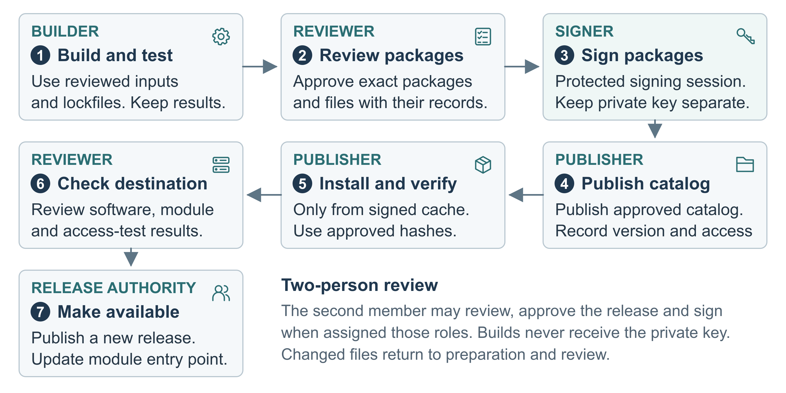
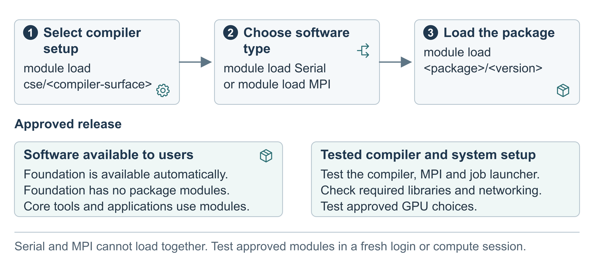

# CSE Spack Build and Publication Procedure

This standard operating procedure (SOP) is for teammates who build, review, and
release software for the Computational Science Environment (CSE). It explains
who does each step, what to record, and when the software is ready for users.

| Document control | Value |
|---|---|
| Status | Working draft |
| Review revision | 2026-09-10 |
| Audience | CSE builders, reviewers, release authority, and supporting system and security staff |
| Scope | CSE software choices, responsibilities, access, and release requirements |
| Shared procedure | [Spack build and publication procedure](software_stack_sop_v1.md) |

## Review priorities

**Keep the core practices.** Record exact inputs and changes, version local
corrections separately, verify sources, control access, and test software and
modules. Keep the two-person release review and records needed for support,
rebuilding, and recovery. Reuse earlier evidence when it still applies; review
does not require a second full build or a manual check of every package.

**Confirm what each system needs.** Match transfers and tests to supported
systems. Confirm who will use the catalog (versioned platform configuration) and
which software combinations it supports. CSE must publish the catalog. Section
2.2 explains when security staff become involved.

Reviewers should settle these choices, including who owns the work and the
resources needed:

| Review topic | Decision for reviewers | CSE sections |
|---|---|---|
| Build network restrictions | How the system blocks outbound access, who maintains the block, and how it is tested | 9.3 |
| Security scans and compiler protections | Tools, update feeds, coverage, handling of findings, and capacity for numerical and performance tests | 8.1, 9.3 |
| Signing and binary publication | Who holds the keys, where signing runs, how public keys are trusted, and how keys are replaced or recovered | 10.1–10.3 |
| Ongoing support | Staffing for response targets, security updates, record retention, and recovery | 12–14 |

This draft requires restricted builds and publication from signed binary
packages only. To change a requirement, record the clause, reason, owner, and
resources, then update both documents before adopting the change. Site
requirements still apply. A written requirement is not proof that it is in place.

## 1. Purpose

This SOP sets CSE's software choices, responsibilities, access rules, and
acceptance conditions. The [shared procedure](software_stack_sop_v1.md) gives
the common steps and commands for preparing inputs, mirrors and transfers,
building, testing, signing, publishing, and maintenance.

Spack manages software packages and their dependencies. A Spack **environment**
lists the requested packages and settings. **Concretization** resolves these
requests into exact package versions, dependencies, compilers, and build
options, saved in a **lockfile**. A **pin** fixes an input to a recorded version
or revision. A proposed release is called a **candidate** in the records.

Designated CSE package managers build with approved user accounts without
elevated privileges. Signing and publication use the separately authorized roles and
accounts in Section 10. End users load accepted software through environment
modules, which select the software available in their shell. They do not build,
modify, or publish CSE-managed releases.

Use both documents and record their revisions for each release. Resolve
conflicts with system or security requirements through the responsible
authority before the affected step; do not choose the less strict instruction.
These requirements apply with any approved tools. Record system paths, software providers, scheduler
commands, network controls, and responsible people under Section 3. The release record shows the work completed on each system.

### 1.1 Procedure map

| Activity | Follow the shared procedure | CSE decisions in this SOP |
|---|---|---|
| Assign roles and record the release | Sections 2 and 3 | Sections 2 and 3 |
| Prepare Spack, storage, and configuration | Sections 4 and 5 | Sections 4 and 5 |
| Select the catalog and prepare environments | Sections 6 and 7 | Sections 6 and 7 |
| Maintain local package corrections | [Local correction procedure](software_stack_sop_v1.md#procedure-local-corrections) | Section 7.3 |
| Resolve and review the proposed release | [Review procedure](software_stack_sop_v1.md#procedure-review) | Section 8 |
| Prepare sources and mirrors | [Source mirror procedure](software_stack_sop_v1.md#procedure-source-mirrors) | Section 9.1 |
| Deliver inputs to systems with limited network access | [Transfer procedure](software_stack_sop_v1.md#procedure-disconnected-transfer) | Section 9.2 |
| Build and test | [Build and validation procedure](software_stack_sop_v1.md#procedure-build-validation) | Section 9.3 |
| Sign, publish the catalog, and install the public stack | [Signing](software_stack_sop_v1.md#procedure-signing), [catalog publication](software_stack_sop_v1.md#procedure-catalog-publication), and [cache publication](software_stack_sop_v1.md#procedure-cache-publication) | Section 10 |
| Check user access and maintain releases | Sections 11 through 14 | Sections 11 through 14 |

Release sequence: review inputs and lockfiles, collect approved sources,
build and test with network restrictions, obtain independent review, sign,
publish the catalog, install from the **build cache** (stored binary packages),
check the destination, then make the software available to users. Stop at any
step whose acceptance checks fail.

## 2. Responsibilities

Assign a builder and a separate qualified technical reviewer to each proposed
release. Two CSE team members can perform the process and exchange roles
between releases. Each person's decisions must be recorded under their own name.

| Role | CSE responsibility |
|---|---|
| Build owner | Prepare the release, record inputs and changes, collect sources, build and test, record results and exceptions, and submit the exact result for review. |
| Technical reviewer | Independently check inputs and changes, selected package reviews, test and scan results, publication plans, and destination acceptance. Record approval, required corrections, or a hold, with reasons. |
| Release authority | Approve signing and release to users. The CSE software lead or a named delegate fills this role. It may be delegated to the reviewer; a third person is not required. |
| System or platform owner | Provide and confirm the filesystem, account, network, scheduler, compiler, Message Passing Interface (MPI), graphics processing unit (GPU), external-library, and destination controls used by CSE. |
| Security reviewer or responsible security authority | Advise on security requirements and assess exceptions, boundary changes, and incidents within their local authority. Send decisions that need another authorizing role to that role. |

Give the project manager schedule, risk, and release-status updates. Name the
CSE staff and system and security contacts in the release record. A list of roles
alone does not show that review occurred.

### 2.1 Two-person review and audit trail



Figure 1. CSE review and release handoff. The reviewer may also be the delegated release authority and sign in a separately controlled environment. Sections 9 and 10 define the testing and publication requirements.

The builder submits the release identity, inputs and changes, review scope and
reasoning, test and scan results, unresolved items, and recommended decision.
The reviewer records their name, date, evidence revision or checksum, decision,
and conditions. Keep corrections and the reviewer's recheck of the revised
release. Approval of earlier files does not approve later changes.

The reviewer checks that the procedure ran, assesses the package-review plan
and findings, and checks selected evidence directly. One reviewer must remain independent of the
changes affecting the release or its inputs and accountable for its full
review. They may witness repeatable steps and verify unchanged approved inputs;
corrections return to the builder. If both people make changes affecting the release or its inputs, hold
the release or obtain another qualified independent reviewer through the
existing management process. Reviewing each other's separate changes does not
replace independent review of the whole release.

Keep these decisions in one controlled ticket, review record, or release
database entry. Preserve its history and reviewed snapshots; do not rewrite an
earlier decision to describe a later result.

### 2.2 Security review and decisions

Routine releases within agreed requirements stay with the builder, reviewer,
and delegated release authority. Use the local security process to identify
the reviewer and approval authority for these cases:

| Trigger | Required involvement | CSE action while unresolved |
|---|---|---|
| Initial security requirements, or a substantial change to source trust, build isolation, signing, review, or publication boundaries | Confirm required security outcomes, acceptable evidence, and who may accept exceptions. | Prepare and test; hold affected production use until the required decision. |
| Unresolved security finding or exception to an agreed requirement | Assess the risk and proposed protection; obtain an authorized decision with a defined scope and end date. | Hold affected publication; record owner, scope, expiration, and retest conditions. |
| Suspected malicious content, compromised key, or integrity failure suggesting compromise | Use the existing incident-response and security process for containment guidance. | Quarantine affected inputs or outputs, preserve evidence, and do not publish them. |
| New transfer route or destination security boundary, or a change to an approved route | Confirm transfer handling, destination checks, and security approval with transfer and system authorities. | Prepare the inventory; do not use an unapproved route or assume source-system approval covers the destination. |

Unchanged dependencies and routine source-mirror refreshes within an accepted
scope need no separate security approval under this SOP. Seek input when it
resolves a security question. CSE technical approval cannot waive a system
security requirement.

## 3. Required inputs

Complete the operating record in shared procedure Section 3 for each system
and release. Also record these CSE choices:

| CSE record | Required information |
|---|---|
| Release identity | System, stack, candidate or release identifier, previous release, builder, reviewer, release authority, and document revisions. |
| Package choices | Approved package list and environments, including requested package versions, build options (variants), supported dependency combinations, and exceptions. |
| Platform catalog | Exact restricted catalog release, source identities, checksums of selected configuration scopes (sets of Spack settings), and reviewed platform and provider records. |
| Tools and recipes | Approved Spack version, tag, and commit, package-repository commits and search order, and local recipes (overlays). Verify the exact Spack version against the shared procedure's command baseline. |
| Deployment | Installer-chosen restricted and published paths, build stages, caches and mirrors, evidence and module-entry locations, collaboration group, and intended users. |
| Security requirements | Input sources, acquisition and build network controls, scanners and tests, signing backend and full key fingerprint, review scope, and all applicable exception decisions. |
| Transfer, when used | Source, destination, authorized route, bundle identity and inventory, build or binary-install mode, compatibility evidence, and receipt and acceptance decisions. |
| Operations | Support queue, announcement channel, system and security contacts, retention choices, and stricter site response targets. |

The approved package list controls requested versions and variants. Email,
mirror contents, or available binaries do not override it. The catalog controls
supported configuration. The installer records deployment paths; CSE does not
infer them from system discovery.

## 4. Storage, access, and Spack runtime

Use shared procedure Section 4 to set up and check paths, Spack, permissions,
and the configuration Spack actually uses. Keep restricted work and published
content in separate directory trees:

```text
<approved-cse-shared-root>/
  restricted/
    catalogs/<system>/static/<catalog-release>/
    workspaces/<system>/<stack>/<release>/
    cache/source/
    cache/misc/<builder>/
    releases/<system>/<release>/
    buildcache/<system>/<release>/
    evidence/<system>/<release>/
  published/
    catalogs/<system>/static/<catalog-release>/
    catalogs/<system>/static/current
    workspaces/<system>/<stack>/<release>/
    releases/<system>/<release>/

<approved-per-user-stage-root>/<builder>/<release>/
  build-stage/
  publish-stage/
```

Record actual paths in place of these examples. Also record source-mirror snapshot, transfer staging, and evidence
paths and write access.

| State | CSE access policy |
|---|---|
| Restricted workspace, source cache, views, modules, file-backed candidate cache, and working evidence | Recorded CSE group; directories `2770`, ordinary files `0660`, executables `0770`, with no access for others during preparation. |
| Restricted install tree, database, and locks | Spack permissions use the recorded group, group read and write, and enabled locking. Verify locks on the shared filesystem. |
| Persistent miscellaneous cache | A separate mutable index partition for each builder, with group access for recovery. |
| Build stage, per-process or per-user cache, and bootstrap state (tools needed to run Spack) | Private to the builder or process, recreated for handoff, and outside the Spack tool directory. |
| Approved inputs, reviewed snapshots, and accepted evidence | Identifiable retained versions with controlled write access; read-only to build execution where required. Shared working-directory permissions alone do not provide this protection. |
| Release private key | Separately controlled signing environment, outside builds and transfer bundles. Build work receives no signing credential. |
| Published content | Recorded CSE management group; directories `2775`, executables `0775`, ordinary files `0664`, and no write access outside CSE. |

Confirm the CSE Unix collaboration group on each system. Use setgid to retain
group ownership and the selected default access control list (ACL) or
`umask 0007` for working permissions. Programs can create stricter permissions,
so still run the shared handoff checks. Each builder fixes permissions only on
their own outputs after parallel work stops. Obtain the filesystem owner's
confirmation of scope before recursively changing a shared tree.

CSE keeps group management access for retirement and replacement, but does not
edit accepted releases in place. Protect and retain approved snapshots and
checksums, and record management actions. Group-write access does not make
storage immutable.

Use a read-only shared Spack checkout or a builder-local copy of the same clean,
approved version, tag, and commit. Keep it unchanged during the release. The Spack
tool directory contains no workspace, installed packages, stages, caches,
views, modules, or signing key. Install a changed Spack version in a new sibling
directory. Follow the shared runtime and configuration-scope checks; do not
change checkout-local configuration in place.

## 5. Preflight

With shared procedure Section 5 and the CSE operating record, both team members
confirm that the system and catalog, deployment, package list, Spack, repositories,
and configuration describe the same release. Check required node types and
providers, shared paths and locks, and both accounts' working access.

Record and verify acquisition and build network controls, the signing environment,
and mirror paths. For transferred inputs, complete destination preflight and
transfer checks before running tools or recipes. Stop the affected step if a
prerequisite fails.

## 6. Select platform configuration

Use shared procedure Section 6 to prepare, inspect, and select catalog
configuration. Keep the exact restricted catalog as the source for both build
and publication workspaces. Record its identity, source revisions, selected
configuration scopes, and resulting Spack configuration.

The public catalog is a separate configuration release for package managers
outside CSE. Include reviewed Spack configuration, a contents and identity
inventory, supported platform and provider combinations, instructions, and approval.
Exclude restricted workspaces, package installation paths, private caches, and
signing material. Consumers pin its versioned path; `current` helps them find
releases. Publishing it does not replace CSE's restricted catalog of record.

Select compiler, MPI, and GPU combinations from reviewed provider evidence. Cray
MPICH is the normal Cray-native MPI provider; alternatives are allowed when
CSE policy and the catalog support them. Do not select MPI from system family
alone. A compiler version in a Cray MPI flavor name states a supported baseline;
it does not pin CSE's exact GNU Compiler Collection (GCC) version.

Keep system OpenSSL, curl, MPI, fabric, launcher, math, and runtime components
as **externals** (software supplied outside this Spack build) when catalog policy
assigns them to the platform. Record exact identities and test integration.
The acquisition system's platform details do not replace the destination's.

## 7. Define the environment

Prepare and inspect environments and inputs with shared procedure Section 7.
Keep the release record, environment sources and lockfiles, configuration
scopes, overlays, modules, and instructions another authorized operator needs.
Transfer relative includes as a complete directory tree. Run the same Spack
configuration checks whether preparation was manual or automated.

### 7.1 CSE environment layout

A **compiler surface** groups the software built for one selected compiler.
Concretize its environments separately:

| Environment | CSE content and compiler and provider requirements |
|---|---|
| Core | Foundation support libraries, CSE tools, and Python, built for the compiler surface. |
| Common | Compiler-dependent packages shared by the application environments, built for the compiler. |
| Serial | Applications and libraries built for the compiler with MPI disabled. |
| MPI | Applications and libraries built for the compiler with MPI enabled and the selected provider. |

A **lane** is a selected Serial, MPI, or GPU environment. For approved GPU
software, start with the applicable MPI set, add GPU packages, and select
compatible compiler, MPI, and GPU versions. Record supported combinations and required
destination GPU tests.

Build in this order: compiler, Foundation, build tools and Core, then application
packages. Express this order and selection with Spack's grouping and toolchain
constraints from the shared procedure. Repeated compiler, Foundation, and
build-tool specifications (**specs**) reuse installed packages only when their
full concrete hashes match. These hashes identify the resolved builds.
Foundation belongs to its compiler surface; a public **view** (a directory
presenting selected installed software) does not prove compatibility with
another surface.

### 7.2 CSE package and dependency policy

- Pin one Foundation library version per release. Make these libraries available
  through the selected view, without individual package modules.
- Normally publish the current approved CSE package version and the newest
  active version in the pinned recipes. If the current version is absent,
  use the two newest approved versions available in those recipes.
- Record additional versions as exceptions in the approved package list.
- Publish Hierarchical Data Format version 5 (HDF5) and Network Common Data Form
  (NetCDF) as tested dependency combinations. Pin build-tool dependencies
  separately from any additional public tool version.
- Make version-sensitive modules load tested dependencies and reject conflicts.
- Disable MPI in Serial specs; enable MPI and select its provider in MPI specs.
- Apply the approved portable central processing unit (CPU) target to packages
  requested directly and their dependencies when building from source. Approved
  architecture-specific binary distributions may use the generic target their
  recipe requires.

### 7.3 CSE local package corrections

When pinned upstream recipes do not correctly support an approved package and
platform combination, CSE may keep a local recipe or source correction. Keep
the upstream pin and version the local package repository separately, with an
explicit namespace and search order. Follow the shared
[local correction procedure](software_stack_sop_v1.md#procedure-local-corrections).
Keep package choices and deployment settings in their own configuration under
shared procedure Section 4.2.

Keep the failure, correction rationale, full recipe and supporting files, affected
versions, compilers, and variants, upstream reference or decision, and dependency graphs. The independent reviewer checks changes and test
evidence under Sections 2.1 and 8.1 as part of release review. Use Section 2.2
for security involvement.

Check every CSE environment using the local repository, including shared
dependencies and other compilers. A compiler-specific condition does not prove
other resolved package identities stayed unchanged. Keep accepted releases
unchanged; record a new candidate input revision, review affected lockfiles,
and rebuild and retest all affected packages and dependencies. Make the tested
repository revision available to another authorized builder and include it in
applicable transfer and retention records.

If a supported public catalog choice needs the correction, give its approved
users the exact unchanging repository revision through an authorized,
accessible source, with identity and selection instructions. A restricted internal path will not work for those users. When an approved upstream update contains the
fix, check that it provides equivalent behavior and retire the local change
through the same review and tests.

## 8. Concretize and review

Use the shared [review procedure](software_stack_sop_v1.md#procedure-review).
Across all environments, check approved versions, compiler and MPI selections,
portable targets, externals, HDF5 and NetCDF combinations, build-tool pins, no MPI
in Serial, and matching producer hashes for reuse. All required lockfiles and
cross-environment checks must pass before production builds start.

### 8.1 Review package changes

Inventory all resolved packages and dependencies. Run required automated checks
across available sources and build outputs. Manual review of every recipe or
every dependency's source code is not required for each build. Recipes and
source code remain executable inputs even when not individually reviewed.

For the initial baseline, record pinned repositories, source origins, selected
dependencies, automated findings, and a human review plan based on risk. The
reviewer assesses the plan and results. Focus on local recipes and patches,
new sources of trust, changed download or execution logic, unusual hooks or
embedded downloads, security-sensitive components, and significant findings.
Presence in an upstream repository alone does not count as local review.

For later releases, compare all inputs with the retained baseline and use
changes and findings to select further review. Upstream changes unrelated to
the selected release need not be manually reviewed. Reuse earlier review only
when the input identity, context, and risk assumptions still apply. Record
selection criteria, examined content, tools and results, decisions, and reused
review evidence. Expand review when findings or trust-boundary changes warrant
it; send unresolved significant findings through Section 2.2.

The independent reviewer approves the review record and required corrections.
Record and follow any stricter organizational review within its required scope.

## 9. Build and validate

### 9.1 CSE source and mirror preparation

Use the shared [source mirror procedure](software_stack_sop_v1.md#procedure-source-mirrors).
Prepare a versioned **source mirror** (a stored collection of source archives)
for the approved resolved environments on a system with authorized network
access. Include dependency sources, patches and resources, archives from version
control systems with recorded source identities, and separately
approved bootstrap tools and prerequisites. Keep origins, checksums, scan
results, completeness checks, and review evidence. A download cache alone is
not a documented transfer bundle.

If a destination cannot retrieve all inputs, gather them on an approved connected
system and deliver them under Section 9.2. Build with destination-approved
configuration and local mirrors. Gather missing content through the same
controlled process and record each supplemental delivery.

### 9.2 Systems with limited or no external network access

Use the shared [transfer procedure](software_stack_sop_v1.md#procedure-disconnected-transfer)
whenever a destination cannot retrieve all inputs, including partially connected
and air-gapped systems. Use only the authorized route for that source and
destination. Future classified systems use the same technical preparation;
their transfer and destination-security rules add acceptance requirements.

The builder prepares the delivery inventory; the second person reviews it
before transfer. Keep destination verification and acceptance records. Include
approved source mirrors, signed binary packages, or both; pinned tools and recipe
repositories, complete configuration, lockfiles, inventories, and transferable
evidence. Exclude release private keys and acquisition credentials. Establish
trust in approved public keys separately on the receiving system.

Record one mode per destination environment:

| Mode | Required CSE checks |
|---|---|
| Build from transferred sources | Prepare or verify the destination's resolved dependency graph and complete local sources and tools. Build and test in its restricted area, then apply two-person review, signing, and publication to the new candidate. |
| Install compatible approved binaries | Verify approved release and package signatures, exact selected hashes, and destination compatibility. Install only from the transferred build cache, with no source-build fallback. Accept runtime, modules, and permissions before making software available to users. |

Sister systems still need compatibility checks. Compare operating system (OS),
application binary interface (ABI), architecture and CPU target, compiler and
runtime, MPI, fabric, and launcher, applicable GPU software, external identities,
and required paths and relocation needs. Keep destination evidence. If binaries are not
acceptable, explicitly select a source build and apply its requirements; never
silently rebuild during publication.

On the acquisition system, use the approved lockfile only to collect destination
inputs. Do not substitute the acquisition system's compiler or externals. If
destination concretization changes the graph, review it and gather missing
sources before building. Sources from a sister system may be incomplete for
that graph.

The destination owns its acceptance decision and records. It may reference
source-site review for unchanged inputs, but needs local evidence for its
configuration, platform integration, transfer integrity, and execution results.
A destination rebuild needs its own build, test, review, and signing records.

### 9.3 Restricted build and acceptance

Use the shared [build and validation procedure](software_stack_sop_v1.md#procedure-build-validation).
Separate source acquisition from builds. CSE's intended production requirements
are builds without root privileges, approved local inputs, enforced outbound
network blocking, and no access to release-signing credentials. Record and test
the system's enforcement. Handle proposed exceptions under Section 2.2 before
affected production publication.

For parallel builds, use separate environments, enabled and tested shared locks,
private process state, separate builder miscellaneous caches, and one owner per
environment's views and modules. Coordinate total CPU and memory use. Parallel work
still requires independent two-person review.

Acceptance tests cover applicable C, C++, and Fortran compilation, linking and
execution; package behavior; headers, libraries and linkage; numerical accuracy
and representative performance; clean Serial execution; native multi-node MPI
and fabric and launcher behavior; and approved GPU tests. Select checks and any
reused evidence under shared procedure Section 9.3.

Run recorded security scans and validated compiler-hardening settings. Keep
failures and exceptions with related functional and performance results. A
**software bill of materials (SBOM)** lists software components; it is not a
vulnerability scan or proof that tests passed.

Prepare compiler-entry and lane-selection modules in the restricted module
directory for team review, without making them available outside CSE. Record
each required environment as `built`, `runtime-passed`, or `held`, with its
security decision. Sign only after all release-required environments pass and
all required findings have accepted decisions. `runtime-passed` alone is not
security approval.

For module and view presentation changes only, repeat those checks without a new
solve or build if the graph is unchanged. Compiler, provider, external,
dependency, recipe, or hash changes return to release review. A different
compiler for a dependency needs an explicit mixed-toolchain decision, ABI and
linkage tests, and retained compatibility evidence.

## 10. Publish

### 10.1 CSE signing and release decision

Use the shared [signing procedure](software_stack_sop_v1.md#procedure-signing)
and dedicated approved CSE signing identity. Share the complete public-key
fingerprint through a controlled channel. The reviewer or release authority may
sign with separately controlled credentials; a third person is not required.
Build jobs receive no private key.

Sign only the exact reviewed set of packages and associated files. Link their identities to the evidence
and decision in the release record. Record and verify the selected cache
backend's signing behavior. Do not assume an Open Container Initiative (OCI)
registry meets Spack 1.2.2 native signing requirements. Package signatures do
not authenticate the whole cache index or prove CSE release membership.
Under shared procedure Section 10.1, record the allowed full hashes in the
authenticated release record, whose source and integrity have been verified.
The installer must compare selected hashes with
that set before installation.

Review the release key at least annually. Keep old public keys while retained
releases need verification. Record the applicable security or release decision for key replacement,
expiration, revocation, or suspected disclosure under Section 12.

### 10.2 CSE static catalog publication

Use the shared [catalog publication procedure](software_stack_sop_v1.md#procedure-catalog-publication).
Publish the accepted restricted catalog once restricted validation and
build-cache checks pass. The catalog remains a separate configuration product;
CSE publishes it in this release order.

Before publication, require and retain the versioned public tree, publication
approval record, checksum inventory,
original catalog identity, and approved user-facing paths required by the
shared procedure. Apply Section 4's published permissions and test access
outside CSE. Retain the restricted original for CSE workspaces; external
package managers pin the versioned public catalog.

### 10.3 CSE stack publication

Use the shared [cache publication procedure](software_stack_sop_v1.md#procedure-cache-publication).
Prepare a separate publication workspace from the same approved package and
platform inputs, its publication deployment record, and approved lockfiles.
Do not copy the changeable restricted workspace, reconcretize, or replace the
restricted catalog with the public catalog as the configuration source.

Retain the recorded CSE group and effective Spack permissions `read: world`
and `write: group` in the publication deployment. These are deployment choices,
not catalog facts. A missing or unverified cache object stops publication and
returns to restricted preparation. Changed inputs or required hashes create
a new candidate.

After installation, verify signatures and confirm every hash belongs to the
allowed set in the authenticated release record. Check destination runtime,
modules and views, and permissions. On relevant node types, use the second CSE
account to verify management access, and a non-CSE account to verify read and
execute access with writes denied. Test writes only in designated locations
without changing approved files.

The reviewer records results; the delegated release authority approves access
for users. Only then publish the new version and update the discovery or default
pointer. Do not repair accepted releases in place.

### 10.4 CSE inventory

Handle SBOMs and external inventories under shared procedure Section 10.4. Link the
SBOMs generated where the binaries were built, and their checksums, to the
accepted release. Keep any
destination-generated SBOM separately: installation hooks may regenerate
metadata, so matching Spack hashes need not produce identical SBOM files.
Compare expected package and component identities and retain the platform-owned
external inventory. Use the approved vulnerability analysis process; an SBOM
is not a scan result.

## 11. User access

Check modules, execution, and access in clean sessions under shared procedure
Section 11. Users enter the CSE stack with:

```bash
module load cse/<compiler-surface>
module load <Serial|MPI>
module load <package>/<version>
```



Figure 2. User access to the accepted CSE stack. The compiler and lane select the tested environment. Foundation libraries are available through the view; users load Core tools and approved packages through modules.

The **CSE gateway** is the entry module in the site's established module
namespace, directly or through an approved symbolic link. It selects the
accepted compiler surface and adds that release's lane-module directory.
The lane selects the matching Spack package-module directory. Generated
modules and views stay under the published release. Users need no `module use`,
Spack hashes, installation paths, or local Spack installation.

The compiler-entry module activates its exact module chain and records
`CSE_CC`, `CSE_CXX`, and `CSE_FC`. The MPI lane records `CSE_MPI_PROVIDER`,
`CSE_MPI_VERSION`, `CSE_MPICC`, `CSE_MPICXX`, and `CSE_MPIFC`. CSE-built MPI
loads its exact provider module. Platform Cray MPI uses the reviewed module
from its selected programming-environment (`PrgEnv`) and Cray Programming
Environment (CPE) module chain, without silently replacing the chain.

With CSE-built compilers and external Cray MPICH, test and accept the compiler
wrappers users will run separately. Successful Spack builds alone do not verify
that user interface.
Expose `mpicc`, `mpicxx`, `mpifort`, `mpif90`, and `mpif77` from the exact approved
installation, set `MPICH_*` compiler overrides to the CSE compiler-entry module,
and avoid compiler-selecting `PrgEnv-*` modules. Require a native multi-node
launch through the approved scheduler and launcher before making this selector
available to users.

Foundation libraries are available without package modules. Use approved module and view naming rules for Core tools and application packages. Serial and MPI
selections conflict. Versioned modules load tested dependencies and reject
conflicts. Test a version-sensitive combination such as NetCDF-C with its exact
public HDF5 dependency, including rejection of an incompatible HDF5 loaded at
the same time.

Proposed-release module paths are allowed during validation. In accepted clean
login and compute shells, generated package-module directories must be absent
before loading the gateway. Afterward, only selected accepted directories may
appear.

### 11.1 Fully qualified module aliases

Compiler then lane remains CSE's main module sequence. If publishing additional
fully qualified names, use a separate named Spack module set and directory.
These aliases use the same accepted specs and installation paths, with no
separate build, environment, view, or install tree.

Serial names include package and compiler versions; MPI names also include
provider and version. Refresh and inspect each enabled set with the shared
procedure. Aliases must resolve to the same installation path and hash and conflict
with each other. Record clean login and batch results and approved names.
If both sets are public, document the lane sequence as the main entrance.

## 12. Changes, security events, and platform updates

Use shared procedure Section 12 for changes, security advisories, platform
checks, withdrawal, and replacement. Create a new CSE candidate or release when
build-defining requested packages, versions, variants, recipes, patches,
repository revisions or search order, compilers, MPI or GPU providers, catalog scopes,
Spack, externals, environments, or lockfiles change. Reuse unchanged packages
only with matching full hashes and retained records of their inputs, build
history, and approval that still apply.

Keep the official record in the approved support queue. One team member owns
advisory response; the other reviews affected releases and corrective results.
Include transferred releases and destination contacts. On restricted networks,
refresh vulnerability and scan information through the approved route and record
how current it is. Record a decision for missed updates or new findings.

Use these targets unless a recorded stricter policy applies:

| Priority | Initial assessment | Target action |
|---|---|---|
| Emergency: known exploitation, active compromise, or security-designated critical exposure | Same business day | Remove exposure or apply an approved mitigation within 72 hours; publish a replacement when validation passes. |
| High: serious remotely reachable or broadly used component | Within 3 business days | Remediate within 30 calendar days. |
| Routine: other confirmed advisories | Within 10 business days | Address in the next planned release, no later than 90 calendar days. |

Handle Section 2.2 cases through the existing security process. Follow incident
authority for immediate containment; release approval must not delay it.
Notices name affected releases, temporary actions, replacement, retirement
date, and support reference.

For OS, CPE, compiler, MPI, fabric, launcher, GPU, or platform-library changes,
obtain updated reviewed platform and catalog evidence. Use shared compatibility
and runtime checks to decide whether to retest, keep the current pin, rebuild,
or hold. A changed default module alone does not settle compatibility.

## 13. Retention, recovery, and rollback

Apply shared procedure Section 13 and these CSE retention requirements unless
a documented site or security decision supersedes them:

- Keep the current release and at least one accepted previous release.
- Keep the previous release available for at least 90 days after replacement.
- Give at least 30 days' notice before normal module-tree removal.
- Keep a build-cache hash while any retained lockfile refers to it. Wait at
  least 30 more days after removing the last referring release before pruning it.
- Keep manifests, lockfiles, SBOMs, reviews and approvals, security decisions, test
  evidence, and transfer and destination acceptance records for at least three
  years, subject to destination handling rules.

Keep or reference approved sources, recipes, and tools needed to rebuild
supported releases, including disconnected destinations. Record their retention
period. Preserve failed-workspace evidence and the last accepted checkpoint
until the replacement is accepted. Reuse a candidate only to retry operations
with unchanged defining inputs; otherwise create a new one.

Rollback selects a retained release still acceptable under current security
findings. Change the supported pointer or module default without editing
either release. Do not restore a release that is no longer acceptable under current security
findings based only on its earlier approval.

## 14. Required release record

To the release record in shared procedure Section 14, add CSE's approved package list,
cross-environment checks, relationship between the restricted and public catalogs, permissions,
compiler, lane, and module acceptance, and applicable transfer records. Link builder
evidence, independent review, the release decision, and exact approved input
and output identities.

Before each operation, record its system paths, contacts, security requirements,
scanner and update process, signing authority and backend, transfer route if used,
support channel, and named CSE roles. List missing values as open prerequisites.
This draft does not assign unnamed people or certify controls not yet in place.

## Appendix A. Terms

The shared procedure defines common terms such as source mirror, build cache,
lockfile, environment, configuration scope, and transfer.

**CSE restricted catalog:** the retained configuration release used for both
CSE workspaces. **CSE public catalog:** its separately accepted publication for
external package managers.

**CSE package roster:** the approved list of requested packages, versions,
variants, and supported combinations. Section 7.2 sets the selection rules.

**Foundation:** pinned support libraries available through the selected view,
without individual package modules. **Core:** Foundation plus user-loadable
tools. **Common:** compiler-dependent packages shared by Serial and MPI.

**Compiler surface:** one compiler with its Core, Common, Serial, MPI, and
approved GPU environments. **Lane:** a selected Serial, MPI, or GPU environment.
**CSE gateway:** the entry module that selects the compiler surface and makes
its lane selectors available (Section 11).

**CSE published release:** accepted cache-installed software, views, modules,
and release records made available to approved users.
