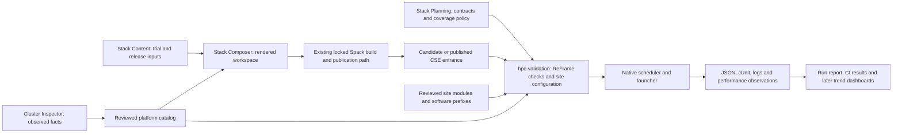

# HPC validation with ReFrame: implementation specification v1

| Document control | |
|---|---|
| Date | 2026-09-06 |
| Status | First functional CSE trial profile implemented; local consumers verified; target-system acceptance outstanding |
| First consumer | Initial Conversion Trials |
| Continuing scope | CSE releases, site software, compiler/MPI providers, CPU/GPU nodes, fabric and storage |
| Implementation | Separate local `hpc-validation` repository; intended site GitLab home to be assigned |

## 1. Decision: a separate suite, beginning with the trials

Use **`hpc-validation` as a sibling repository**. The CSE trials are its first
consumer and first release profile. They do not own the lifetime of the suite.
This changes the initial placement recommendation in
[the CSE validation plan](cse_validation_flux_and_module_activation_plan_v1.md#21-ownership)
because the requested scope now includes the HPC system and independently
provided software, not just the trial workspace.

A single suite can answer three different questions with separate results:

1. **Platform:** does the selected node class, scheduler, native launcher, MPI,
   GPU runtime, fabric and filesystem work?
2. **CSE:** does this exact candidate or published release expose a working
   user development environment and its promised package interfaces?
3. **Other software:** does this exact site/user-provided module or prefix work
   on its supported execution contexts?

Keep test implementations reusable. For example, the same MPI collective probe
runs once against a reviewed system MPI tuple and again through a CSE entrance.
Passing the system case does not certify the CSE case: its compiler, activation,
dependencies and provenance differ.

The stack-generation system retains its existing four repositories. The new
repository is a downstream validation consumer, not another renderer or a new
required build stage inside Stack Composer. Do not reorganize the eight trial
environments or change their locks to add testing.

## 2. Ownership and integration

| Owner | Responsibility |
|---|---|
| Stack Planning | Acceptance design, cross-repository seam, coverage and evidence semantics |
| Stack Content | CSE package intent, module templates, release values; later a small invocation adapter or suite revision reference |
| Cluster Inspector | Observations and supporting evidence; does not choose tests or declare acceptance |
| Stack Composer | Render the workspace; does not launch tests or schedule jobs |
| Existing builder/operator | Build exact locks, refresh owned views/modules, publish through the established cache path |
| hpc-validation | Checks, tiny source fixtures, site execution configuration, run selection and validation evidence |
| Site deployment/operator | Accounts, partitions, reservations, approved launcher tuple, resource limits, evidence location and execution cadence |

Initially invoke the external suite against the restricted candidate entrance.
After candidate acceptance, repeat the appropriate checks from the published
user entrance following cache-only publication. A candidate pass alone does
not prove that the published modules, paths or permissions work.

Later a generated `cse-validate` entry point may call a **pinned installed suite**
with reviewed inputs. It should not carry another copy of the checks, fetch
dependencies at runtime, alter locks, or make Stack Composer a test executor.
Pin the validation revision alongside each acceptance bundle. Host the suite
under the eventual site GitLab authority; assigning a remote is separate from
the local implementation.

### Spack is the software producer

Do not use `build_system = 'Spack'` for CSE acceptance. That backend can add and
install specs in an environment, which is a different job from testing the
already accepted build inputs. ReFrame can compile a tiny consumer with the
selected compiler or run an existing executable through modules and explicit
prefixes. See [ReFrame's Spack integration](https://reframe-hpc.readthedocs.io/en/stable/howto.html#integrating-with-spack).

An exact Spack hash, lockfile digest and approved prefix are provenance inputs.
They do not require running Spack during the test. Read-only Spack queries can
help an adapter extract installed inventory, but do not replace testing the
public module surface. Keep benchmark provisioning separate too: build OSU,
BabelStream or application canaries beforehand, or compile small vendored
fixtures in a disposable stage. No test silently installs a missing benchmark.

The ReFrame controller uses its own supported Python. Testing CSE Python
3.8 does not mean running ReFrame under Python 3.8. Invoke each target
interpreter as software under test. The starter pins ReFrame 4.10.3, whose
[published package requires Python 3.10 or newer](https://pypi.org/project/reframe-hpc/4.10.3/).

## 3. Profiles and execution model

These names select coverage, not a new stack-intent language:

| Profile | Selection |
|---|---|
| `local-smoke` | Verify the harness and report path on a workstation; no HPC or CSE acceptance claim |
| `cse-smoke` | First bring-up of one exact CSE entrance and compiler; a subset of release coverage |
| `system-mpi` | Reuse MPI checks against an explicitly selected site/compiler/MPI tuple |
| `consumer-dev` | Explicit existing workstation libraries/tools for consumer development; no CSE acceptance claim |
| `cse-trial` (first functional sweep implemented) | All authored roots in the current eight environments and approved version chains; complete interface acceptance remains outstanding |
| `cse-release` (planned) | Required interfaces derived from a future release inventory, including its supported GPU lanes |
| `platform` (planned) | System compiler/MPI/GPU, CPU/memory, fabric, filesystem and scheduler acceptance |
| `site-software` (planned) | Reviewed application/module/prefix entries maintained by site or software owners |

Prefer native ReFrame configuration for systems, partitions, programming
environments, resources and launcher selection. The first trial adapter reads
three locked environments per surface/lane (Core including Foundation and
independent tools, Common, and the selected payload lane). It exports full
concrete hashes, installed prefixes, dependency edges, root membership, lock
digests, public module projections and activation expectations. Read-only
Spack queries supply installed prefixes; no layout-derived paths or rebuilds
are permitted. The roster resolver requires each explicit pinned dependency
version in the selected root's closure. Site launcher/account/partition and
module bootstrap remain separately reviewed inputs. Avoid building an
independent scheduling system around ReFrame.

Use separate environments for each approved activation/compiler/provider tuple.
Parameterize package versions and resource shapes only when supported. An
explicit expected-case inventory is necessary before the full release gate:
feature filtering alone can make an accidentally absent environment disappear.
Discovery must fail the gate if a required case is missing.

### Proposed adapter input, before defining a machine-readable schema

This table defines information to resolve from existing records. It is **not an
implemented acceptance-manifest schema** and does not change `profile.yaml` or
the release-manifest schema in this change.

| Information | Authority / use |
|---|---|
| Subject kind and identity | Trial/release ID or site-software name/version; never infer a CSE release from the suite version |
| Source snapshots | Reviewed catalog/profile, trial values, eight locks, installed roots, suite revision and ReFrame version |
| Public activation | Ordered module root and exact compiler front door, lane selector, package modules; expected `STACK_*` identities |
| Compiler commands | Exact accepted `CC`, `CXX`, `FC` commands and wrapper provenance; preserve the full provider module chain |
| MPI runtime tuple | Provider/version/prefix, compiler binding, wrapper, launcher, PMI/PMIx, fabric and vendor runtime set where applicable |
| Package chain | Root/version/hash, dependency-chain identity, expected headers/libraries/metadata and allowed external prefixes |
| Execution context | System, node class, partition, scheduler/launcher, account, resource shape and CPU/GPU architecture |
| Expected cases | Required, advisory or explicitly not applicable; rationale and owner for exclusions |
| Evidence policy | Unique durable output root, baseline cohort, retention, artifact access and approved resource ceiling |

Reject unresolved placeholders, unsupported tuples, missing mandatory identity,
ambiguous prefixes, and empty required selections before expensive runs.
Do not default an unknown scheduler to local execution. Local execution inside
an allocation must be an explicit site configuration and record that allocation.

### Activation and provenance

Start from a controlled session that avoids personal startup files and unwanted
module/Conda/Spack state, while preserving the site variables required for an
existing scheduler allocation. Initialize the approved module engine, reset it
according to site policy, load the exact entrance, and record the resulting
module list, command resolution and `STACK_*` identities.

Do not set the expected `STACK_*` variables in the test to manufacture a pass.
Read what the entrance sets. A clean environment is necessary but is not a
filesystem sandbox: discovery and linkage checks must additionally reject
unapproved fallback dependencies. Compare resolved physical prefixes, not just
path-string starts. Follow allowed CSE view symlinks to their approved stores.

The first identity check is only a subset. Full G1 must cover load/unload,
wrong-parent and sibling conflicts, stale environment removal, actual compiler
and MPI wrapper targets, and approved dependency resolution. On Cray, preserve
the distinct reviewed CCE and CSE-GCC entry paths. Do not assume every Cray MPI
lane uses Cray MPICH or that its `Serial` selection guarantees MPI is invisible.

## 4. CSE trial coverage

The active trial is CPU-only and has **eight independent environments**:
Core, Common, Serial and MPI for shared GCC, plus those four for the selected
platform compiler. Foundation libraries are ambient at each compiler surface.
The authored roster and actual locks determine cases, not a guessed Cartesian
product. See the [current validation matrix](cse_validation_flux_and_module_activation_plan_v1.md#53-package-capability-matrix),
[version record](initial_conversion_trials_package_version_check_v1.md), and
[execution model](initial_conversion_trials_build_execution_model_v1.md).

The build environments do not imply eight programming environments in ReFrame.
The current Cray trial has four main user activation tuples: GCC Serial, GCC
MPI, CCE Serial and CCE MPI. Core/Common are exposed by the compiler front door.
Start from the authored [roster](../../stack-content/pilots/cse-pilot/roster.yaml)
and expand package/version cases beneath those entrances. `ninja`, `pkgconf`
and `git` are unversioned roster roots; their precise accepted versions come
from the locks.

The current trial front doors are `cse/init-GCC` and `cse/init-CCE`, followed by
`Serial` or `MPI`. The tracked Blueback selection is GCC 12.5.0 / CCE 21.0.0 /
Cray MPICH 9.1.0; Fran selects GCC 12.5.0 / CCE 20.0.0 / Cray MPICH 9.0.1.
These are recorded site inputs, not live acceptance results or generic defaults.
The exact native launcher/plugin and pending runtime evidence must still be
resolved. GCC's external Cray-MPICH MPI selector remains withheld from the
release module root pending native multi-node validation; use the restricted
workspace candidate for that gate.

The following is target coverage; a row is not implemented simply because it
appears here. CSE smoke tests are only the beginning of G1/G3.

| Capability / current version selection | Required behavior |
|---|---|
| Compiler entrance, every surface | Identity; C, C++ and Fortran numerical build/run; mixed-language link; wrapper resolution; module lifecycle and negative conflicts |
| zlib 1.3.1, xz 5.4.6, zstd 1.5.6 | Compress/decompress with exact byte/checksum comparison; library consumption through the ambient Foundation surface |
| CMake 3.31.12 / 4.4.2, Ninja, pkgconf | Configure/build/test a small consumer using each CMake; verify discovered CSE package paths; verify Ninja and metadata tools |
| Git | Offline init/commit/checkout/archive in stage, using test-local identity |
| Python 3.8.20 / 3.10.20 / 3.12.13 | Exact target interpreter, standard library/SSL import, venv, compiled extension and dependency provenance |
| Miniforge 26.1.1-3 | Base/command identity and offline environment/package metadata; no live channel downloads |
| GSL 2.6 / 2.8 | Numerical integration or root solve with a stated tolerance |
| SQLite 3.51.2 / 3.53.1 | C API transaction/write/read and CLI readback using each selected library; Python's bundled SQLite alone does not cover these roots |
| Netlib LAPACK 3.10.1 / 3.12.1 | BLAS multiplication and LAPACK solve with residual; C/Fortran interfaces actually built in each root |
| Gnuplot 5.4.10 / 6.0.0 | Headless plot with validated output artifact |
| HDF5 1.10.6 / 2.1.0, Serial | C/C++/Fortran/HL creation, write/read and data validation for enabled interfaces |
| HDF5, MPI | Collective parallel I/O, distributed hyperslabs and readback on one and two nodes |
| NetCDF-C 4.9.2 + Fortran 4.6.0 + HDF5 1.10.6 | Approved old chain: serial and parallel C/Fortran data/attribute round trips |
| NetCDF-C 4.10.0 + Fortran 4.6.2 + HDF5 2.1.0 | Approved new chain: same behaviors with exact dependency provenance |
| NetCDF-CXX4 4.3.1 | C++ data round trip against both approved chains; do not assume it exposes every parallel C API |
| FFTW 3.3.10 / 3.3.11 | Forward/inverse reconstruction error; distributed transform and global error in MPI |
| Boost 1.81.0 / 1.90.0 | Program Options, Regex, Serialization and enabled interfaces; MPI broadcast/reduce and serialized exchange |
| Dakota 6.23.0 / 6.24.0 | Small deterministic optimization with expected objective; Python binding where enabled; native MPI execution |
| MPI provider in each supported lane | C/C++, `mpif.h`, `use mpi`, `mpi_f08` where promised; collectives, rank count, distinct-node count, library/provider identity |
| Module namespace and discovery | Every public version/chain accessible, private dependencies not exposed as public modules, incompatible combinations rejected, no unintended fallback |

One-node MPI proves basic runtime use. Two-node native execution with actual
distinct-node evidence is a separate mandatory release result. A two-rank run
on one host does not satisfy it. The standalone MPI C starter checks correctness
and placement; later transport evidence is needed to establish the intended
fabric instead of a fallback transport.

The current lock verifier remains authoritative for structural checks and exact
hash convergence. ReFrame adds user-observable behavior and provenance rather
than recreating the concretizer or duplicating lock verification.

### Full CSE and realistic consumers

Retain these package checks as release intent evolves. Add tests for the
[managed consumption environment](post_trial_cse_consumption_environment_plan_v1.md):
header/library/metadata isolation, approved host integrations, compiler-neutral
versus compiler/provider-bound artifacts, coexisting versions and view collisions.

After focused probes, build a small CSE I/O consumer spanning MPI, FFTW,
BLAS/LAPACK and parallel HDF5/NetCDF. Then add one pinned Quantum ESPRESSO or
LAMMPS canary. Add OpenFOAM later, with explicit checks that its ThirdParty
mechanism has not substituted the CSE dependencies. These are disposable
validation consumers; they are not additions to the approved trial roots.
OpenBLAS, Kokkos and RAJA are also not current trial roots.

## 5. Platform and other-software coverage

| Area | Correctness and integration | Performance / operational observations |
|---|---|---|
| Scheduler | Native batch submit, resource assignment, launcher, cancellation/timeout behavior | Queue delay separately from execution time; do not call queue congestion a CPU regression |
| CPU / memory | Scalar/vector/OpenMP result; affinity and NUMA placement | STREAM bandwidth and pinned computational kernels by node class |
| System MPI | Each supported compiler/provider pairing; collectives and native multi-node placement | OSU latency/bandwidth/collectives by message size and rank layout |
| Fabric | Provider/transport and runtime identity, native two-node MPI | OSU with transport evidence; link/error counters correlated to the job window |
| NVIDIA GPU | Device identity, compiler/runtime compatibility, allocation/copy/kernel/readback, explicit device visibility | BabelStream, transfer bandwidth, NCCL collectives; driver and topology context |
| AMD GPU | HIP compile/kernel/readback and device visibility with explicit target | BabelStream, transfer bandwidth, RCCL collectives; ROCm and topology context |
| GPU-aware MPI | Device-buffer MPI with numerical validation, two nodes, intended GPU/fabric path | Transfer size sweep; separate host-staged and direct-device cases |
| Storage | Stage-local and selected shared filesystem write/read/checksum, rename and locking behavior | IOR throughput / mdtest metadata operations with reviewed dataset size and scratch quota |
| User/site applications | Pinned small inputs, expected numerical/scientific result, module/prefix and dependency identity | Time-to-solution and throughput for that exact input and execution shape |

Start one node per representative node class, then two-node integration. Wider
node sweeps and stress/performance tests need explicit node lists or scheduler
constraints, time limits, quotas and concurrency ceilings. Do not interpret
ReFrame's concurrent-job limit as a reservation of the physical resources.

Use the same software test against a system module or CSE module by changing
the reviewed environment. Preserve origin in results (`cse`, `site`, `user`),
including when software was built by another package manager.

The existing `gpu-benchmark-suite` is a source of candidate OSU, STREAM,
BabelStream, NCCL/RCCL and PyTorch checks. Review and port checks selectively.
Its default build/detection/evidence behavior should not become the CSE
acceptance contract. The existing `gpu-environment-stack/reframe` directory is
a reference point, not proof that GPU acceptance is operational.

In particular, a GPU-buffer MPI test establishes that the API accepts device
buffers and returns correct data; it does not by itself prove the absence of
internal host staging or prove GPUDirect/RDMA use. Transport claims need
additional provider/runtime evidence. Replace header-only sanity checks and
unreviewed universal bandwidth thresholds when adapting existing benchmarks.

## 6. Results, metrics and visualizations

Start with ReFrame JSON + JUnit + retained job/build logs and a human-readable
run report. Keep native performance values with units. Add a results database
and trend dashboard only after case identity and baseline grouping stabilize.
See the [site/reporting research](reframe_site_practices_and_reporting_research_v1.md)
for verified site examples and the differences between framework output and
external dashboard projects.

The useful views are:

| View | Question answered |
|---|---|
| Required coverage grid | Which system × release × compiler × lane × version-chain checks passed, failed, are blocked or have not run? |
| Release comparison | Which results changed between candidate and last accepted release on comparable hardware? |
| MPI / I/O / GPU trend lines | Are latency, throughput or time-to-solution changing within the same measured cohort? |
| Node-class or node map | Is a failure widespread or isolated to selected nodes? |
| Failure detail | What failed, on which allocation, with what modules, compiler, MPI, logs and input? |

Treat missing coverage as visible missing coverage. A dashboard showing
`100% of executed tests passed` must also show `executed / expected` and the
scope. A local smoke pass is not a green system or release tile. Synthetic
dashboard examples must be labelled; the starter report should use actual run
results and show untested HPC areas explicitly.

### Baseline rules

Correctness gates can block immediately. Performance starts advisory. Establish
repeatable measurements and review variance before approving thresholds.
Group by test/source revision, system/node class, partition, compiler/provider,
package hash, runtime/driver, rank/thread/GPU count, binding, input size and
benchmark options. Retain per-run values and spread; do not compare unlike
cohorts or silently replace a good baseline with the latest degraded result.

For a positive baseline, the displayed change is `(current - baseline) /
baseline × 100%`. State direction: lower latency/time is better; higher
bandwidth/throughput is better. Handle absent/zero baselines explicitly.
Repeated measurements distinguish regression from noise. Retries retain the
first failure and are restricted to classified operational failures; a pass on
retry remains visible.

Continuous telemetry complements the bounded tests: GPU counters, scheduler
accounting and filesystem/fabric health can explain why a measurement changed.
ReFrame is not the site's continuous node-monitoring service. Keep high-cardinality
identifiers such as full hashes and job IDs in run records; choose restrained
labels for a metrics service.

### Acceptance aggregation and artifacts

Translate native results into `pass`, `fail`, `blocked`, `not-run`, and approved
`not-applicable`. Any missing, skipped, aborted or dependency-blocked required
case prevents acceptance. Advisory performance warnings do not erase correctness
failures. A suite can pass only for its declared scope and complete expected set.

Retain the expected-case inventory, original inputs/digests, exact invocation,
suite revision and dirty-tree state, ReFrame version, generated scripts,
stdout/stderr, job/allocation/node identity, native JSON, JUnit, measurements,
dependency audits and summary. Use unique run directories; never overwrite the
last run. Archive interrupted runs as incomplete and retain their available logs.
Concurrent runners must not write one shared report file. Keep dashboard storage
rebuildable from durable raw evidence.

## 7. Implementation sequence and acceptance criteria

| Step | Deliverable | Done when |
|---|---|---|
| 0: runnable starter | Separate suite, pinned runtime, native config, local numerical/SQLite smoke, CSE identity/compile and MPI C probe, evidence output | Real local run passes; failure/empty-selection paths cannot report success; cluster examples reject unresolved inputs |
| 1: first CSE cluster run | One exact reviewed compiler entrance plus one-node and two-node MPI site configuration | Target-system logs show correct entrance, expected compiler/provider, correct reduction, rank and distinct-node count; no placeholders |
| 2: activation gate | All live shared/platform compiler surfaces; module lifecycle/conflicts and C/C++/Fortran/wrapper/linkage checks | Current CCE entrance/publication blockers closed by live evidence and captured separately from render tests |
| 3: complete trial gate | Focused package fixtures, explicit expected inventory and supported version-chain expansion | Every required interface in the eight environments passes through native execution; missing cases block |
| 4: platform breadth | System MPI/provider profiles, CPU/memory/storage and one GPU vendor then the other | Correctness and placement proven for selected node classes; benchmarks pre-provisioned; measurements advisory |
| 5: recurring reports | Site CI runner, retained JSON/JUnit, report publication and reviewed baselines | Failures actionable, scope/coverage visible, raw evidence recoverable, history comparable |
| 6: full CSE and canaries | Release-inventory adapter, managed-environment isolation, realistic consumers, broader GPU/software coverage | Same reusable tests cover the new release model with no trial dependency |

The implementation is deliberately short of full acceptance. Its README is
the exact command reference and implemented inventory. The remaining items
above are required work, not implied current capabilities.

The [validation repository](../../hpc-validation/README.md) now implements a
first functional consumer for every authored trial root: **34 Serial cases**
and **48 MPI-lane cases** per compiler surface, or 164 executions across the
four public compiler/lane entrances. Compiler interfaces, library operations,
tool behavior, approved dependency versions and expected CSE identity are
covered by this selection. MPI library probes assert rank and processor-name
node counts inside the application; Dakota asserts its reported two-rank MPI
startup plus numerical output without an application node-mapping claim.

The [implementation record](../../hpc-validation/docs/trial-implementation-2026-09-06.md)
records 11 real local consumer passes, retained negative controls, local MPI
placement controls, a synthetic full-roster export/resolution test, and
reporting verification. CSV exports, PostgreSQL import/schema and Grafana
queries are supplied; database/dashboard deployment is outstanding. Local
results are development evidence, not acceptance of the CSE installations.
See the [implemented coverage and gaps](../../hpc-validation/docs/coverage.md)
for HDF5/FFTW/Boost interfaces, module lifecycle, variant/loader provenance,
Dakota placement and benchmark work still required. Use the
[first native CSE run guide](../../hpc-validation/docs/first-cse-run.md) to
begin target-system execution.

### Initial run order

1. Run `local-smoke` and inspect its JSON/JUnit and human-readable report.
2. Copy a cluster example; fill in reviewed site scheduler, account, module
   roots, compiler commands and exact expected CSE identity. List cases first.
3. Run one compiler surface in the restricted workspace. Resolve activation
   failures before broadening the package matrix.
4. Run same-node MPI, then two-node native MPI. Record both independently.
5. Expand to the other compiler surface and both approved package chains.
6. After candidate gates and cache publication, exercise the published entrance.

A site operator still must supply the live allocation/account, accepted launch
tuple, exact entrance names and paths, and target node selection. Examples do
not establish those values. No target cluster is certified by the local work.

### Suggested cadence, to configure after bring-up

- Each suite/config change: local correctness, discovery and negative controls;
  cluster smoke when a site adapter or execution behavior changed.
- Each candidate and publication: required trial/release gates, including native
  two-node MPI for supported MPI lanes.
- Nightly: representative entrance/compiler/package smoke and two-node MPI.
- Weekly: complete supported package matrix and representative performance.
- Lower cadence or before major change: application canaries and broader node,
  GPU, filesystem or scale sweeps.
- On platform/runtime drift: affected-lane checks, then complete acceptance as
  required by the existing CSE change policy.

Flux stays an optional later profile inside a granted allocation. It neither
blocks initial adoption nor substitutes for native scheduler acceptance.

## 8. Source and status discipline

Local scope comes from the authored trial roster, the documents linked above,
and the existing module/build work. External capabilities and site examples
are documented with primary sources in
[the research report](reframe_site_practices_and_reporting_research_v1.md).
Keep the implementation README and recorded results distinct from this target
coverage plan. Update the plan as tests land; do not infer completion from
proposed architecture or an unfilled operator record.
