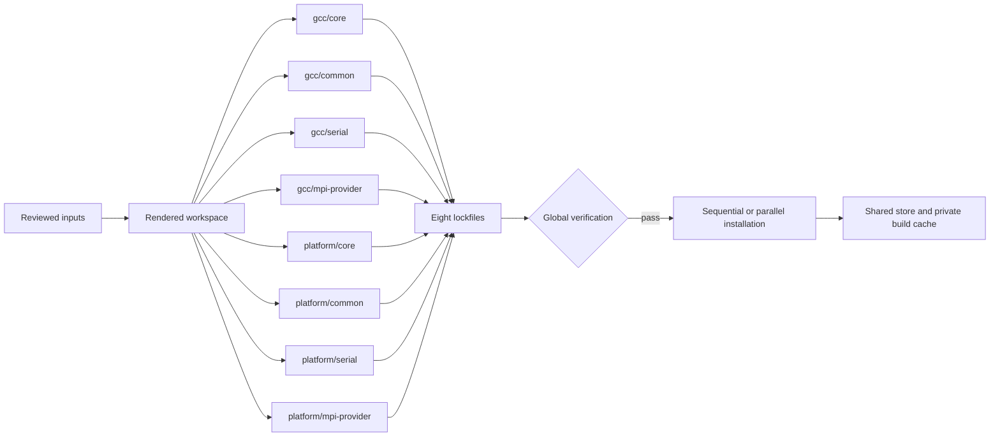

# Initial Conversion Trials Build Execution Model (v1)

| Document control | |
|---|---|
| Date | 2026-08-24 |
| Status | Active design and implementation record |
| Scope | CPU-only Initial Conversion Trials using Spack 1.2.2 |
| Future use | Source design for the build and lock-verification seam in the full renderer |

## 1. Purpose

This document explains how the Initial Conversion Trials execute builds, why
the workspace contains multiple partially overlapping environments, how those
environments can be installed in parallel without rebuilding identical
packages, and why every lockfile is verified as one set before installation.

The design has four goals:

1. isolate compiler and MPI boundaries so one failed lane does not invalidate
   every package in one large environment;
2. allow distinct environments to build concurrently when the shared
   filesystem and Spack locks support it;
3. reuse identical concrete DAGs rather than maintaining unnecessary copies of
   GCC, Foundation, build tools, and selected dependencies; and
4. make the resolved lockfiles—not the installed prefixes or the apparent YAML
   intent—the authority for what will be built and published.

The generated verifier is the executable statement of the fourth goal. It
checks both the rendered inputs and the concrete DAGs because a valid-looking
`spack.yaml` can still resolve to an unintended compiler, MPI provider, target,
or dependency hash.

## 2. Ownership across the four repositories

| Repository | Owns in this process | Does not own |
|---|---|---|
| Stack Planning | Architecture, invariants, operating procedure, and the future full-render direction | Host facts, rendering, or builds |
| Cluster Inspector | Observed system facts: compilers, MPI providers, modules, architectures, filesystems, and build-stage candidates | Stack selection, package policy, or lockfiles |
| Stack Content | Trial blueprint, package roster, environment/config templates, generated build wrapper, and generated lock verifier | Host probing or template rendering |
| Stack Composer | Deterministic assembly of the authored blueprint, reviewed catalog, and selected values into one workspace tree | Concretization, installation, or host probing |

Spack owns concretization, installation, its package database, build-cache use,
and prefix/database locks. The generated `cse-build` command invokes Spack, but
it is a workspace convenience interface rather than a new package manager or
scheduler.

Relevant implementation sources are the
[trial blueprint](../../stack-content/pilots/cse-pilot/blueprint.yaml),
[payload environment template](../../stack-content/pilots/cse-pilot/templates/_partials/payload-spack.yaml.j2),
[shared toolchain template](../../stack-content/pilots/cse-pilot/templates/configs/surfaces/shared/toolchains.yaml.j2),
[build wrapper template](../../stack-content/pilots/cse-pilot/templates/cse-build.j2),
and [lock verifier template](../../stack-content/pilots/cse-pilot/templates/scripts/verify-lockfiles.py.j2).

## 3. Workspace topology

Each system/release workspace contains eight independently concretized Spack
environments:

| Compiler surface | Core | Common | Serial | MPI |
|---|---|---|---|---|
| Shared CSE GCC | `gcc/core` | `gcc/common` | `gcc/serial` | `gcc/mpi-<provider>` |
| Platform compiler | `<compiler>/core` | `<compiler>/common` | `<compiler>/serial` | `<compiler>/mpi-<provider>` |

The surface answers **which compiler ABI owns the packages**. The environment
answers **which package and exposure boundary is being built**:

- **Core** contains Foundation plus user-facing compiler/Core tools.
- **Common** contains compiler-dependent packages shared by payload lanes.
- **Serial** contains the approved payload with MPI explicitly disabled.
- **MPI** contains the MPI-enabled payload and either a built MPI producer or
  an exact reviewed external MPI provider.

Every environment is self-contained. It contains the Foundation and
build-tool/Core producer groups it needs instead of depending on an activated
view or on a different environment's mutable state. Each shared-GCC environment
also repeats the same GCC producer root.



### Why eight environments instead of one

Independent environments provide useful failure, execution, and publication
boundaries:

- a Serial solve cannot silently acquire MPI through a combined MPI root set;
- compiler surfaces do not imply cross-compiler ABI compatibility;
- Core/Common work can be completed and inspected before expensive payloads;
- distinct environment installs may run on different allocated nodes;
- view and module generation has one owner per environment; and
- a failed lane can be corrected without replacing unrelated platform locks.

A single combined environment would reduce process-level parallelism, enlarge
the failure domain, and make multi-version view/module collisions harder to
control.

### Why repeat producers instead of referencing an installed view

The environments must remain independently reproducible. A view is an exposure
mechanism, not proof of a compiler or dependency's concrete DAG. Depending on a
view or on “whatever is already installed” would make the solve depend on
execution history.

The trial therefore repeats the same producer spec under the same complete
configuration. If every input is identical, Spack computes the same DAG hash.
The lock verifier proves that convergence before any build is accepted. During
installation, the shared store or build cache turns the repeated lockfile node
into one physical build/prefix rather than four independent builds.

## 4. The shared-GCC producer/consumer contract

Within each shared-GCC environment the conceptual order is:

```text
managed GCC producer
  -> Foundation
  -> Core or build tools
  -> built MPI producer when applicable
  -> payload
```

Four separate controls are required. None substitutes for the others.

### 4.1 The producer root defines what must exist

Every shared environment repeats one explicit managed GCC producer, including
the approved version, `+binutils`, language set, portable target, and verified
older seed compiler. The seed compiler builds GCC; it must not become the
language provider for downstream roots.

### 4.2 `needs` orders groups but does not select the compiler

`needs: [compiler]` makes the compiler group available before a dependent group
is concretized and exposes its concrete specs as reuse candidates inside that
environment. It does not add a C, C++, or Fortran provider constraint to the
consumer.

This distinction is load-bearing. Without an explicit selector, Spack can use
the older external seed compiler for Foundation and payload roots even during
`concretize --fresh` and even when the install store is empty.

### 4.3 The conditional toolchain selects direct virtual providers

Every shared downstream root applies `%cse_shared`. The generated toolchain
binds providers conditionally:

```yaml
toolchains:
  cse_shared:
    - {spec: '%c=gcc@12.5.0+binutils', when: '%c'}
    - {spec: '%cxx=gcc@12.5.0+binutils', when: '%cxx'}
    - {spec: '%fortran=gcc@12.5.0+binutils', when: '%fortran'}
    - {spec: '%mpi=<selected-mpi>@<version>', when: '%mpi'}
```

The `when` clauses avoid overconstraining a C-only package to require C++ or
Fortran. The MPI entry works for either a CSE-built OpenMPI producer or a
reviewed external provider such as Cray MPICH. It constrains the root's direct
MPI virtual without imposing the CSE source-build target on platform-owned
externals such as Slurm, UCX, libfabric, or Cray PMI.

### 4.4 Managed-GCC locks resolve without concrete-spec reuse

The shared-GCC environments set:

```yaml
concretizer:
  unify: false
  reuse: false
```

This makes a newly created managed-GCC lock resolve from the current rendered
inputs instead of allowing an installed compiler DAG to outrank the intended
surface. It does not disable installation reuse: an already installed prefix
with the exact resulting hash is still reused, as is an exact build-cache
artifact.

Platform-compiler environments retain the common `reuse: true` policy. They do
not contain a managed GCC producer and do not receive `%cse_shared`.

## 5. Hash convergence and separation rules

A Spack DAG hash identifies the complete concrete node: package/version,
variants, compiler/language providers, architecture, dependencies, package
recipe, and relevant configuration. Matching only `name@version` is not proof
of reuse.

The trial intentionally requires the following convergence:

| Scope | Required invariant | Reason |
|---|---|---|
| Four shared-GCC environments | One `gcc@12.5.0+binutils` producer hash | One managed compiler surface, regardless of which environment reaches it first |
| Every shared downstream root | Direct language-provider hash equals that producer hash | Prevents the seed compiler or a stale same-version GCC DAG from becoming the actual provider |
| Foundation roots within one compiler surface | One hash per package/version | Repeated self-contained groups should reuse one concrete prefix |
| Build CMake within one compiler surface | One hash for the approved build version | Public CMake versions must not change the package-build toolchain |
| Approved Python and netlib-lapack versions within one surface | One hash per version | Avoids hidden dependency divergence between Core and payload environments |
| Payload roots in one MPI environment | One selected MPI provider hash | Prevents payload packages from resolving different MPI implementations or builds |
| Dakota dependencies | Exact direct Boost, Python, LAPACK, and build-CMake relationships | Preserves the tested Dakota overlay and dependency chain |

The trial intentionally does **not** require shared-GCC and platform-compiler
Foundation packages to have the same hash. Compiler surfaces are separate ABI
boundaries and build their own compiler-dependent roots.

All source-built nodes use the one portable target selected for the workspace.
The reviewed generic Miniforge binary target is the named exception. Platform
externals retain the architecture recorded in the static catalog rather than
being rewritten to the CSE source-build target.

## 6. Execution sequence

### Phase A: render one immutable handoff

The operator combines the reviewed static catalog, authored trial blueprint,
and explicit system/release values with `stack-composer init-workspace`. The
result is one shared workspace containing the eight environments, all included
configuration, the package-repository overlay, the build wrapper, and the
workspace-specific verifier.

The builder does not regenerate values or reconstruct individual YAML files.
The entire relative-include tree is the handoff.

### Phase B: preflight and concretize all locks

From the workspace root:

```bash
./cse-build login concretize
./cse-build login verify
```

`concretize` creates only missing lockfiles with the pinned Spack runtime. The
wrapper checks rendered inputs before performing the action and verifies the
complete lock set afterward. Existing locks are not silently replaced because
a builder, node, cache path, or Spack checkout path changed.

All eight locks must exist and pass as one set before fetching or installing.
This global gate prevents parallel workers from beginning with individually
valid locks that disagree about a shared producer.

### Phase C: prove the shared filesystem can coordinate builds

Parallel installation is allowed only after the real shared install tree passes
the cross-node prefix-lock smoke test. A path that is merely mounted and
writable is not sufficient evidence that its locking semantics are safe.

### Phase D: fetch, then install sequentially or in parallel

The conservative path is:

```bash
./cse-build login fetch
./cse-build compute install
```

The wrapper installs all eight environments sequentially. After lock and
filesystem verification, the operator may split the two surfaces:

```bash
# Build node/process 1
./cse-build compute install --surface shared

# Build node/process 2
./cse-build compute install --surface platform
```

The operator may also run distinct environments directly with bare Spack. The
parallel contract is:

- every process consumes the already verified lockfiles with
  `install --only-concrete`;
- no two processes install the same environment concurrently;
- each process has a distinct mutable `SPACK_USER_CACHE_PATH`;
- each builder has one persistent private `SPACK_MISC_CACHE_PATH`, reused by
  that builder's contexts and processes because Spack writes some provider and
  concretization index files with user-only modes;
- the package store, Spack database, source cache, and build cache remain shared
  as configured;
- each environment process alone owns its view and module refresh; and
- `BUILD_JOBS` is a per-process budget, so the sum of simultaneous processes
  must fit the node/allocation's CPU and memory limits.

Different hashes build concurrently. When two environments reach the same
hash, Spack's shared prefix/database locks allow one process to install it while
the other waits and then reuses the completed prefix. This is how independent
environment parallelism and package deduplication coexist.

## 7. Why the generated Python verifier exists

Spack correctly solves the constraints it receives, but the trials have
cross-environment release invariants that one independent solve cannot prove.
Examples include “all four GCC environments use the same managed compiler
hash,” “Serial roots reach no MPI provider,” and “the two public NetCDF chains
retain their approved HDF5 pairings.”

The verifier therefore has two modes.

### 7.1 Workspace-input verification

`verify-lockfiles.py --workspace-only` runs before concretization or
installation. It rejects stale or incomplete generated inputs, including:

- an incomplete Dakota overlay;
- a GCC producer without `+binutils`;
- a shared environment missing the toolchain include or `%cse_shared` on a
  downstream group;
- a shared environment that permits concrete-spec reuse for a new lock;
- a downstream group missing its `needs: [compiler]` ordering edge; or
- compiler/toolchain policy that no longer names the selected managed GCC and
  MPI providers exactly.

This mode exists because a controls-only refresh cannot repair stale
environment YAML. It fails before an expensive solve or build begins.

### 7.2 Concrete-lock verification

The default mode reads all eight Spack 1.2 lockfiles and traverses their DAGs.
It verifies:

- the exact expected environment set and lockfile format;
- built-node CPU targets and named binary exceptions;
- compiler providers by surface and exact shared-GCC provider hashes;
- one repeated `+binutils` GCC producer hash;
- Foundation, CMake, Python, and LAPACK hash convergence where required;
- the approved CMake and Python root sets;
- Serial/MPI separation and the selected MPI provider/hash;
- the approved NetCDF/HDF5 chains; and
- Dakota's tested Boost, Python, LAPACK, and build-CMake relationships.

The verifier is generated rather than maintained as one site-neutral static
script because its expected environments, compilers, MPI providers, targets,
and package versions come from the resolved workspace values and authored
roster. It travels with the handoff and is invoked through the pinned Spack
runtime's Python, so the receiving builder does not need Stack Composer or a
separate Python dependency set. The generated code must remain compatible with
the oldest host Python supported by that Spack runtime; the current trial floor
includes Python 3.6 on Raider.

The verifier is deliberately not a scheduler. It does not install, delete,
reconcretize, probe the host, repair a lock, or coordinate processes. It only
turns the release invariants into a pass/fail gate with actionable errors.

## 8. Failure and recovery semantics

| Failure | Meaning | Recovery boundary |
|---|---|---|
| Workspace-input verification fails | Environment/config templates are stale or incomplete | Regenerate the affected workspace inputs; a controls-only refresh is insufficient when environment YAML is wrong |
| A lock is missing | Concretization checkpoint is incomplete | Create only the missing lock, then verify all eight again |
| Shared-GCC provider/hash verification fails | The four shared locks do not describe one managed compiler surface | Preserve evidence and replace/reconcretize the affected shared-GCC locks; keep unrelated valid platform locks |
| Platform-only lock fails | That platform surface or lane is stale | Correct only that affected surface/lane unless a shared input changed |
| Prefix-lock smoke test fails | The filesystem cannot safely coordinate independent Spack writers | Install sequentially or move the restricted store to a lock-capable filesystem |
| Installation fails after locks pass | Build/package/runtime failure, not permission to change the DAG silently | Keep the verified locks and diagnose the exact failed hash; reconcretize only for a reviewed input/policy correction |

An older prefix may remain in the restricted store after a correction. Store
inventory alone does not define the release. A prefix is publishable only when
it is reachable from the approved locks and passes the release gates. Do not
delete historical prefixes merely to make `spack find` look clean, and do not
overwrite accepted lock evidence during recovery.

## 9. What should move into the full renderer

The Initial Conversion Trials implementation is intentionally specific, but
the underlying build contract is general and should be retained when the full
renderer takes over:

1. **Render independent environments from one resolved plan.** Lane-level
   execution and view/module ownership remain separate even when roots overlap.
2. **Emit explicit conditional provider bindings.** A producer/order edge is
   not a compiler or MPI selector.
3. **Describe expected hash-sharing classes.** The render plan should identify
   which producer/package coordinates must converge within a surface and which
   surfaces must remain separate.
4. **Generate workspace-specific verification data.** System/compiler/MPI
   names and package-chain expectations should come from resolved plan data,
   not accumulate as hard-coded host branches in a generic verifier.
5. **Verify the complete lock set before parallel installation.** Per-lane
   success is insufficient when lanes claim to share producers.
6. **Keep execution downstream of Stack Composer.** The renderer may emit a
   verifier contract and build metadata, but Spack, `spack-build`, Ansible, or
   another build driver remains responsible for process placement and install
   execution.
7. **Separate general DAG invariants from trial package policy.** Compiler,
   target, MPI, environment-set, and hash-sharing checks are general. Dakota or
   particular NetCDF/HDF5 chain checks should be emitted from package policy or
   release acceptance data.
8. **Classify shared and builder-owned mutable paths explicitly.** Source
   archives may remain shared, but provider, patch, index, and concretization
   metadata must use a builder-owned cache unless the pinned Spack release has
   a separately validated cross-user publication/permissions design.

A future verifier may consume a rendered machine-readable invariant manifest
instead of embedding all expectations directly in Python. That is an
implementation choice; the required behavior is unchanged: compare the actual
lock DAGs with the resolved build plan before any parallel build or
publication.

## 10. Operational acceptance checklist

Before parallel installation:

- [ ] The workspace was rendered from reviewed catalog and values inputs.
- [ ] The pinned Spack source/tag/commit is active.
- [ ] Workspace-input verification passes.
- [ ] All eight lockfiles exist.
- [ ] Complete lockfile verification passes.
- [ ] The four shared environments record one managed GCC producer hash.
- [ ] Every shared downstream language provider uses that exact hash.
- [ ] Platform compiler and MPI externals remain the reviewed catalog entries.
- [ ] The portable target and named binary exceptions pass.
- [ ] The real shared install tree passes the cross-node prefix-lock test.
- [ ] Each parallel process has a unique environment and mutable user cache.
- [ ] Each builder's misc/concretization cache is private and persists across
      that builder's login/compute contexts and processes.
- [ ] The sum of per-process job budgets fits the allocation.

After installation:

- [ ] Re-run complete lock verification.
- [ ] Regenerate views/modules only from their owning environment process.
- [ ] Run the compiler, Serial, MPI, scheduler, and package smoke tests required
  by the common runbook and system acceptance checklist.
- [ ] Promote only artifacts reachable from the approved lockfiles.

## Related documents

- [Canonical Initial Conversion Trials runbook](runbook.md)
- [Stack build handoff note](stack_build_handoff_note_v1.md)
- [Environment granularity decision](environment_granularity_note_v1.md)
- [Foundation/Core reuse and exposure semantics](foundation_core_view_semantics_note_v1.md)
- [Spack 1.2.2 build-orchestration semantics](spack_1_2_2_build_orchestration_semantics_research_v1.md)
- [Rendered Spack 1.2 environment reference](spack_1_2_rendered_environment_reference_v1.md)
- [Initial Conversion Trials build findings](initial_conversion_trials_build_findings_v1.md)
