# Package corrections and build lifecycle assessment v1

**Implementation follow-up, 2026-09-19:** The findings below record the original
trial baseline. Repository priority, exact builtin pins, generic overlay
inventory enforcement, cache isolation, scoped refresh/recovery and named
module maintenance are now implemented in source. See the
[implementation receipt](recovery_hardening_acceptance_2026_09_19.md) for actual
test results and remaining acceptance boundaries. Source updates do not deploy
these controls to existing cluster workspaces.

**Date:** 2026-09-19  
**Scope:** Current Initial Conversion Trials, Spack 1.2.2, and alternative production paths.  
**Status:** Operating map of existing procedures plus an implementation assessment;
not a target-system acceptance record or a new security approval.

**Production remains undecided.** The follow-up
[failure/recovery and test matrix](stack_failure_recovery_and_test_matrix_v1.md)
audits static-catalog consumption, blueprint initialization, and full render as
alternative preparation paths. A full-render defect is a gate for that path;
it does not require moving the current trials or catalog consumers onto it.

## Finding and document ownership

The architecture already supports operating without an LLM. An operator can
inspect the pinned recipe and build logs, edit configuration or a local recipe,
reconcretize a candidate, retry one package, and retain/transfer the correction
using the tools installed on the system. Diagnosing an unfamiliar source or
compiler defect still requires engineering judgment; no existing helper
automatically determines or certifies the fix.

The missing piece was not an absent SOP. The shared SOP already has a complete
[local-correction procedure, Section 7.6](software_stack_sop_v1.md#procedure-local-corrections),
and the [CSE SOP, Section 7.3](cse_software_stack_sop_v1.md#73-cse-local-package-corrections)
adds CSE review, affected-environment, distribution, and retirement rules.
Keep that division:

| Document | Owns |
| --- | --- |
| Shared SOP §7.6 | Common Spack procedure: diagnose, create/select/register a repository, review recipe selection, recover locks, test, retain, retire |
| CSE SOP §7.3 | CSE policy, independent review, immutable accepted inputs, cross-surface checks, and delivery to catalog consumers |
| This Stack Planning map | Correction-layer decisions, ownership and path map, lifecycle coverage, and remaining verification work |
| [Trial runbook](runbook.md) | Trial release/checkpoint rules and orchestration |
| [Workspace quickstart](../../stack-content/pilots/cse-pilot/templates/PACKAGE-OVERLAY-QUICKSTART.md) | Exact on-system commands, copied into generated workspaces for offline use |
| [Detailed overlay workflow](../../stack-content/pilots/cse-pilot/PACKAGE-OVERLAY-WORKFLOW.md) | Recipe diagnosis, complete-file delivery, and recovery detail |
| [Customization inventory](cse_spack_customization_and_upstream_inventory_v1.md) | Active corrections, reasons, upstream disposition, and retirement gates |
| Stack Content system notes | Actual site paths, observed failures, and system-specific acceptance evidence |

The two SOPs remain independently distributable. They do not need to depend on
this internal map. Keep executable command examples beside the templates that
ship them; a second full command tutorial in Planning would create another
copy to maintain. The Word SOPs remain the separately dated review editions
described in [their index](word-documents/README.md).

## Active trial boundary: finish the two remaining CCE systems

The owner reports that all other builds are complete and only two systems,
both using CCE, remain unfinished. This is the operating constraint for the
current work; this assessment did not independently inspect those systems.
The task is to finish those failures while preserving completed work. The
broader findings below are not instructions to update every live workspace.

Before applying a correction, record the remaining system, failed CCE
environment/hash, and the status of every environment that shares the affected
dependency. Preserve completed environments' manifests, locks, installed
prefixes, and views/modules as the baseline. Do not rerender, reconcretize,
uninstall, refresh modules, advance pins, or replace controls there merely
because the source repositories have changed.

| Update class | Current-trial delivery boundary |
| --- | --- |
| Documentation | Copy the reviewed guide to the intended workspace; this does not deploy a recipe or change a lock |
| Failing CCE package recipe/patch | Apply only the complete reviewed package file set to an unaccepted diagnostic candidate after evidence capture; review affected CCE dependencies and locks before retrying |
| Generated shell/verifier controls | Use the existing allowlisted control refresh only for a specific needed correction, after testing in a disposable copy and reviewing its exact diff; it does not deploy overlays or authorize new solves |
| Variant, dependency, compiler/provider, or accepted lock change | Prepare a separate scoped candidate/release under the runbook; preserve completed environments and reuse only compatible approved binaries |
| Composer implementation, generic full-render priority, runtime/package-repo pin, or new digest enforcement | Track for a separately tested refresh or new candidate; do not roll these findings into running trials automatically |

For the focused CCE correction, inspect every affected graph but change only
the explicitly selected unaccepted candidate locks. A dependency fix can
require rebuilding its affected consumers. If that set reaches a completed
environment or violates the workspace's shared-producer hash checks, stop the
rollout and prepare a separate candidate with an explicit impact decision.
Do not force all eight locks to change just to make the verifier pass, and do
not weaken the verifier to hide a mismatch.

Keep original recipes, locks and failure evidence. New concrete packages may
coexist with old prefixes in the shared store; retain the original working
release and do not delete shared installs to force a rebuild. Before resuming,
compare the declared affected set with the actual diff and prove the completed
baseline was not changed. A refresh is a delivery operation with a reviewed
file list, not permission to reset a workspace.

## 1. Choose the correction layer before creating an overlay

An overlay changes a package recipe or the source it builds. A supported
variant selection ordinarily changes package intent instead.

| Observation or request | Owning input/action | Evidence required before resuming |
| --- | --- | --- |
| Scheduler timeout, node loss, quota, permissions, interrupted fetch | Operational recovery; retain approved semantic inputs | Same locks/hashes; restored resource/access; successful retry |
| Enable an existing variant, change an approved version, choose a provider/dependency | Authored roster/package set, `stack.yaml`, environment specs, or reviewed `packages.yaml` policy | Supported option in the pinned recipe; affected graph diff; new candidate tests |
| A variant/version is absent or implemented incorrectly in the pinned recipe | Recipe overlay if source supports the feature; otherwise source correction or a different package choice | Recipe/source evidence, complete change, supported scope, reproducer |
| Wrong compiler path, provider identity, module chain, or external prefix | Correct observed profile facts/hints or the owning catalog input; deployment paths stay installer-owned | New reviewed profile/catalog when facts change; compiler/MPI probes and consumers |
| Correct facts but wrong generated configuration | Authored template/policy, or Composer defect if the renderer violated the contract | Corrected source input and separate candidate output; render comparison |
| Configure, compile, or link failure caused by package source/recipe | Narrow package overlay and optional source patch | Exact failing command and first causal error; before/after package test |
| Several unrelated packages demonstrate the same compiler metadata defect | Compiler recipe/provider metadata at its owning layer | Independent reproducers; compiler and dependent-package checks |
| Successful install but incorrect library, numerical result, module, or runtime provider | Identify package, view/module, or platform integration owner before editing | Consumer reproducer and actual runtime evidence; installation success is insufficient |

Do not fix a requested `+shared` package by silently changing it to `~shared`,
or conceal a recipe error in a global shell flag. If a variant change is an
intentional workaround, record the changed capability and acceptance decision.
The [Blueback zlib investigation](../../stack-content/systems/blueback/runbook-notes.md)
is the concrete example: a `+shared` CCE build installed only an archive, so
the correction belongs to zlib rather than its failing Perl consumer.

For current trials, the authored [roster](../../stack-content/pilots/cse-pilot/roster.yaml),
values, policy, and templates own future workspace output. Editing generated
`spack.yaml` can be a diagnostic experiment; carry the accepted change into its
owning authored input before creating the releasable candidate. The control
refresh helper does not deliver changed package intent or recipe overlays.

## 2. Know exactly which copy is being changed

| Item | Current CSE location / rule |
| --- | --- |
| Authored overlay source | `stack-content/pilots/cse-pilot/templates/package-repos/spack_repo/cse_trials/` |
| Deployed working overlay | `<workspace>/package-repos/spack_repo/cse_trials/` |
| Recipe and support files | `packages/<python-package-module>/package.py` plus every referenced patch/helper; API v2 uses e.g. `netlib_lapack` for the `netlib-lapack` spec |
| Namespace/API declaration | `repo.yaml` inside that repository root |
| Registration | `<workspace>/configs/common/repos.yaml`; `cse_trials` before pinned `builtin` |
| Environment inputs and lock | `<workspace>/environments/<compiler>/<lane>/spack.yaml` and `spack.lock` |
| Original recipe | Pinned builtin checkout reported by Spack in that environment; inspect, do not edit |
| Failure/change record | Explicit shared path outside `packages/`, retaining logs, snapshots, diffs, and before/after locks |

The generated CSE repository is already registered. Adding another package
directory does not require `spack repo add`, user configuration, or a new
Composer binary. Bare-Spack consumers create/register their own managed
repository using shared SOP §7.6.2–3.

A checkout update does not update a deployed workspace. A workspace edit does
not update Stack Content. A control refresh does not copy overlays. Carry the
reviewed complete recipe and patches to each intended destination explicitly,
then verify the effective repository order, package directory, and imported
class using the workspace quickstart. Do not infer selection from the file's
presence alone.

## 3. Scope a correction to the evidence

Record separately the package versions, compiler family/versions, variants,
dependencies/providers, OS/target, affected systems, and tested systems. A
successful CCE test is not evidence for all CCE releases or other compilers.

Prefer Spack spec conditions for facts the spec represents. If a defect is
verified only for a compiler release, narrow the condition to that range rather
than every release of the family. If the cause is genuinely compiler-wide,
record why the wider condition is justified and test an unaffected compiler.
Review inherited builder behavior as well as the package class.

A hostname or local path is not a substitute for a spec constraint. If the
correction is site-only and the distinguishing fact cannot be expressed in
the concrete spec, limit distribution/registration to that site's reviewed
candidate. A genuinely configurable package behavior may justify a declared
variant. Do not add ambient hostname checks to a shared recipe to make its
behavior silently differ across systems.

The current trial template distributes one `cse_trials` repository to both
compiler surfaces. A guarded patch can leave another compiler's behavior
unchanged while the recipe/namespace identity still changes. Review every
environment using that package and its dependents; do not promise unchanged
hashes based only on the guard.

## 4. Complete the operator loop

```mermaid
flowchart LR
  A[Capture failure and exact inputs] --> B[Choose owning layer]
  B --> C[Prepare and review complete candidate]
  C --> D[Prove selection and review affected locks]
  D --> E[Build and reproduce the passing result]
  E --> F[Test consumers and other affected surfaces]
  F --> G[Retain source and release evidence]
  G --> H[Approve, sign, publish and test public entrance]
  H --> I[Monitor upstream and retire through a new candidate]
```



1. **Capture before editing.** Save the exact Spack/builtin/local-repository
   identities, failed concrete spec, command, full log, stage context, and
   relevant generated files. Login and compute stages may differ. Identify
   the first causal error rather than a later dependent failure.
2. **Prepare one candidate.** Inspect the pinned builtin and existing overlay;
   preserve previous fixes. Produce a complete recipe/patch set, diff, scope,
   original-failure reproducer, and package-specific test. Any authoring method
   uses this same handoff; an LLM is optional.
3. **Review and deliver.** Coordinate with all users of the shared repository.
   Check syntax, patch applicability/order, complete support files, and group
   access. Copy the reviewed files and prove Spack selects them.
4. **Review the affected graph.** Back up each affected candidate lock. The
   quickstart distinguishes a root replacement with `-f --reuse-deps` from a
   dependency correction that may require `-f --fresh`. Reused ancestors can
   retain an unwanted dependency; choose based on the graph. Compare all changed
   nodes, namespaces, hashes, and providers; resolve unexplained differences.
5. **Build the changed concrete package.** Use its new full hash in the prepared
   compute context, verify required offline inputs, and retain the actual
   source-build log. `--fresh` is a solve policy; `--no-cache` is an install
   policy; neither forces replacement of an already installed hash. Do not
   delete shared prefixes merely to obtain a fresh test.
6. **Demonstrate the fix.** Repeat the original failing operation and a real
   consumer. Include other affected compiler/lane cases and an unaffected
   control. Run the generated lock verifier, but do not treat it as a binary
   or runtime acceptance test.
7. **Retain and reproduce.** Copy the accepted files back to authored content;
   record a commit or complete archive digest and the final recipe tree. Keep
   each before/after lock, command, log, test result, and reviewer decision.
   An initialization manifest predating a manual edit is not the identity of
   the final edited workspace. Prove the next candidate can be reconstructed.
8. **Publish and retire.** Apply the existing release review/sign/cache-only
   publication gates and test the actual public module entrance. Transfer
   reviewed files and evidence to another system, then solve/test against its
   own inputs. When an admitted upstream revision contains an equivalent fix,
   remove the overlay in a new candidate and repeat affected tests.

### Release boundary

The [runbook's same/new-release rule](runbook.md#same-release-or-new-release)
governs trials: semantic changes to recipes, variants, providers, or locks need
a new trial release; operational retries with unchanged inputs can resume.
Checkpoint 4 means **locks reviewed**, earlier than final user publication.
Never interpret “unfinished trial” as permission to alter reviewed locks or
cached release inputs in place.

An unaccepted working copy can be used for diagnosis and the focused retry in
the quickstart. Record those edits as an experiment. Integrate a semantic fix
into a new trial release under the runbook before advancing acceptance; preserve
the original record. The new release can reuse compatible approved binaries.
Do not regenerate over an active workspace to deliver one diagnostic overlay.

### Minimum correction record

Use a `CHANGE.md` beside the saved evidence, as in the workspace quickstart:

```text
Change ID; owner; reviewer; candidate/release and state:
System, node context, workspace and affected environment paths:
Spack commit; builtin tag + resolved commit; local revision/archive digest:
Package/version/compiler/variants/provider/target; full failed hash:
Failure command, first error, log/stage/generated-file paths:
Cause; owning layer; complete file list and diff:
Scope intended; systems/compiler versions actually tested; unaffected control:
Every affected lock and before/after hashes; explanation of graph changes:
Retry, package/consumer checks and outcomes; skipped/unrun checks:
Canonical source location/revision; transfer and reconstruction evidence:
Approval; publication/rollback reference; upstream tracking/removal condition:
```

## 5. Lifecycle completeness and remaining gates

The useful end-to-end model includes authored content, downstream execution,
validation, and publication in addition to Inspector, Composer, and Spack.
The current boundaries are appropriate; a new general orchestrator or an LLM
service is not required to close the gaps below.

| Stage | Present today | Evidence still needed / bounded next work |
| --- | --- | --- |
| Observe platform | Inspector profiles, schema checks, module/provider evidence, scheduler runners | [Release checks](../../cluster-inspector/docs/acceptance-and-release-checks.md) still call for real Cray/GPU/filesystem, oldest Linux, multi-host PBS, and portable-release qualification |
| Author package intent and exceptions | Stack Content roster/policy/templates and six recipe overlays | Keep each active exception's owner, scope, local result, upstream status, and removal gate current |
| Render and hand off | Static catalog plus trial blueprint path; source digests and deterministic assembly | Full render currently ignores declared repository priority (see below). Composer's [phase status](../../stack-composer/PHASE_STATUS.md#full-render-production-gap) also leaves the final Spack 1.2 full-render contract unfinished: native modules, producer groups/needs, selection and GPU/CPE behavior |
| Admit exact runtime/recipes | Pinned Spack runtime and tagged builtin repository; SOP review requirements | Current trial `repos.yaml` renders `tag`, while [snapshot admission research](spack_repository_snapshot_admission_research_v1.md#immutable-identity-recommendation) recommends an active full commit pin; implement/verify the chosen admission rule before claiming enforcement |
| Diagnose and recover | Offline quickstart, prepared shells, selective solves/retries, lock checks | Exercise the complete correction/reconstruction/receiving-system loop with retained target evidence; file-shape tests do not establish this |
| Build and capture | Spack and downstream launchers, source/mirror separation, shared-store locks, stage/log controls | Demonstrate target resource limits, concurrency and failure recovery; restricted-network operation requires complete inputs and independently verified network enforcement |
| Validate installed software | [HPC validation](../../hpc-validation/README.md) has consumer, language, Serial/MPI and scheduler checks | Its [coverage statement](../../hpc-validation/docs/coverage.md) leaves variant audit, module switch/unload/conflicts, transitive loader provenance, HDF5 Fortran/HL and other APIs, GPU/fabric/storage, and calibrated performance incomplete |
| Approve, sign and publish | SOP independent review; private build cache; cache-only publication; external inventory/SBOM and rollback procedures | Retain real approval, signature/hash membership, public-module acceptance, and rollback/recovery evidence; documented requirements are not proof of deployed enforcement |
| Maintain | Upstream inventory, security/platform-change procedures and release retention | Assign cadence/owner for vulnerability review, repository advancement, overlay retirement, external-runtime drift, mirror recovery and retention checks |

### Priority order

1. **Finish the two remaining CCE trials with bounded corrections.** Capture the full failure,
   verify scope/recipe selection, recover affected candidate locks, and retain
   before/after consumer evidence while preserving completed builds. The quickstart's Blueback CCE LAPACK example
   explicitly does not claim a diagnosed fix or successful retry.
2. **In a separately tested refresh, make selection and final inputs provable.** Correct full-render
   repository priority before using it for overlays. Resolve the builtin full-commit pin and
   final overlay-tree inventory/enforcement gap. Include a negative check for
   changed/missing recipe or patch files and a clean reconstruction test.
3. **Finish acceptance at the user boundary.** Run the existing validation suite
   on real target candidates and published modules, then close the listed module,
   library, API, MPI/fabric and numerical/performance gaps applicable to scope.
4. **Qualify the selected production path and its tools.** Keep the choice open
   while auditing all paths. If full render is selected, complete and test its
   documented gaps; trial blueprint success cannot establish that the separate
   renderer is ready. Static-catalog and blueprint paths need their own complete
   lifecycle evidence, not a mandatory transition to full render.
5. **Make maintenance repeatable.** Assign evidence owners and advancement,
   retirement, security, backup and rollback exercises. Keep optional convenience
   automation downstream of Composer's pure rendering boundary.

Items 2–5 do not authorize changing the completed or running trials. A control
needed to finish a current CCE failure can be brought forward only as a scoped,
tested correction with the same preservation checks.

## 6. Verification record for this assessment

This assessment inspects local source and existing procedures; it does not
connect to a trial cluster, alter its packages/locks, publish a release, or
establish target acceptance. Specific local test results and upstream semantics
are recorded with the final assessment results and the companion
[Spack semantics research](package_overlay_spack_semantics_research_v1.md).

### Confirmed full-render precedence defect

The [stack schema](../schemas/stack-v1.json) defines a package repository's
`priority`, and [Composer input validation](../../stack-composer/src/stack_composer/validate/checks.py)
requires it to record its position relative to builtin. However,
[`repos_mapping`](../../stack-composer/src/stack_composer/render/common.py)
inserts `builtin` first and then every local repository, without using that
priority. A `before_builtin` overlay therefore does not get the promised
precedence when a builtin pin is present. The existing
[`test_repos_yaml_pins_builtin_recipe_generation`](../../stack-composer/tests/test_render.py)
checks entry values but not their order.

The trial [repository template](../../stack-content/pilots/cse-pilot/templates/configs/common/repos.yaml.j2)
correctly places `cse_trials` first; this defect concerns the separate generic
full-render path. Close it with before/after-builtin ordering checks and an
actual same-name recipe selection check. This assessment records the defect;
it does not change renderer implementation amid its existing work in progress.

### Input enforcement and provenance gaps

The current [blueprint](../../stack-content/pilots/cse-pilot/blueprint.yaml)
and [values generator](../../stack-content/pilots/cse-pilot/scripts/create-build-values.py)
require/produce builtin `git` plus `tag`, and the repository template emits that
tag. No expected full builtin commit is enforced by this trial path. Recording
the resolved commit during diagnosis is useful evidence but does not enforce
an admitted identity before recipe loading.

The generated [lock verifier](../../stack-content/pilots/cse-pilot/templates/scripts/verify-lockfiles.py.j2)
checks Dakota and HDF5 recipe/patch content explicitly. Its workspace-only
check does not inventory all six overlays or validate arbitrary newly added
ones. A test fixture containing just Dakota and HDF5 passes that gate. A
complete local repository inventory, recipe/support-file digests and negative
missing/changed-file checks remain bounded implementation work.

The [workspace initializer](../../stack-composer/src/stack_composer/workspace/initializer.py)
records source-template digests when assembling a workspace. The launcher
requires a readable manifest, but does not compare the manually edited recipe
tree with a final approved overlay inventory. Preserve the quickstart's
change record and archive now; do not present the original initialization
digest as attesting later edits. A controlled final inventory and clean
reconstruction/verification path would remove that manual bookkeeping gap.

### Local checks and documentation corrections

The audit ran the existing Stack Content overlay suite (**13 passed**), one
focused workspace-gate test (**passed**), and seven focused Composer
render/validation/provenance tests (**passed**). A direct call to
`repos_mapping` with a full builtin commit and one `before_builtin` local repo
returned `['builtin', 'cse_trials']`, reproducing the precedence defect even
though the existing tests pass. No real Spack solve/build or cluster test was
run for this assessment.

After the guide edits, the 13 overlay tests passed again using
`python3 -m unittest pilots.cse-pilot.tests.test_package_repo_overlays` from
Stack Content. All 29 Bash blocks in the operating map, inventory and two
overlay guides passed `bash -n`. A temporary stubbed-shell check exercised
the actual quickstart copy block: an install failure retained its nonzero
status and skipped selection; successful copies reached both selection
checks. This verifies shell control flow, not real Spack selection or a
transactional filesystem update. Both repositories passed `git diff --check`.

The offline quickstart now explicitly assigns a separate evidence directory
to each affected environment, captures those locks before editing a shared
recipe, and runs selection checks inside the copy block so a failed copy
cannot be masked by later successful inspection of an old recipe. Copying is
still non-atomic; coordinate stopped builders and restore incomplete file sets
before any solve/build. The quickstart and detailed guide now also state the
runbook's new-release adoption rule explicitly.

The implementation inventory needed correction: it still counted four overlays
and required workspace regeneration for every overlay. The current source
contains six (`cmake`, `cce`, `dakota`, `hdf5`, `ncurses`, `zlib`), and the manual workflow
supports copying reviewed files to a diagnostic workspace without regeneration.
That delivery shortcut does not waive affected-lock review or release rules.
