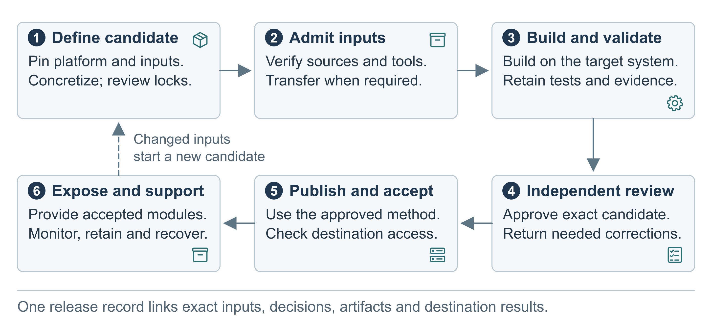
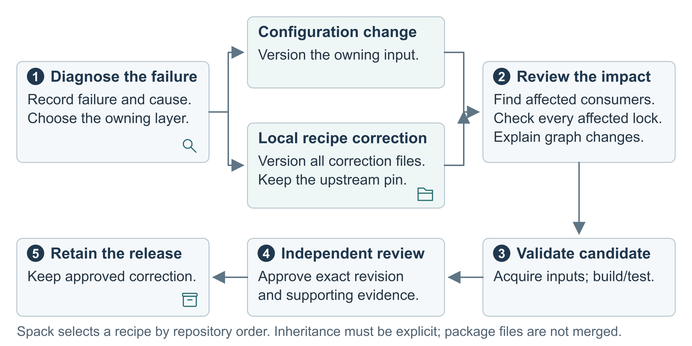
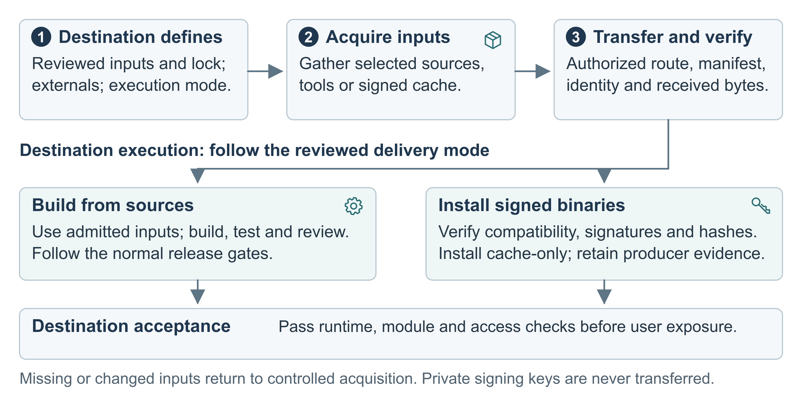

# Spack Build and Publication Procedure

Use this standard operating procedure (SOP) to prepare, build, test, and publish
software with Spack. It explains what to do, what to check, and what to keep so
another team member can review or repeat the work.

| Document control | Value |
|---|---|
| Status | Working draft |
| Review revision | 2026-09-16 |
| Audience | Package managers and reviewers using Spack on a supported system |
| Scope | Spack setup, package selection, review, source mirrors, transfer, building, testing, publication, and recovery |
| Command baseline | Spack 1.2.2; check the commands again before adopting another version |

## Review priorities

**Keep these practices.** Record exact input versions and local changes, verify
sources, build without administrator privileges, control access, use an
independent reviewer, test software and modules, and retain records for recovery.
Save results as you work. Reuse applicable results when the inputs have not changed.

**Confirm what applies.** Choose the steps for your role, system, transfer needs,
and publication method. Section 12 explains when to involve security staff.

Reviewers should confirm who will provide and maintain these controls:

| Review topic | Decision for reviewers | Sections |
|---|---|---|
| Network restrictions | Required restrictions, platform support, and proof that they work | 4.3, 9.3 |
| Security checks and testing | Spack/Python/bootstrap admission, scan coverage, tools, advisory updates, handling of findings, and specialist and scientific testing support | 4.4–4.5, 8.1, 9.3, 12 |
| Package signing | Cache type, key protection, trusted-key distribution, key replacement, and recovery | 10.1, 10.3 |
| Ongoing support | Staff for security updates, record retention, storage, and recovery checks | 12–14 |

These questions do not change the requirements below. For each proposed change,
record the affected section, reason, owner, and resources. Update the affected
procedures and required records before adopting it. Site requirements still
apply. A control listed in this draft still needs to be implemented and verified.

## 1. Purpose

The package manager chooses the software to build. The site provides a reviewed
**platform catalog**: configuration files that describe supported compilers,
hardware, and system-provided software. This procedure combines those choices
into a tested release.

A Spack **environment** holds the package requests and configuration for a build.
Its `spack.yaml` is a text configuration file.
A **spec** names a package and its constraints, such as version and build options
(called **variants**). Spack **concretization** resolves these requests to exact
packages and dependencies and writes them to `spack.lock`, the **lockfile**.
Each resolved package has a **hash**, which identifies its build specification.
A **candidate** is a proposed release being prepared for review. **Pinning** means
recording and using exact versions or revisions so they do not change during the work.

Use the operating record in Section 3 for actual paths, configuration, groups,
scheduler commands, security requirements, test criteria, retention periods,
and support contacts. Team policy may add requirements. The procedure uses
Spack's own commands and configuration; it does not require a particular
workspace preparation tool.



Figure 1. Build and release steps. Use the transfer and publication options approved for the system. Stop at any failed check and resolve it before continuing.

Each environment must select a supported compiler and its required tools, called
a **toolchain**. A successful build also needs passing runtime and module tests
before it can be published.

### 1.1 How to use this procedure

Follow the applicable sections in order. For transfers, follow the source and
destination sequence in Section 9.2.1. Stop at a failed required check. Record
unused branches as not applicable, with a reason; do not mark them as passed.

1. Complete the operating record in Section 3.
2. Admit and install the pinned Spack runtime, assess its supporting tools, and
   run the setup checks in Sections 4.4–4.5 before the first production solve.
3. Select one approved catalog release and its configuration scopes.
4. Prepare and review the environment files.
5. Concretize and review `spack.lock`.
6. Create source mirrors and transfer inputs when needed.
7. Build or install the candidate and test it on the destination node types.
8. Obtain independent review and publish only the approved package hashes.
9. Keep the source files, lockfile, results, and approval record.

Replace every `<placeholder>` with an approved value before running a command.
Shell variables can shorten commands, but save their actual values in the
operating record so they survive a lost session. Publication and transfer
examples assume a supported Linux shell and approved storage and transfer methods.

### 1.2 What to keep

Save command output as text files with the environment files, lockfile, file
inventories, checksums, and test programs. For each required test, record the
command, node, date, exit status, and output. Screenshots are optional and cannot
be the only record of a check.

### 1.3 How the platform catalog works

The **static platform catalog** is a versioned set of approved Spack configuration
for one system. Its **scopes** are named groups of configuration files that an
environment includes. It lists supported compilers, processor targets, Message
Passing Interface (MPI) implementations for parallel programs, graphics
processing unit (GPU) support, and **externals**: software supplied outside
the managed Spack installation. A **provider** is the selected implementation of a capability, such
as MPI. The catalog records which combinations are supported.

The catalog includes valid configuration files and an inventory of their paths,
sources, supported combinations, and approval. Select scopes from that inventory
for your environment. Section 6.1 lists the required contents. The site may
choose its own catalog layout and preparation tools. Package selection and
installation paths remain the package manager's or site's deployment choices.

## 2. Responsibilities

| Role | Responsibility |
|---|---|
| Package manager | Choose packages and catalog scopes, prepare the environment, build, test, and keep the release record. |
| Technical reviewer | Independently check inputs and changes, the lockfile, test and scan results, module behavior, and publication records. |
| Release authority | Approve publication under the team's normal process. |
| Platform or transfer owner | Confirm destination compatibility, enforce network restrictions, provide approved transfer handling, and manage system externals. |
| Security reviewer or responsible security authority | Review security questions outside the agreed requirements. Exception decisions follow the local approval process. |

Use two people: one prepares the build and results; the other reviews and records
a decision before publication. The reviewer may also approve release when the
team delegates that authority. Roles may alternate between releases, but builders
cannot approve their own work. If the reviewer is unavailable, hold publication
until a named alternate can review. The reviewer need not repeat every build command.

The responsible release, system, or security authority may designate a
qualified reviewer from outside the producing team for independent scrutiny
or specialist expertise. Record organization, qualifications, independence,
scope, evidence reviewed, and disposition. Use authorized evidence access;
review assignment alone confers no build-write, signing, publication, or
risk-acceptance authority. A reviewer must remain independent of changes to
the candidate, regardless of team membership.

Routine releases use the team's agreed review process. Involve security staff
for the triggers in Section 12. Publishing a module in a centrally managed
module namespace also needs its owner's approval.

## 3. Required inputs

Record these before concretization:

- the target system and node types for builds and runtime tests;
- the approved catalog path, release, inventory, approval, and allowed users;
- the compiler and any matching MPI and GPU scopes;
- requested packages (**roots**), versions, variants, and dependency constraints;
- the exact Spack version and package-recipe source;
- installation, build-stage, cache, view, and module paths;
- filesystem ownership and access rules; and
- the team's release identifier.

A **recipe** is the package's build instructions in `package.py`. The **install
tree** stores installed packages, each in its own **prefix** directory. A **build
stage** holds temporary build files. A **view** brings selected installed files
under one directory. **Environment modules** let users select installed software
and set the shell environment needed to use it.

### 3.1 Operating record

Create a release worksheet as a tracked text file, ticket, or database record.
Fill every actual-value field before the setup checks in Section 5.

| Item | Shell name used in this SOP | Actual value required |
|---|---|---|
| Target system | `STACK_SYSTEM` | System name |
| Application release | `STACK_RELEASE` | Release identifier that will not be reused or changed |
| Catalog release root | `CATALOG_RELEASE_ROOT` | Absolute path to one approved catalog release |
| Catalog inventory and usage record | `CATALOG_RECORD` | Absolute path to its contents, supported selections, and approval record within the release; Section 6.1 |
| Environment directory | `ENVIRONMENT_ROOT` | Absolute path containing `spack.yaml` |
| Approved Spack checkout | `SPACK_ROOT` | Absolute path to the pinned checkout |
| Spack version | `SPACK_VERSION` | Approved version and commit |
| Starting Python | `SPACK_PYTHON` | Absolute approved interpreter path, version, provider/package identity, and assessment reference |
| Spack toolchain admission | Operating record | Spack checkout/archive and vendored-library inventory; host prerequisites; bootstrap bundle and installed-tool inventory; digests, scan coverage, findings, reviewer, and acceptance scope; Sections 4.4–4.5 |
| Package repositories | Release record | Each approved upstream and local source, commit or checksum, namespace, and search order |
| Per-user Spack state | `SPACK_USER_CACHE_PATH` | Absolute path private to the builder |
| Bootstrap configuration | `BOOTSTRAP_CONFIG_DIR` | Absolute path to an approved scope outside the Spack checkout; Section 4.5 |
| Build stage | `SPACK_STAGE_ROOT` | Absolute path the builder can write to |
| Install tree | Site configuration | Absolute package-store path chosen by the application team |
| Source cache | Site configuration | Absolute shared-cache path populated during approved source fetching |
| Miscellaneous cache | Site configuration | Absolute shared root, divided by builder when required |
| Build cache | Release configuration | Approved private or published mirror address and trust rules |
| View root | Environment configuration | Absolute view path, or `none` |
| Module root | Environment configuration | Absolute module path, or `none` |
| Build group | Deployment record | Approved Unix group |
| Build and runtime nodes | Deployment record | Login, build, and test node types |
| Reviewer and release authority | Release record | Named people or approving roles |
| Connectivity and transfer | Release record | Available network access, approved source-acquisition node, and transfer method when needed |
| Mirror and bundle identity | Release record | Source-mirror path, signed binary-cache address if used, archive checksum, and source and destination checks |
| Security requirements | Operating record | Review triggers, approved scans, network policy, exception authority, and transfer authorization |
| Acceptance and support | Operating record | Required tests and tolerances, support contacts, retention and notification periods |

A **source mirror** holds downloaded source files for later builds. A **build
cache** holds built packages for later installation. A **checksum**, also called
a digest, lets you check that a file's contents match the recorded value. Keep
these file checksums distinct from Spack's package hashes.

Set the recorded paths first. These exports do not approve or start Spack;
complete Section 4.4 before sourcing its setup script or running its commands.

```bash
export STACK_SYSTEM="<system>"
export STACK_RELEASE="<application-release>"
export CATALOG_RELEASE_ROOT="<absolute-catalog-release-root>"
export CATALOG_RECORD="<absolute-catalog-inventory-and-usage-record>"
export ENVIRONMENT_ROOT="<absolute-environment-directory>"
export SPACK_ROOT="<absolute-approved-spack-root>"
export SPACK_VERSION="1.2.2"
export SPACK_TAG="v1.2.2"
export SPACK_COMMIT="<approved-full-spack-commit>"
export SPACK_PYTHON="<absolute-approved-python-executable>"
export SPACK_STAGE_ROOT="<absolute-build-stage>"
export BOOTSTRAP_CONFIG_DIR="<absolute-approved-bootstrap-config-directory>"

export SPACK_DISABLE_LOCAL_CONFIG=true
export SPACK_USER_CACHE_PATH="<absolute-per-user-cache-root>/$USER/spack/$SPACK_VERSION"
export PYTHONDONTWRITEBYTECODE=1
```

Prepare the tools and configuration in Sections 4.4–4.5 before concretization
or any command that may install Spack's supporting tools. Later examples
explicitly include that configuration so the same trust rules apply.

## 4. Storage, access, and Spack runtime

Keep these locations separate:

- the pinned Spack installation;
- installed packages;
- the build workspace;
- shared source and package-manager metadata caches;
- each builder's stages and temporary state;
- build caches;
- views and modules; and
- release records and test results.

Use an approved, pinned Spack installation and record its version, source, and
commit where applicable. Do not put packages or changing build files inside the
Spack checkout.

Give each builder their own temporary Spack state:

```bash
export SPACK_DISABLE_LOCAL_CONFIG=true
export SPACK_USER_CACHE_PATH="<approved-per-user-cache-root>/$USER/spack/<version>"
```

Keep verification keys and authorized signing keys in private per-user or
approved site locations outside the Spack installation and package store.
Never include private release-signing keys in a workspace or transfer bundle.
Follow Section 10.1 for signing.

The shared workspace must be writable by the approved build group while the
release is prepared. Record that Unix group for each stack and keep it unchanged
for the release. Different stacks may use different groups. Use setgid
directories, which pass their group to new entries, and the site's default
access control list (ACL) or `umask` permission rules. Published users outside
the build group may read and run software, but may not change it.

Record shared and private paths before starting:

| State class | Normal policy |
|---|---|
| Shared build state | Workspace, generated environments and lockfiles, source cache, package store/database/locks, views, modules, file-backed build cache, and release results. Only the approved build group may write. |
| Shared state divided by builder | Changing package-manager metadata may use a persistent `$USER` directory when concurrent replacement is unsafe. Keep it accessible to the build group for handoff and recovery. |
| Builder-private state | Build stage, `SPACK_USER_CACHE_PATH`, bootstrap state, and temporary command files. Each builder creates their own paths. |
| Signing state | Private keyring reserved for the authorized signing role, outside build workspaces. Build and publication processes receive no private signing key; Section 10.1 defines the separate verification keyring. |
| Spack installation | Shared and read-only, or an unchanged local checkout of the same approved revision. Never use it as a cache or package store. |

Permission defaults do not override software that creates private `0600` files
or `0700` directories. Correct permissions on builder-created shared content
outside installed package directories, and have another group member verify
access before handoff. A typical restricted policy uses `2770` directories,
`0660` ordinary files, and `0770` executables. Use Spack's package-permission
configuration for installed packages; do not apply a blanket recursive `chmod`
across the package database and prefix locks.

### 4.1 Installed package permissions

Set installed-package permissions in deployment configuration, outside the
platform catalog. For a published stack managed by a package-manager group, use:

```yaml
packages:
  all:
    permissions:
      group: <approved-package-manager-group>
      read: world
      write: group
```

Place this under `spack.packages` in `spack.yaml`, or in a `packages.yaml` scope
included by the environment. Every environment writing to the same install
tree must use the reviewed access policy. Keep that policy file with the release.

Check the merged settings before installation:

```bash
spack -C "$BOOTSTRAP_CONFIG_DIR" -e "$ENVIRONMENT_ROOT" config get packages
```

Published permissions are `2775` for directories, `0775` for executables, and
`0664` for ordinary files. The owner and approved group can write; others can
read and run. The leading `2` sets group inheritance. It is not the sticky bit
(the leading `1`), which this policy does not use.

For restricted builds, change `read: world` to `read: group` and retain
`write: group`. Normal permissions are then `2770`, `0770`, and `0660`. Keep
the private build cache restricted. General users access the final installed
packages, views, and modules, rather than that cache.

### 4.2 Where configuration belongs

Keep package choices separate from system paths and access rules:

| Information | Record it in | Spack configuration |
|---|---|---|
| Observed compilers, MPI, GPU, operating system, and externals | Reviewed platform records kept with the catalog | Selected package, compiler, target, and provider scopes |
| Package names, versions, variants, dependencies, and compiler/provider choices | The package manager's `spack.yaml` | `spack.specs` and explicit compiler or toolchain constraints |
| Installation, stage, cache, view, module, build-cache destination, and access settings | Deployment record with the actual values from Section 3 | `config.yaml`, `packages.yaml`, `modules.yaml`, mirror configuration, and view paths |
| Site defaults for providers and package selection | Reviewed defaults and catalog policy | Included configuration scopes |

Make a correction in the file that owns the setting. Put package constraints
and compiler/provider selections in the environment or reviewed `packages.yaml`
scopes. Put paths, access, mirrors, views, and module naming in deployment
configuration. Ask the catalog owner to correct inaccurate platform facts and
provide a reviewed revision.

Use a local recipe or source patch only when the recipe or source needs a build
fix; follow Section 7.6. Version that change separately to keep the upstream
repository pinned. Do not put deployment paths or routine package choices in a
recipe to avoid correcting configuration. Retained changes still need the
Section 12 process and applicable release checks.

Shell variables can shorten commands, but save reviewed values in the environment
files, deployment record, lockfile, and release record. Before concretization,
check that the merged configuration explicitly sets at least:

```yaml
config:
  install_tree:
    root: <absolute-install-tree>
  build_stage:
    - <absolute-per-builder-stage>
  source_cache: <absolute-reviewed-source-cache>
  misc_cache: <absolute-builder-misc-cache>
  locks: true
```

Keep `SPACK_USER_CACHE_PATH`, bootstrap state, and signing keys private to the
active builder, outside shared configuration. Configure build-cache mirrors
separately from source caches; approving source files does not approve built
packages for publication.

For modules, record whether generation is enabled, the absolute output path,
naming rules, dependencies to load, and conflicts to enforce. The package manager
chooses these details and keeps the generated `modules.yaml` with the release.

Check the merged settings; another scope may override the intended file:

```bash
spack -C "$BOOTSTRAP_CONFIG_DIR" -e "$ENVIRONMENT_ROOT" config get config
spack -C "$BOOTSTRAP_CONFIG_DIR" -e "$ENVIRONMENT_ROOT" config get packages
spack -C "$BOOTSTRAP_CONFIG_DIR" -e "$ENVIRONMENT_ROOT" config get mirrors
spack -C "$BOOTSTRAP_CONFIG_DIR" -e "$ENVIRONMENT_ROOT" config get modules
spack -C "$BOOTSTRAP_CONFIG_DIR" -e "$ENVIRONMENT_ROOT" config scopes -vp
```

### 4.3 Review inputs and protect approved releases

Review the Spack installation, repositories, recipes, patches, sources, externals,
and binary caches as separate inputs. A checksum confirms that downloaded bytes
match the recipe's recorded checksum. It does not show that the recipe, source,
or dependency is safe. Likewise, a lockfile records the selected packages but
does not replace recipe review or vulnerability checks.

| Required check | Result needed |
|---|---|
| Approve inputs, Section 8.1 | Exact tool and repository revisions, complete inventory, risk-based review, and decisions on scan findings |
| Acquire and transfer, Sections 9.1–9.2 | Approved mirrors, a complete bundle when needed, and matching file checks at both systems |
| Build and test, Section 9.3 | Build without administrator privileges, enforced network restrictions, target-system tests, and saved results |
| Review and release, Sections 10.1–10.4 | Independent review, approved signing key, exact accepted package hashes, controlled publication, and inventories |
| Maintain, Sections 12–14 | Security advisory handling, recorded exceptions, retention, withdrawal, and rollback |

The build group can change working files while preparing a candidate. Once
inputs or a release are approved, freeze that version: save checksums and
approval records, restrict writes using site storage controls, and verify
checksums before use or handoff. Group ownership alone does not prevent changes.
Changed approved content needs a new recorded identity and review.

Record approved scanners, advisory sources, network restrictions, hardening
requirements, and who can approve exceptions. Keep actual results and pass
criteria. Planned checks do not count as completed checks. Hold and escalate
unresolved requirements under Section 12.

### 4.4 Check the Spack version and repositories

This section installs and approves **Spack itself**, before it is used to build
application packages. Apply it to the builder's Spack and to any separate
Spack used for signing or managed binary installation. An application lockfile
or package SBOM does not inventory that complete toolchain.

#### 4.4.1 Acquire and admit the runtime before executing it

1. Record the approved origin, release tag, full commit, and target runtime
   requirements. The full commit is the pin; retain evidence connecting it to
   the approved origin. Choose an unused versioned directory for a new runtime.
   Reuse a shared installation only when its identity and admission record match.
2. On the authorized intake system, acquire the candidate with already approved
   download, Git, extraction, and scanning tools. Keep it in restricted staging.
   Do not source its setup script or run its Python code to establish its own
   initial approval. For a Git delivery, the acquisition and identity checks are:

```bash
export SPACK_ORIGIN="<approved-spack-git-origin>"
git clone --no-checkout "$SPACK_ORIGIN" "$SPACK_ROOT"
git -C "$SPACK_ROOT" checkout --detach "$SPACK_COMMIT"
test "$(git -C "$SPACK_ROOT" rev-parse HEAD)" = "$SPACK_COMMIT"
test "$(git -C "$SPACK_ROOT" rev-parse "${SPACK_TAG}^{commit}")" = "$SPACK_COMMIT"
test -z "$(git -C "$SPACK_ROOT" status --porcelain)"
```

   For an archive delivery, verify its SHA-256 against the authenticated intake
   record before extraction; retain the archive, origin, full source revision,
   and an extracted-file digest inventory. Check received and deployed files
   against that inventory. A digest obtained only from the same unreviewed
   download does not establish an approved origin. Follow Section 9.2 for transfer.

3. Inventory and assess the entire checkout, including vendored Python code.
   For Spack 1.2.2, retain `var/spack/vendoring/vendor.txt` and inspect the bundled
   files under `lib/spack/spack/vendor`; a host `pip list` is not a complete
   inventory of those copies. Match exact component versions/revisions against
   current vulnerability advisories and run required malware checks using the
   approved scanner and policy recorded below. Scan tools run from the approved
   intake environment, independently of the candidate Spack installation.
4. Separately verify the existing Python interpreter and system prerequisites
   against the host's approved inventory and security assessment. Record Python's
   provider/package revision and relevant modules and libraries, including any
   vendor backports. Use a supported interpreter accepted by the site; satisfying
   Spack's minimum Python version alone is not security approval. Spack must
   already have Python to start and does not bootstrap that starting interpreter.
5. Resolve required findings and coverage gaps, or retain an authorized exception
   under Section 12. Obtain independent review identifying the exact bytes and
   approved use. Approval for controlled provisioning/testing is distinct from
   approval for production builds or publication. Protect the admitted runtime
   from modification and retain its assessment outside the checkout.

**Required assessment record.** Name the organization-approved malware scanner
and vulnerability/software-composition-analysis (SCA) tool or advisory service;
record the exact invocation or job, tool and policy versions, vulnerability/feed
timestamp, scan time, input digests, covered components, results, exclusions,
errors, and reviewer decision. Record each unresolved component or unrecognized
version as a coverage gap, not a clean result. A source checkout or custom
bootstrap version may require explicit upstream-version/commit mapping and
documented advisory review. If the site has not selected the required tools,
coverage, and acceptance criteria, resolve that requirement before production use.
This SOP does not supply a built-in Spack vulnerability-scanning command.

#### 4.4.2 Activate and verify the admitted runtime

Create the external configuration directory and place the reviewed
`bootstrap.yaml` and local `repos.yaml` from Section 4.5 there before activation.
Start with bootstrap disabled until any required bootstrap inputs have passed
intake. Use an approved shell/Python environment; inherited Python module paths or startup customizations
must not add unreviewed code. After Section 3.1's exports, run:

```bash
test -x "$SPACK_PYTHON"
"$SPACK_PYTHON" --version
test -f "$SPACK_ROOT/share/spack/setup-env.sh"
test -r "$BOOTSTRAP_CONFIG_DIR/bootstrap.yaml"
test -r "$BOOTSTRAP_CONFIG_DIR/repos.yaml"
source "$SPACK_ROOT/share/spack/setup-env.sh"
SPACK_VERSION_OUTPUT="$(spack -C "$BOOTSTRAP_CONFIG_DIR" --version)"
printf '%s\n' "$SPACK_VERSION_OUTPUT"
test "${SPACK_VERSION_OUTPUT%% *}" = "$SPACK_VERSION"
SPACK_EXPECTED_PYTHON="$("$SPACK_PYTHON" -c 'import sys; print(sys.executable)')"
SPACK_SELECTED_PYTHON="$(spack -C "$BOOTSTRAP_CONFIG_DIR" python --path)"
printf '%s\n' "$SPACK_SELECTED_PYTHON"
test "$SPACK_SELECTED_PYTHON" = "$SPACK_EXPECTED_PYTHON"
test "$(git -C "$SPACK_ROOT" rev-parse HEAD)" = "$SPACK_COMMIT"
test "$(git -C "$SPACK_ROOT" rev-parse "${SPACK_TAG}^{commit}")" = "$SPACK_COMMIT"
test -z "$(git -C "$SPACK_ROOT" status --porcelain)"
spack -C "$BOOTSTRAP_CONFIG_DIR" config scopes -vp
```

For an approved archive without Git metadata, substitute the retained archive
and deployed-file digest checks for the Git checks. Save the Python identity,
Spack version, checkout identity, and scope output. Stop for any mismatch or
unexpected scope. Do not pull updates, switch branches, edit checkout-local
configuration, or replace the tool directory during a release. Install a new
version in a separate directory.

#### 4.4.3 Check the recipe repositories separately

Before concretization imports recipes, review their sources and any new or
changed executable inputs under Section 8.1. Complete the review against the
resolved dependencies afterward. Once the environment is prepared, inspect all
active repositories:

```bash
spack -C "$BOOTSTRAP_CONFIG_DIR" -e "$ENVIRONMENT_ROOT" config get repos
spack -C "$BOOTSTRAP_CONFIG_DIR" -e "$ENVIRONMENT_ROOT" repo list
spack -C "$BOOTSTRAP_CONFIG_DIR" -e "$ENVIRONMENT_ROOT" config scopes -vp
```

Compare each repository's source, commit or archive checksum, namespace, and
search order with the release record. Include local recipes (**overlays**),
imported helpers, and patches. Confirm each tree is clean or matches its approved
archive. Stop if an overlay is not recorded.

For this Spack version, `SPACK_DISABLE_LOCAL_CONFIG` disables user and system
configuration. Use `include::` to select the intended environment configuration.
Inspect all active scopes, repository order, security settings, and approved
command-line overrides. The variable or include list alone does not prove that
all settings are approved.

### 4.5 Prepare Spack supporting tools

**Bootstrapping** provisions missing Spack support tools, notably the Clingo
solver, GnuPG when needed, and patchelf for Linux binary relocation. It uses the
already running Python interpreter; assess that interpreter under Section 4.4.
Basic host utilities still need approved system provisioning. These tools and
their dependencies have their own inventory and admission record, separate from
the application environment's `spack.lock` and SPDX files.

Complete these steps before the first production solve or other operation that
may bootstrap. Installing from a reviewed application lockfile avoids solving
again, but still requires an admitted runtime and any installation helpers.

#### 4.5.1 Choose and restrict the provisioning path

Use one of two paths: approved preinstalled tools, or an approved local bootstrap
mirror. Acquire and scan any new tools, source/binary artifacts, and bootstrap
metadata on the authorized intake system; follow Section 9.2 for transfer.
Retain origin, artifact SHA-256, upstream component identity, dependency inventory,
and the Section 4.4 assessment record. The bundle can be prepared before an
application lockfile exists. For source provisioning, review its recipes,
patches, compilers, and complete build inputs as well as the resulting binaries.

Keep approved configuration in `$BOOTSTRAP_CONFIG_DIR` outside the pinned
checkout. Give each builder a private bootstrap working directory. For
preinstalled tools, use this `bootstrap.yaml`:

```yaml
bootstrap::
  enable: false
  root: <absolute-private-builder-bootstrap-root>
  sources: []
  trusted: {}
```

For an approved local bootstrap mirror, use this alternative after its metadata
and files pass the acquisition and transfer checks:

```yaml
bootstrap::
  enable: true
  root: <absolute-private-builder-bootstrap-root>
  sources:
    - name: local-binaries
      metadata: <absolute-admitted-bootstrap-root>/metadata/binaries
    - name: local-sources
      metadata: <absolute-admitted-bootstrap-root>/metadata/sources
  trusted:
    local-binaries: true
    local-sources: true
```

`bootstrap::` replaces the default public sources and trust list. List only
approved metadata actually supplied. Omit binary sources unless their runtime
and architecture compatibility is accepted. Save actual local paths in the
configuration. Bootstrap metadata trust and release-package signing trust are
separate decisions.

In the same `$BOOTSTRAP_CONFIG_DIR`, create `repos.yaml` pointing to the already
acquired, reviewed local recipe repository. Use the actual directory containing
`repo.yaml` and `packages/`, not the checkout root:

```yaml
repos::
  builtin: <absolute-approved-spack-packages-root>/repos/spack_repo/builtin
```

List any required approved overlay repositories explicitly, in their reviewed
precedence order. The `repos::` override replaces lower-scope repositories.
Entering bootstrap context, including bootstrap-store inventory, can initialize
the repository configuration; a remote descriptor can trigger a clone or fetch.
Prepare this local selection before those commands. If provisioning from sources,
the selected recipes and their build inputs must already have passed intake.

Spack's prebuilt bootstrap artifacts are verified against SHA-256 values in
bootstrap metadata; `trusted: true` or `bootstrap add --trust` does not establish
a release GPG signature or vulnerability approval. Admit the metadata and the
artifacts together. A Spack core pin fixes its bundled bootstrap metadata, but
does not itself approve the downloaded components. The application's recipe
snapshot age does not establish their age or security status.

Keep outbound access blocked except for the explicitly authorized acquisition
step. Local mirror configuration alone cannot enforce this: source provisioning
can use the configured recipe repositories and ordinary fetch paths. Review
those repositories and supply all required sources; block public-origin fallback
outside Spack. A missing approved input must stop provisioning.

#### 4.5.2 Provision, inventory, scan, and accept

First inspect the effective settings with the admitted runtime:

```bash
spack -C "$BOOTSTRAP_CONFIG_DIR" config get bootstrap
spack -C "$BOOTSTRAP_CONFIG_DIR" config get repos
spack -C "$BOOTSTRAP_CONFIG_DIR" bootstrap list
```

For preinstalled tools, keep bootstrap disabled and resolve missing tools through
the host's approved provisioning process. Check the actual approved Python's
Clingo import/version/path, the selected GnuPG executable, patchelf on Linux,
and required host utilities against the recorded compatibility requirements.
For example, after those inputs have passed intake:

```bash
spack -C "$BOOTSTRAP_CONFIG_DIR" python -c 'import clingo; print(clingo.__version__); print(clingo.__file__)'
"<absolute-approved-gnupg-executable>" --version
```

Check the approved patchelf executable's version on Linux as well. Retain the
external inventory and assessment; no bootstrap-store inventory is expected
for this path. In Spack 1.2.2, ordinary `bootstrap status` and `-b` store commands
require bootstrap to be enabled, so omit them for the disabled path. Do not
turn on provisioning to work around that command limitation.

For the admitted local-mirror path, provision in the approved restricted setup
context using:

```bash
spack -C "$BOOTSTRAP_CONFIG_DIR" bootstrap now
```

This command installs tools; it is not an inventory or scan command. Run it only
after approving the inputs, configuration, and execution context above. Do not
enable public sources or development tools to make a readiness check pass.

For that local-mirror path, record the actual installed inventory and readiness
after provisioning:

```bash
spack -C "$BOOTSTRAP_CONFIG_DIR" bootstrap root
spack -C "$BOOTSTRAP_CONFIG_DIR" -b find --json --deps
spack -C "$BOOTSTRAP_CONFIG_DIR" -b find -p
spack -C "$BOOTSTRAP_CONFIG_DIR" bootstrap status
```

For both paths, the inventory must cover any tools supplied externally through
the host or Python environment. The bootstrap-store inventory excludes those
tools. Record their actual paths, versions, provider/package identities, and
assessment references separately. Match installed components,
dependencies, and file digests to the admitted inputs; scan the installed tools
and assess the combined inventory against current vulnerabilities before
production use. Retain the commands/jobs and decisions defined in Section 4.4.
For source-built tools, retain build logs and assess the resulting components.

`bootstrap list` reports configured sources; `bootstrap status` checks tool
availability. Neither is a vulnerability scan. `spack audit`, package hashes,
and clean malware results also do not replace vulnerability matching. Resolve
findings and unexplained inventory differences, or obtain the scoped exception
required by Section 12. The independent reviewer records acceptance of the exact
toolchain and allowed target systems/uses. Reuse evidence for identical approved
inputs when its scope and freshness still apply; verify each builder's private
installation. Do not copy another builder's mutable state or signing material.

After Section 7 prepares an environment, repeat the merged configuration check
before concretization or installation:

```bash
spack -C "$BOOTSTRAP_CONFIG_DIR" -e "$ENVIRONMENT_ROOT" config get bootstrap
spack -C "$BOOTSTRAP_CONFIG_DIR" -e "$ENVIRONMENT_ROOT" config get repos
```

Stop if an environment changes the approved sources, trust settings, root, or
repository selection. Keep the same `-C` scope on later commands. Supporting
tools must be ready and accepted before production use; readiness alone is not
acceptance. Reassess on Spack, Python, bootstrap, or host-dependency changes and
when new vulnerability intelligence affects retained inventory (Section 12).

For Spack 1.2.2 behavior, see the official
[bootstrap configuration](https://github.com/spack/spack/blob/v1.2.2/etc/spack/defaults/bootstrap.yaml)
and [bootstrap command implementation](https://github.com/spack/spack/blob/v1.2.2/lib/spack/spack/cmd/bootstrap.py),
[starting Python selection](https://github.com/spack/spack/blob/v1.2.2/bin/spack#L12-L36),
[Python and repository handling during bootstrap](https://github.com/spack/spack/blob/v1.2.2/lib/spack/spack/bootstrap/config.py),
and [vendored library inventory](https://github.com/spack/spack/blob/v1.2.2/var/spack/vendoring/vendor.txt).

## 5. Preflight

Before building, check from the node types that will build and test the software:

- the catalog and selected scopes are readable;
- the catalog supports the chosen compiler and any MPI pairing;
- installation, cache, view, and module paths are reachable;
- another build-group member can read, write, and traverse shared generated files;
- the build stage is writable with enough space and file entries (inodes);
- the Spack version matches the approved version;
- the runtime and bootstrap admission record covers the actual Python, tools,
  dependencies, target, and effective configuration, with no unresolved required check;
- package recipes are available;
- required scheduler, launcher, interconnect (fabric), and GPU resources are available; and
- active scopes contain no unexpected user, system, or site configuration.

Inspect the scopes:

```bash
spack -C "$BOOTSTRAP_CONFIG_DIR" config scopes -vp
spack -C "$BOOTSTRAP_CONFIG_DIR" -e "$ENVIRONMENT_ROOT" config scopes -vp
```

Run the first command during initial setup. Run the environment command after
Section 7 creates `spack.yaml`, before concretization. Stop and correct the setup
if an unexpected scope could affect package resolution.

Check the proposed build stage from the intended build node:

```bash
export SPACK_STAGE_ROOT="<approved-build-stage>"
mkdir -p "$SPACK_STAGE_ROOT"
test -d "$SPACK_STAGE_ROOT"
test -w "$SPACK_STAGE_ROOT"
touch "$SPACK_STAGE_ROOT/.spack-write-test"
rm "$SPACK_STAGE_ROOT/.spack-write-test"
df -Pk "$SPACK_STAGE_ROOT"
df -Pi "$SPACK_STAGE_ROOT"
```

Confirm its quota, cleanup schedule, retention period, and mount options too.

Check the catalog:

```bash
test -d "$CATALOG_RELEASE_ROOT"
test -r "$CATALOG_RECORD"
find "$CATALOG_RELEASE_ROOT" -type f -print | sort
```

Compare files and checksums with the approved inventory. Check its compiler,
MPI, GPU, target, module, prefix, and external selections against the operating
record. Every selected scope must exist. Stop for a missing scope or an unresolved
provider dependency.

Preflight passes when the recorded paths and node types work, the Spack version
matches, its runtime and support tools are accepted under Sections 4.4–4.5, the
catalog is readable, and both scope listings contain only expected configuration.

## 6. Select platform configuration

### 6.1 Prepare and review a catalog

If you are using an existing catalog, go to Section 6.2. The catalog owner
prepares a versioned directory of Spack configuration, supporting platform
records, and a readable catalog record. The same requirements apply whether
prepared manually or with approved tools:

1. Record system and node types, compiler versions and identities, MPI, fabric, launcher, and GPU
   providers, central processing unit (CPU) targets, and system externals with
   their versions, prefixes, and required modules. Record the source of these
   facts and how and when they were verified.
2. Prepare valid configuration scopes usable by a Spack environment. Record
   relative paths, file inventories, and checksums. Check symbolic links and record their targets.
   The site chooses the directory layout.
3. Include a catalog record with the system, release, exact Spack version and commit,
   sources, preparation date, scopes and contents, and supported combinations.
   Explain scope selection and order, toolchain names, provider constraints,
   and supporting platform results. List unsupported combinations and unresolved
   limits. Use text, Markdown, or a documented structured format.
4. Record `CATALOG_RELEASE_ROOT` and `CATALOG_RECORD`; the record must be inside
   that release. Use a representative environment and the commands in Sections
   4.2 and 7.5 to inspect selected scopes. Compare merged values with platform
   results; valid file syntax alone does not show compatibility.
5. Record the independent reviewer, decision, date, and exact candidate identity.
   Support every claimed compiler/provider pairing and node type with results.
   Hold unsupported or unresolved selections.
6. Keep the candidate version and results. After required checks pass, publish
   under Section 10.2. Keep the full reviewed copy if publication uses another directory.

Maintain the catalog and inventory separately from the application release.
Package selection, installation and cache paths, views, module roots, and
permissions remain recorded deployment choices.

### 6.2 Select approved scopes

Use the exact scope paths in the catalog record. A normal environment includes:

1. common site configuration;
2. one compiler scope;
3. one target or platform scope;
4. a matching MPI scope for MPI builds; and
5. a compatible GPU scope for GPU builds.

Use the fixed path to one catalog release. A `current` pointer may help locate
it, but record and use the actual release directory in the environment. Approved
users must be able to read and traverse the published catalog. Only the approved
catalog-manager group may write, and no one edits a released version in place.

For corrections, update the owning inputs and prepare a new reviewed release.
Publish it with new approval records and checksums before moving `current`.
Retain or retire the old version under the recorded release policy.

Use `include::` to replace inherited include-list entries. Other scopes still
apply; inspect merged settings and precedence under Section 4.4. Published
environments must use absolute paths to the fixed catalog release. Replace
these example paths with those in the catalog record:

```yaml
spack:
  include::
    - <absolute-catalog-release-root>/scopes/common
    - <absolute-catalog-release-root>/scopes/compilers/<compiler>/<version>
    - <absolute-catalog-release-root>/scopes/mpi/<provider>/<version>/<compiler-flavor>
    - <absolute-catalog-release-root>/scopes/platform/<platform>
```

Use the toolchain name in the selected MPI scope's `toolchains.yaml`. A Serial
environment omits MPI and selects a compiler for each root. Do not duplicate
catalog-owned compiler, MPI, external-prefix, or module settings in the environment.

When using relative includes, keep the catalog and environment tree together;
copying `spack.yaml` alone leaves out required configuration. Use only documented
compiler/MPI pairings, not pairings inferred from module names or directories.

Save selected paths in the worksheet. Catalog selection passes when all paths
are in the approved inventory and resolve without unapproved overrides.

## 7. Define the environment

List root packages in `spack.yaml` using Spack spec syntax. Pin published versions
and important variants. At minimum:

- select an explicit compiler for every root built from source;
- disable MPI for Serial roots;
- enable MPI and select its provider for MPI roots;
- select the compiler, MPI provider, and GPU runtime for GPU roots;
- keep system software external where site policy requires;
- constrain dependency versions needed for compatibility; and
- choose unambiguous view and module names when multiple versions are present.

Use one environment or several separately concretized environments. Separate
them when compiler, MPI, GPU, or module conflicts require it.

### 7.1 Minimum Serial environment

Replace the placeholders with values from the operating record and catalog:

```yaml
spack:
  include::
    - <absolute-catalog-release-root>/scopes/common
    - <absolute-catalog-release-root>/scopes/compilers/<compiler>/<version>
    - <absolute-catalog-release-root>/scopes/platform/<platform>

  specs:
    - <package>@<version>~mpi %<compiler>@<compiler-version>

  concretizer:
    unify: false
    reuse: false

  view: false
```

Omit `~mpi` if the package has no MPI variant. Still select the approved compiler.
Add installation, view, and module policy before concretization.

### 7.2 Minimum MPI environment

Use this minimum MPI pattern:

```yaml
spack:
  include::
    - <absolute-catalog-release-root>/scopes/common
    - <absolute-catalog-release-root>/scopes/compilers/<compiler>/<version>
    - <absolute-catalog-release-root>/scopes/mpi/<provider>/<version>/<compiler-flavor>
    - <absolute-catalog-release-root>/scopes/platform/<platform>

  specs:
    - <package>@<version>+mpi %<catalog-toolchain-name>

  concretizer:
    unify: false
    reuse: false

  view: false
```

Read `<catalog-toolchain-name>` from the MPI scope's `toolchains.yaml`; do not
infer it from a provider or module name. Add a GPU scope and approved GPU variants
only for a GPU build.

### 7.3 Deployment configuration

Use paths from the reviewed deployment record in Section 4.2:

```yaml
spack:
  config:
    install_tree:
      root: <absolute-install-tree>
    build_stage:
      - <absolute-per-builder-stage>
    source_cache: <absolute-source-cache>
    misc_cache: <absolute-builder-misc-cache>
    locks: true
```

Add views and modules only when the release publishes them. Record their
absolute, application-owned paths before concretization. Set build-cache
locations and signature rules separately from source and miscellaneous caches.
Do not take deployment paths from the platform catalog.

### 7.4 Build dependencies in order

Spack 1.2 groups and `needs` can order packages that produce tools and packages
that use them. This example orders compiler, MPI, and application builds:

```yaml
spack:
  packages:
    c:
      prefer: [gcc@<version>]
    cxx:
      prefer: [gcc@<version>]
    fortran:
      prefer: [gcc@<version>]
    mpi:
      require: [openmpi]

  specs:
    - group: compiler
      specs:
        - gcc@<version>

    - group: mpi
      needs: [compiler]
      specs:
        - openmpi@<version> %<catalog-toolchain-name>

    - group: applications
      needs: [compiler, mpi]
      specs:
        - hdf5@<version>+mpi+fortran %<catalog-toolchain-name>

  concretizer:
    unify: false
    reuse: false
```

The toolchain chooses compiler and MPI providers for the languages and virtual
packages each root uses. `needs` orders groups and makes earlier groups' package
hashes available; it does not select providers. Preferences alone do not enforce
those selections.

When the stack builds its own compiler, create new lockfiles without reusing
existing concrete specs. Then reuse identical package hashes through the shared
install tree, build cache, and Spack locking. This avoids carrying forward a
dependency graph built with the initial compiler. When using an external compiler,
the existing reuse policy may remain because the stack does not manage that compiler build.

### 7.5 Check the prepared workspace

Inspect all environment and configuration files before concretization, including
files received from another operator. The workspace needs its `spack.yaml` files,
existing reviewed lockfiles, referenced configuration, and accessible pinned
repositories and overlays. Its operating record identifies the system, release,
catalog, package choices, deployment settings, paths and checksums, repository
versions, and responsible people. No special layout or metadata filename is required.

For each recorded environment, run:

```bash
test -r "$ENVIRONMENT_ROOT/spack.yaml"
spack -C "$BOOTSTRAP_CONFIG_DIR" -e "$ENVIRONMENT_ROOT" config scopes -vp
spack -C "$BOOTSTRAP_CONFIG_DIR" -e "$ENVIRONMENT_ROOT" config get config
spack -C "$BOOTSTRAP_CONFIG_DIR" -e "$ENVIRONMENT_ROOT" config get packages
spack -C "$BOOTSTRAP_CONFIG_DIR" -e "$ENVIRONMENT_ROOT" config get mirrors
spack -C "$BOOTSTRAP_CONFIG_DIR" -e "$ENVIRONMENT_ROOT" config get modules
spack -C "$BOOTSTRAP_CONFIG_DIR" -e "$ENVIRONMENT_ROOT" config get repos
```

Relative `include::` paths must resolve within the saved workspace or associated
catalog tree. Transfer that full tree. Record and verify external absolute paths
on the destination. If remote configuration or repositories will be unreachable,
prepare reviewed local copies before transfer.

Compare merged paths, access, compilers, targets, providers, and module settings
with the record. Verify file identities and repeat the checks with the receiving
builder's Spack installation. Confirm shared access before handoff. If configuration
must change, correct its owning input and prepare a new candidate. Keep earlier
lockfiles, build output, and results instead of overwriting the old workspace.

<a id="procedure-local-corrections"></a>

### 7.6 Maintain local package corrections

A local recipe repository lets you fix build behavior while keeping the upstream
repository pinned. Record the local repository's own revision or archive checksum.
Its recipes are executable inputs, so they need the same approval, review,
transfer, and retention checks as upstream recipes. First use Section 4.2 to
check whether the fix belongs in configuration.



Figure 2. Local package corrections. Record each correction's version and check every environment that uses it. Sections 7.6.1 through 7.6.5 give the steps.

For an unqualified package name, Spack uses the first configured repository that
contains it. It does not merge `package.py` files. A local recipe can explicitly
inherit the pinned upstream package class and add a limited patch or override.
Preserve existing behavior, including any recipe-specific builder class. If you
replace a recipe completely, review the behavior being replaced. See
[Spack repositories and recipe inheritance](https://github.com/spack/spack/blob/v1.2.2/lib/spack/docs/repositories.rst).

#### 7.6.1 Record the failure and proposed fix

Keep the failing command and log, package and compiler versions, variants, target,
environment, package hash, upstream recipe/repository revision, and existing local
files. Identify the cause before choosing where to fix it. If adapting an upstream
fix, record its exact revision and check it against the pinned recipe and source.
The fix need not change the full upstream repository pin.

Prepare the complete updated `package.py`, all referenced patches and helpers,
a diff, and a test plan. Keep existing local fixes that still apply. Limit the
new fix to the package and compiler versions, variant, platform, or target supported by the
failure evidence, and explain that choice. The same review applies regardless
of how the files were written.

#### 7.6.2 Select or create the local repository

Use the approved repository that already holds this package's corrections. For
a new repository, choose a managed path and namespace, record ownership and
access under Section 4, and initialize it once:

```bash
export LOCAL_REPO_PROJECT="<absolute-new-local-repository-project>"
spack -C "$BOOTSTRAP_CONFIG_DIR" repo create \
  "$LOCAL_REPO_PROJECT" local_overlay
export LOCAL_REPO_ROOT="$LOCAL_REPO_PROJECT/spack_repo/local_overlay"
test -r "$LOCAL_REPO_ROOT/repo.yaml"
```

Spack 1.2.2 creates a repository using version 2 of its application programming
interface (API). Verify the reported path, namespace, and API version in
`repo.yaml`. For an existing repository, set `LOCAL_REPO_ROOT` to the directory
containing `repo.yaml`, retain its namespace, and skip initialization. The default layout is:

```text
<local-repository-root>/
  repo.yaml
  packages/
    <package-module>/
      package.py
      <referenced-local-patch-or-helper-files>
```

Use the pinned recipe's API v2 Python module spelling: for example,
`netlib-lapack` uses `netlib_lapack`. Record the repository and environment paths;
they need not share a directory. No generator or wrapper is required.

#### 7.6.3 Place and register the reviewed files

Coordinate with other builders using the repository. Before making changes,
keep the original recipes, merged configuration, and affected lockfiles. Do not
change accepted release inputs; create a new repository revision or snapshot.

Review under Section 8.1, then copy the complete recipe and listed supporting
files into its package directory. Recipes must reference their patch files.
Check completeness and group access before use. Record the commit or archive
checksum. Do not edit the cached upstream repository.

Add the local repository to the candidate environment's reviewed `repos`
configuration. For the example above, add this under the existing `spack:` section:

```yaml
  repos:
    local_overlay: <absolute-local-repository-root-containing-repo.yaml>
```

Add to the existing mapping; do not create a second `repos` key. Keep every
approved upstream entry and exact pin in its owning scope. Verify that the local
repository comes first for the affected package. Save configuration and actual
paths under Section 3; an unrecorded user-level `spack repo add` is insufficient.

#### 7.6.4 Check recipe selection and the fix

After reviewing executable recipe inputs, inspect the selected package's
repository order and recipe path without running the solver:

```bash
export PACKAGE_NAME="<affected-spack-package-name>"
spack -C "$BOOTSTRAP_CONFIG_DIR" -e "$ENVIRONMENT_ROOT" repo list
spack -C "$BOOTSTRAP_CONFIG_DIR" -e "$ENVIRONMENT_ROOT" \
  location --package-dir "$PACKAGE_NAME"
spack -C "$BOOTSTRAP_CONFIG_DIR" -e "$ENVIRONMENT_ROOT" python -c \
'import inspect, os, spack.repo
cls = spack.repo.PATH.get_pkg_class(os.environ["PACKAGE_NAME"])
print(inspect.getfile(cls))'
```

Both paths must point to the intended local recipe. Stop for an unexpected
repository, import error, or incompatible builder behavior. These checks do not
change existing lockfiles. Do not use an abstract `spack spec` query for this check;
it may resolve a new dependency graph. Read the upstream recipe from its verified
repository path when comparing the original version.

Test patches on a disposable copy of the exact pinned source, in their intended
order. Keep the original failure test and show that it passes after correction.
Test an unaffected case where applicable. Full build and runtime tests follow
the lockfile review below.

#### 7.6.5 Update affected lockfiles and test

Changing a recipe does not update package identities already in `spack.lock`.
Identify all affected environments and dependent packages. A compiler-specific
condition does not prove other hashes stay unchanged. Keep prior lockfiles and
full package listings.

For a candidate without a lockfile, continue to Section 8. For an existing lockfile,
review the impact and update one affected environment at a time. This command
allows replacement of locked entries and disables installed/build-cache reuse
during concretization:

```bash
spack -C "$BOOTSTRAP_CONFIG_DIR" -e "$ENVIRONMENT_ROOT" \
  concretize -f --fresh
spack -C "$BOOTSTRAP_CONFIG_DIR" -e "$ENVIRONMENT_ROOT" \
  find -c -d -L -N -v
```

Continue only after a successful solve. `-f` permits replacing existing entries;
`--fresh` controls reuse during concretization, not whether installation builds
from source. Compare the entire dependency graph with the saved version because
other packages may change. Check the recipe namespace, corrected package, and
dependent hashes. Resolve unexplained changes before building.

A narrower reuse policy is allowed after impact review, but it must not reuse
the defective package or dependency graphs containing it. Never force this
operation across accepted releases or delete installed packages to make a fix
appear effective. See
[Spack concretization options](https://github.com/spack/spack/blob/v1.2.2/lib/spack/spack/cmd/common/arguments.py).

Repeat Section 8's dependency review and Section 9's source approval, build,
and tests. If a changed lockfile needs missing sources, resources, or patches,
acquire and transfer them under Sections 9.1 and 9.2. Keep failing and passing
test results, required binary/runtime checks, and independent review. Sign and
publish under Section 10.

Keep the tested local repository revision with the release and make it available
to authorized builders. At a later upstream update, check for an equivalent
upstream fix. Remove a redundant local fix only through a new reviewed and tested candidate.

## 8. Concretize and review

Resolve the requested packages and keep the resulting lockfile:

```bash
spack -C "$BOOTSTRAP_CONFIG_DIR" -e "$ENVIRONMENT_ROOT" concretize --fresh
spack -C "$BOOTSTRAP_CONFIG_DIR" -e "$ENVIRONMENT_ROOT" find -c -d -l -v
spack -C "$BOOTSTRAP_CONFIG_DIR" -e "$ENVIRONMENT_ROOT" find -c -d -e -l -v
```

The first `find` lists all resolved packages and dependencies, including those
not installed. The second lists only externals. Review:

- root versions and variants;
- compiler choice;
- MPI and GPU providers;
- external modules and installation prefixes;
- CPU target;
- dependency versions and hashes;
- no MPI in Serial builds; and
- no unapproved providers or configuration.

Do not edit `spack.lock` by hand. Correct the environment or catalog selections
and concretize again. For an already locked candidate, use Section 7.6.5;
plain `concretize --fresh` preserves existing locked entries.

This step passes when a lockfile exists, each root matches the approved request,
providers and externals come from approved scopes, and all dependencies are
covered by the review below. Save both `find` listings. Recorded automated checks
with risk-based human review may cover unchanged dependencies; manual approval
of every package is not required.

<a id="procedure-review"></a>

### 8.1 Review package changes with a second person

Apply the team's recorded snapshot-admission rule, if one is adopted. Record
the upstream tag and full resolved commit, verified publication date and its
evidence, assessment date, calculated age, and decision. Compare actual age
with the required interval instead of assuming a release cadence or that the
preceding tag qualifies. A tag that moves or changed input returns to review.
Check current findings for the selected closure and assess new local changes
separately; they do not inherit an older upstream snapshot's age. Use authorized
exceptions for urgent remediation rather than waiting to fix a known problem.
Time-based eligibility never releases quarantined findings by itself or
replaces the source, build, scan, test, and review checks below.

1. **Record the starting point.** Inventory all locked packages and dependencies, repositories,
   imported recipe helpers, patches, source resources, bootstrap and build tools,
   and system externals. Link the separately accepted Spack/Python/bootstrap
   inventory and scan evidence from Sections 4.4–4.5. For the first release, record repository origins,
   pinned versions, available upstream checks, scan coverage, and risk criteria.
   There is no previous approval to reuse, but line-by-line review of every
   package is still not required.
2. **Compare later changes.** Compare with the last accepted lockfiles, repository
   commits, and external inventory. Keep the list of added, removed, and changed
   inputs. Identify the approved repository version supporting unchanged
   packages. Include shared helper changes that affect used recipes.
3. **Focus manual review.** Review local recipes and patches, changed download
   locations or checksum/commit rules, custom hooks, undeclared downloads during
   builds, security-sensitive packages, new providers, and significant scan
   findings. Select new third-party recipes for review based on source and risk.
   Explain which groups of changes needed deeper review and why. A repository
   update does not require rereading thousands of unchanged packages.
4. **Run required checks.** Use the site's source, recipe, dependency, and binary
   checks at the appropriate acquisition or build step. Record tools, rule or
   advisory versions, time, coverage, results, and gaps. A **software bill of
   materials (SBOM)** lists software components and dependencies. Producing an
   SBOM, checking Spack checksums, or running `spack audit` does not replace
   matching components against known vulnerabilities. Resolve findings or
   escalate them under Section 12 before continuing past the affected check.
5. **Obtain independent review.** The builder supplies the assessment and locked
   candidate. The reviewer checks the starting point, changes, manual-review
   choices, dependencies, providers, and decisions on findings. After Section 9,
   add build, test, and scan results, expected release hashes, and readiness to
   publish to the same review record. Review may happen in stages; final approval
   must identify the exact candidate and the checksums of both its files and the reviewed records.
6. **Save and follow the decision.** Record builder and reviewer names, dates,
   candidate and lockfile identities, scope, findings, decision (`accepted`,
   `changes required`, or `held`), and release authority. Return any changed review evidence
   to the reviewer. Complete independent review before signing and publication.

Use one release assessment for the full inventory, with deeper review based on
change and risk. Team policy may require extra review for particular components
or system conditions.

## 9. Build and validate

<a id="procedure-source-mirrors"></a>

### 9.1 Create and check source mirrors

Use an approved system with enough network access to collect the reviewed
inputs. First prepare the destination's reviewed platform configuration and
lockfiles. The collection system must not silently substitute its compiler, target
or external packages.

For login and compute nodes sharing a source cache, fetch all locked packages
and dependencies:

```bash
test -f "$ENVIRONMENT_ROOT/spack.lock"
spack -C "$BOOTSTRAP_CONFIG_DIR" -e "$ENVIRONMENT_ROOT" fetch -D
```

Installation may run on another node using the same workspace, source cache,
install tree, Spack version and lockfile. To move sources to another network,
create a separate source mirror for every locked destination environment:

```bash
export SOURCE_MIRROR_ROOT="<absolute-release-source-mirror>"
test -f "$ENVIRONMENT_ROOT/spack.lock"
mkdir -p "$SOURCE_MIRROR_ROOT"
spack -C "$BOOTSTRAP_CONFIG_DIR" -e "$ENVIRONMENT_ROOT" find -c -d -l -v
spack -C "$BOOTSTRAP_CONFIG_DIR" -e "$ENVIRONMENT_ROOT" mirror create \
  --all --directory "$SOURCE_MIRROR_ROOT"
```

In Spack 1.2.2, `--all` in an active concrete environment selects its roots and
dependencies, not every repository recipe. Repeat for all release environments
in the same reviewed mirror. Check the report for missing sources or failed downloads against every
retained lockfile and record whether the mirror is complete. Externals are not
fetched.
([Spack mirror procedure](https://github.com/spack/spack/blob/v1.2.2/lib/spack/docs/mirrors.rst#L142-L195))

Retain archives, resources and patches with their download locations, recipe
identities and checksums. Pin sources from version control to full, immutable
commits. For a mirror archive made from such a source, separately record how it
was produced from the reviewed commit and retain its digest. Spack 1.2.2 cannot
check that generated tar file against an ordinary recipe archive checksum.
Stop for unrecorded downloads or checksum failures; never disable verification
to finish the mirror.
([Spack version-control mirror verification](https://github.com/spack/spack/blob/v1.2.2/lib/spack/spack/stage.py#L669-L685))

Complete the approved intake checks and record the decision before approving
the mirror. Register it in the environment you manage:

```bash
spack -C "$BOOTSTRAP_CONFIG_DIR" -e "$ENVIRONMENT_ROOT" mirror add \
  --scope "env:$ENVIRONMENT_ROOT" --type source \
  admitted-sources "$SOURCE_MIRROR_ROOT"
spack -C "$BOOTSTRAP_CONFIG_DIR" -e "$ENVIRONMENT_ROOT" mirror list
spack -C "$BOOTSTRAP_CONFIG_DIR" -e "$ENVIRONMENT_ROOT" config get mirrors
```

Retain and review this mirror configuration with the candidate before use. If
the name already exists, check its value and use the reviewed update process.
A source mirror contains sources, not binary packages. Adding it does not stop
Spack from trying the original download locations. Enforce network restrictions
outside Spack; an attempted fallback fails this check.

<a id="procedure-disconnected-transfer"></a>

### 9.2 Transfer to a system with limited or no external network access

Follow this sequence when the destination cannot obtain all sources or build
inputs directly, including partially connected and fully air-gapped systems.
For classified or other controlled boundaries, follow the site's authorized
handling, scanning, release and import process. This SOP does not grant transfer
permission or choose media or a method for crossing that boundary. Record the
authorization and destination owner before assembling the bundle.



Figure 3. Transfer and destination checks. The destination defines its inputs and keeps its own acceptance results. Collect missing inputs through the approved process. Binary packages must pass producer validation, review and signing before transfer.

#### 9.2.1 Choose source building or binary installation

| Mode | Required destination evidence | Next action |
|---|---|---|
| Build from approved sources | Use the destination catalog and lockfile, approved compilers, providers and externals, and a complete set of sources and tools. | Build from the local mirror under network restrictions. Then validate, review, sign and publish. |
| Install approved signed binaries | Confirm hardware, operating system, binary interfaces, providers and externals are compatible. Retain approved hashes and keys, supported relocation paths and the complete signed cache. | Install from cache only into a controlled candidate store. Run local checks, then approve destination publication. |

For sources, complete Section 9.1, transfer under Sections 9.2.2–9.2.3, validate
under Section 9.3 and publish under Section 10. For binaries, the producer must
first complete Section 9.3, independent review and Section 10.1 signing; an
existing accepted cache may supply this record. Only then assemble and transfer
the signed cache under Sections 9.2.2–9.2.3.
The destination verifies and retains the producer's signatures and signing
record, completes local checks and follows the remaining Section 10 publication
requirements. Record separate producer and destination decisions.

Similar systems still need a compatibility check. Compare processor targets and features,
operating system, system C library and application binary interface (ABI),
compiler runtime, MPI, network fabric, launcher and GPU identities, external versions and
paths, and limits on moving installation paths. The platform owner records the
result. A matching name or Spack hash alone does not prove compatibility. If
compatibility fails or is uncertain, use source building with a new destination
candidate; review it and any revised lockfile before transfer. Both modes require
destination acceptance.

#### 9.2.2 Assemble and check the bundle before transfer

1. Use a dedicated release bundle. Include the approved source mirror for source
   builds, the signed cache from Section 10.1 for binary-only installs, or both
   if both modes are intended. Copy the whole binary mirror: root, index,
   manifests, signatures and content blobs, not just archives or the index.
2. Include the complete destination workspace, catalog snapshot and relative
   configuration tree; every `spack.yaml` and unchanged `spack.lock`; pinned
   Spack, package repositories and overlays; patches and resources; release records;
   and approval, scan, inventory and test evidence.
3. Include or preinstall at destination the exact approved Python, bootstrap tools,
   compilers, build tools and runtime requirements. Mirrors exclude system
   externals: retain their inventory and verify destination availability. A
   source mirror does not supply the complete installation of Spack and its supporting tools.
4. If bootstrap tools must be collected, use an already admitted Spack runtime
   on a compatible authorized intake system. The following command downloads
   inputs and can require supporting tools; assess those tools under Sections
   4.4–4.5 first. Use the separately recorded intake configuration and permitted
   origins, not the destination's local-only scope:

```bash
export INTAKE_CONFIG_DIR="<absolute-approved-acquisition-config-directory>"
export BOOTSTRAP_ROOT="<absolute-release-bootstrap-bundle>"
spack -C "$INTAKE_CONFIG_DIR" bootstrap mirror --binary-packages "$BOOTSTRAP_ROOT"
```

Retain its source and binary metadata, bootstrap cache and setup instructions.
This output is a candidate bundle. Apply the malware and vulnerability assessment
and independent admission in Sections 4.4–4.5 before destination provisioning.
Separately review and approve its origins, digests and destination
architecture and runtime compatibility. Bootstrap metadata needs its own trust
decision; an ordinary build-cache signature does not approve it. Follow Section
4.5 for destination bootstrap configuration. Do not change the pinned Spack
checkout or rely on user configuration disabled by this SOP.
([Spack bootstrap mirrors](https://github.com/spack/spack/blob/v1.2.2/lib/spack/docs/bootstrapping.rst#L148-L173))

5. Retain a bundle manifest: origin and destination, release identifiers, workspace
   and lockfile identities, repository and runtime identities, source and binary
   inventories, source-archive digests, expected signing fingerprints, bootstrap inputs,
   external requirements, selected mode and transfer authorization. Exclude
   private keys, credentials and another builder's working state.
6. Keep relative includes and mirror links inside the bundle. No required link
   may point to an absolute path available only at origin. Ensure extraction
   will not replace unrelated destination files. Preserve the directory
   structure and links, and freeze the inputs before packaging.
7. Create and verify the archive digest. After the approved assembly process
   fills a dedicated bundle directory, for example:

```bash
export TRANSFER_BUNDLE_ROOT="<absolute-complete-transfer-bundle>"
export TRANSFER_OUTPUT_ROOT="<absolute-transfer-output-parent>"
(
  set -euo pipefail
  cd "$TRANSFER_OUTPUT_ROOT" || exit 1
  test ! -e release-bundle.tar
  tar -C "$TRANSFER_BUNDLE_ROOT" -cpf release-bundle.tar .
  sha256sum release-bundle.tar > release-bundle.tar.sha256
  sha256sum --check release-bundle.tar.sha256
)
```

Use a fresh output directory outside the bundle for each transfer. Connect the
digest and manifest to the reviewed transfer record through the site's
authenticated record or signature process. An accompanying checksum alone does
not prove who approved the files. Before transfer, the reviewer checks
completeness, findings and the exact bundle digest.

#### 9.2.3 Receive, check and configure the bundle

1. Receive the archive in the approved intake area. Complete import checks and
   compare its digest with the independently authenticated origin record before
   extraction. Retain both sites' results:

```bash
export RECEIVED_ARCHIVE_ROOT="<absolute-received-archive-parent>"
export RECEIVE_ROOT="<absolute-new-destination-bundle-directory>"
(
  set -euo pipefail
  cd "$RECEIVED_ARCHIVE_ROOT" || exit 1
  sha256sum --check release-bundle.tar.sha256
  test ! -e "$RECEIVE_ROOT"
  test ! -L "$RECEIVE_ROOT"
  mkdir -p "$RECEIVE_ROOT"
  tar -C "$RECEIVE_ROOT" -xpf "$RECEIVED_ARCHIVE_ROOT/release-bundle.tar"
)
```

2. Check the extracted files against the manifest. Set up the approved local
   bootstrap configuration from Section 4.5 and repeat the runtime, repository,
   configuration, external and scope checks in Sections 4–7. Keep the workspace
   and relative `include::` paths intact. Configure approved local repository
   and deployment paths before use; retain the reviewed changes. If a dependency
   or platform identity must change, stop and create a new candidate. Do not
   silently reconcretize during import.
3. Configure only approved destination-local mirrors in the effective
   environment. A reviewed inline replacement looks like this:

```yaml
spack:
  mirrors::
    admitted-sources:
      url: file://<absolute-destination-source-mirror>
      source: true
      binary: false
    approved-binaries:
      url: file://<absolute-destination-binary-mirror>
      source: false
      binary: true
      signed: true
```

Omit a mirror entry if it is not part of the approved delivery. This fragment
changes only the mirrors; retain the rest of the reviewed environment. Inspect
local repositories and bootstrap configuration, then verify effective settings:

```bash
spack -C "$BOOTSTRAP_CONFIG_DIR" -e "$ENVIRONMENT_ROOT" config get mirrors
spack -C "$BOOTSTRAP_CONFIG_DIR" -e "$ENVIRONMENT_ROOT" config scopes -vp
```

Import a public release key only after its full fingerprint matches the
independently approved record, following Section 10.1. Finding a key in the
bundle or mirror does not establish trust.

4. The platform owner must enforce and record blocked outbound access to unapproved
   networks during fetch, bootstrap, build and installation, then verify it with
   the site's approved test. Mirrors do not prevent fallback downloads or
   downloads started by build scripts. Missing sources, tools, cache objects or
   keys stop the run. Collect a reviewed supplemental bundle through controlled
   intake; do not restore Internet access or bypass integrity or signature checks.
5. For source builds, fetch into the approved local source cache and install the
   locked packages in the restricted candidate area:

```bash
spack -C "$BOOTSTRAP_CONFIG_DIR" -e "$ENVIRONMENT_ROOT" fetch -D
spack -C "$BOOTSTRAP_CONFIG_DIR" -e "$ENVIRONMENT_ROOT" install \
  --only-concrete --use-buildcache=never --fail-fast
```

`--use-buildcache=never` blocks binary-cache use but can reuse existing or upstream
installations and declared externals. Use a clean or dedicated controlled store,
no unapproved upstream store, and separately approved externals. Record and
accept intended reuse. Record which packages were rebuilt; claim source
reconstruction only for those outputs.

For binaries, check mirror consistency and install approved hashes from cache
only into the controlled candidate environment and store at destination:

```bash
spack -C "$BOOTSTRAP_CONFIG_DIR" buildcache check-index --verify all <local-approved-binary-mirror>
spack -C "$BOOTSTRAP_CONFIG_DIR" -e "$ENVIRONMENT_ROOT" install \
  --only-concrete --use-buildcache=only --fail-fast
```

Apply Section 10.3's requirements for clean or controlled stores, signatures
and external approvals. A cache miss or relocation failure holds the candidate; it does
not permit source building in that store.

6. Run Section 9.3 on destination login and compute nodes, including applicable
   scheduler, MPI, network fabric, GPU and module tests. Retain local SBOM and external
   evidence and obtain independent review. A destination source build creates
   new outputs even if its concrete hashes match the origin. Sign accepted
   outputs through the authorized destination release process. Complete Section
   10 before making the release available to users.

Transfer passes only after recording the authenticated origin, received
digests, intake decision, complete local inputs, enforced network restrictions
and compatibility. Release also requires destination acceptance and review.

<a id="procedure-build-validation"></a>

### 9.3 Build and test on the target system

Use an account without elevated privileges in the restricted candidate area.
Record the approved network restriction and enter the required compute
allocation. Complete Section 9.1 source intake first, plus Section 9.2 transfer
and configuration checks when applicable.

For parallel installs, first check every lockfile. Give each process its own
writable user cache; never run the same environment twice. One process owns
each environment's view and module refresh. After parallel work stops, check shared
output permissions before handing work to another builder.

Install the reviewed locked packages and refresh their views and modules. If Section
9.2 already installed them, skip installation and continue with refresh and tests:

```bash
spack -C "$BOOTSTRAP_CONFIG_DIR" -e "$ENVIRONMENT_ROOT" install --only-concrete --fail-fast
spack -C "$BOOTSTRAP_CONFIG_DIR" -e "$ENVIRONMENT_ROOT" env view regenerate
spack -C "$BOOTSTRAP_CONFIG_DIR" -e "$ENVIRONMENT_ROOT" module tcl refresh --delete-tree -y
```

Regenerate views and modules only if the environment defines them. Otherwise
record those checks as not applicable.

Run the applicable checks:

- compile and run representative C, C++, and Fortran programs;
- check headers, libraries, embedded runtime library search paths and package
  metadata;
- test Serial packages with no MPI loaded;
- run scheduler-launched, multi-node MPI tests;
- confirm the launcher, network fabric and MPI provider;
- run GPU and GPU-aware MPI tests;
- check regenerated views and modules; and
- test clean login-node and compute-node sessions.

Choose numerical-correctness and representative performance tests for the
package's purpose, platform, changes and risk. Record cases, tolerances,
comparison baseline and results. Reuse unchanged-package evidence only when its
inputs, platform and test assumptions still apply; record why. Explain any
not-applicable check. A missing required result holds the candidate.

Retain configured security-check results, approved compiler-hardening settings
and scoped exceptions. Check installed-file integrity and linkage where
supported. These checks do not replace the vulnerability scanner. Before
approving hardening that may affect scientific results or runtime behavior,
complete required functional, numerical and performance tests.

Refresh each additional named module set using its reviewed `modules.yaml` name.
Do not create another namespace just for this example:

```bash
spack -C "$BOOTSTRAP_CONFIG_DIR" -e "$ENVIRONMENT_ROOT" module tcl -n <configured-module-set> refresh --delete-tree -y
```

Record `module avail`, `module show`, load, conflict and runtime results from
clean login and batch sessions. Compare selected paths and hashes. Two module
names for the same package must use the same accepted installation and conflict
as team policy requires. Check direct-dependency loads and version conflicts;
do not make every private indirect dependency a user module.

After parallel work stops, check shared outputs against the recorded groups and
permissions. A second
package manager must be able to reach and read required inputs and create, replace
and remove a controlled test file in each shared working root. Do not test on
package installations or database files. Preserve private keyrings, bootstrap
state and each builder's temporary state. Retain results for the reviewer.

Record `built`, `runtime-passed`, or `held`. Only `runtime-passed` environments
may be published. Every required compile, runtime, scheduler, MPI, GPU, view,
module, clean-session and permission test must record a successful exit status.
Unavailable required resources or missing results mean `held`.

## 10. Publish

Use the team's approved publication method and preserve the reviewed lockfile
and hashes. Final independent review of the exact candidate and evidence must pass
before signing or publication. Record whether you publish the accepted
installation directly or install it from a signed cache. Both require the same
acceptance and access checks, plus an authenticated release record whose source
and integrity have been verified. Apply Section 10.1
whenever using a binary cache.

<a id="procedure-signing"></a>

### 10.1 Sign packages and fill the approved binary cache

Use the release identity and authorized key custodian in the operating record.
Keep the private key in the restricted signing process. Obtain the approved
public key and full fingerprint through an authenticated record and compare
fingerprints before trusting the key. Verification uses a separate keyring of
approved public keys only, in a directory private to the operator:

```bash
export SPACK_GNUPGHOME="<absolute-verification-only-spack-keyring>"
spack -C "$BOOTSTRAP_CONFIG_DIR" gpg trust <verified-release-public-key-file>
```

A key arriving with a mirror is not automatically trusted. Avoid
`spack buildcache keys --install --trust` unless every mirror key is explicitly
approved. Keep old approved public keys while retained releases need them;
follow Section 12 for rotation, revocation or exposure.

Use a cache with a network address or filesystem path that supports native
Spack package signing. Spack 1.2.2 Open Container Initiative (OCI) caches do not
meet this signature procedure.
Configure the binary mirror separately from source mirrors:

```bash
export BINARY_MIRROR_ROOT="<approved-build-cache-path-or-url>"
export SIGNING_KEY_FINGERPRINT="<full-approved-signing-fingerprint>"
spack -C "$BOOTSTRAP_CONFIG_DIR" -e "$ENVIRONMENT_ROOT" mirror add \
  --scope "env:$ENVIRONMENT_ROOT" --type binary --signed \
  approved-binaries "$BINARY_MIRROR_ROOT"
spack -C "$BOOTSTRAP_CONFIG_DIR" -e "$ENVIRONMENT_ROOT" config get mirrors
```

Review this location before freezing the candidate; check its exact value if
already configured. The signer checks that every package to push belongs to
the accepted release. Push each approved non-external package and dependency
using its full concrete hash:

```bash
export SPACK_GNUPGHOME="<absolute-restricted-signing-keyring>"
spack -C "$BOOTSTRAP_CONFIG_DIR" -e "$ENVIRONMENT_ROOT" buildcache push \
  --signed --key "$SIGNING_KEY_FINGERPRINT" --update-index --fail-fast \
  "$BINARY_MIRROR_ROOT" /<approved-full-concrete-hash>
spack -C "$BOOTSTRAP_CONFIG_DIR" buildcache update-index --keys "$BINARY_MIRROR_ROOT"
spack -C "$BOOTSTRAP_CONFIG_DIR" buildcache check-index --verify all "$BINARY_MIRROR_ROOT"
```

Run this block only in the authorized signing context with its private key.
End that context before build or publication work. Destination and publication
installs return to the verification-only keyring; never copy the private key
there.

Do not use unsigned pushes or bypass signature verification in the normal
procedure. Retain signing identity, approved hashes, push results and index
digest. Finish the index before checksumming a transfer bundle. Transfer the
whole mirror, including manifests, signatures and content blobs. `check-index`
checks consistency; installation verifies package signatures. Spack 1.2.2 does
not sign the index itself. The separately authenticated release record must
therefore identify the permitted hashes and transferred mirror digest. Compare
that permitted set before installation.
([Spack signing and cache layout](https://github.com/spack/spack/blob/v1.2.2/lib/spack/docs/binary_caches.rst#L598-L704))

<a id="procedure-catalog-publication"></a>

### 10.2 Publish the reviewed static catalog

The catalog owner follows this procedure. The operating record defines when to
publish and who may use it. The catalog is configuration, separate from binaries.

1. Confirm Section 6.1 review of the catalog record, platform evidence, scopes
   and instructions. Check paths and instructions at the final location; users
   must not depend on inaccessible restricted storage.
2. Reserve a new versioned destination and staging directory under the same
   dedicated publication parent. Use the site's approved ownership or locking
   method to prevent simultaneous publication. Never overwrite a version.
3. Copy all reviewed files unchanged. Retain an auditable publication record of
   the catalog release, source identities, candidate digest, reviewer, approval,
   date, audience and destination. The site chooses its format and filename.
   Link the record and released-file inventory to the authenticated approval.
4. Create `SHA256SUMS` for every released regular file, including the publication
   record but excluding `SHA256SUMS`. Review links, ensure they resolve inside
   the release and record their targets. Apply the approved group and permissions:
   directories `2775`, executables `0775`, other files `0664`.

Prepare the publication record within the staging tree and set permissions
before running this example. The record is not Spack configuration. The system's
checksum utility using the 256-bit Secure Hash Algorithm (SHA-256) creates the inventory:

```bash
export CATALOG_STAGE="<absolute-new-catalog-staging-directory>"
export PUBLISHED_CATALOG="<absolute-new-versioned-published-catalog>"
export BUILD_GROUP="<approved-catalog-manager-group>"
export CATALOG_PUBLICATION_RECORD="<absolute-publication-record-within-staged-tree>"
(
  set -euo pipefail
  test -r "$CATALOG_PUBLICATION_RECORD"
  cd "$CATALOG_STAGE" || exit 1
  find . -type f ! -name SHA256SUMS -print0 \
    | sort -z | xargs -0 sha256sum > SHA256SUMS
  sha256sum --check SHA256SUMS
)
```

5. Recheck the staged files, including inventory ownership and permissions. Only
   after approval, publish the directory with one rename on the same filesystem:

```bash
(
  set -euo pipefail
  test ! -e "$PUBLISHED_CATALOG"
  test ! -L "$PUBLISHED_CATALOG"
  mv -T -n "$CATALOG_STAGE" "$PUBLISHED_CATALOG"
  test ! -e "$CATALOG_STAGE"
  cd "$PUBLISHED_CATALOG" || exit 1
  sha256sum --check SHA256SUMS
)
test -z "$(find "$PUBLISHED_CATALOG" -type d ! -perm 2775 -print -quit)"
test -z "$(find "$PUBLISHED_CATALOG" -type f -perm /111 ! -perm 0775 -print -quit)"
test -z "$(find "$PUBLISHED_CATALOG" -type f ! -perm /111 ! -perm 0664 -print -quit)"
test -z "$(find "$PUBLISHED_CATALOG" -perm -0002 -print -quit)"
test -z "$(find "$PUBLISHED_CATALOG" ! -group "$BUILD_GROUP" -print -quit)"
```

6. Test read and directory access, and denied writes with a user outside the management
   group. Test controlled management access with another group member. Retain
   checksum, permission, ownership and access results. Update any `current`
   discovery pointer only after acceptance; users pin the exact versioned path.
   Corrections require a new reviewed catalog release.

<a id="procedure-cache-publication"></a>

### 10.3 Install and accept the release from the cache only

Use validated packages from the approved cache in a separate publication
workspace. Prepare it from the same reviewed package and platform inputs,
repositories and release identity, with the approved publication deployment
record and audience. Keep referenced scopes intact; do not copy an entire
active working tree. Before installation, check effective configuration,
approved source and signed binary mirrors, bootstrap policy, expected hashes
and Section 4.1's package permissions: users can read; the approved group can write.

Use a clean or dedicated controlled publication store with no unapproved
upstream store. Cache-only options do not verify packages already installed;
externals are not supplied by the cache. Separately approve external identities
and retain their inventory. Install using the verification-only keyring with
no access to the signing private key. Check the public key's full fingerprint
against the authenticated approval before trusting it. Once validated packages
are in the approved cache, copy the approved lockfile and install:

```bash
export PUBLICATION_ENVIRONMENT_ROOT="<absolute-publication-environment>"
export SPACK_GNUPGHOME="<absolute-verification-only-spack-keyring>"

spack -C "$BOOTSTRAP_CONFIG_DIR" gpg trust <verified-release-public-key-file>
test -f "$PUBLICATION_ENVIRONMENT_ROOT/spack.yaml"
cp "$ENVIRONMENT_ROOT/spack.lock" "$PUBLICATION_ENVIRONMENT_ROOT/spack.lock"
spack -C "$BOOTSTRAP_CONFIG_DIR" -e "$PUBLICATION_ENVIRONMENT_ROOT" find -c -d -l -v
spack -C "$BOOTSTRAP_CONFIG_DIR" -e "$PUBLICATION_ENVIRONMENT_ROOT" install \
  --only-concrete --use-buildcache=only --fail-fast
```

Do not concretize this environment. A cache miss stops publication. Return to
the validated build, supply the missing approved hash and repeat the cache-only
install; never build unreviewed source here. A changed hash needs a new release
record.

Record and compare validated and published hashes before approval:

```bash
export EVIDENCE_ROOT="<absolute-evidence-path>"
mkdir -p "$EVIDENCE_ROOT"
spack -C "$BOOTSTRAP_CONFIG_DIR" -e "$ENVIRONMENT_ROOT" find -c -d --format '{hash}' | sort -u \
  > "$EVIDENCE_ROOT/validated-hashes.txt"
spack -C "$BOOTSTRAP_CONFIG_DIR" -e "$PUBLICATION_ENVIRONMENT_ROOT" find -c -d --format '{hash}' | sort -u \
  > "$EVIDENCE_ROOT/published-hashes.txt"
diff -u \
  "$EVIDENCE_ROOT/validated-hashes.txt" \
  "$EVIDENCE_ROOT/published-hashes.txt"
```

For direct publication of the validated install tree, freeze it after view,
module, permission and clean-session tests pass. Never change an accepted
release in place.

Generate or refresh views and modules only after installation. When publishing
multiple versions, use version-sensitive module names, dependencies and
conflicts. If a package's public build or runtime interface includes a direct
dependency, its module must load that exact compatible dependency module. Do
not automatically load private indirect dependencies. Use package-family
conflicts to prevent users from replacing the dependency with another published
version in the same session. At minimum, test the data-file libraries NetCDF-C
and HDF5 when both are included.

Compare the listings with the authenticated approved release inventory. Also
retain installed-package listings proving every required non-external hash is
installed: copied lockfiles alone do not prove installation. Before making
module defaults available, complete all applicable Section 9.3 destination and
cross-user access checks. Publication requires matching validated and published
hashes, passing runtime and module tests in clean sessions, user read and execute access,
no writes from outside the approved package-manager group, a successful
controlled write test by a second group member, and recorded release-authority
approval.

### 10.4 Keep SBOMs and a separate external-package inventory

For each non-external package installation, Spack 1.2.2 writes an SBOM in
Software Package Data Exchange (SPDX) 2.3 format:

```text
<package-prefix>/.spack/sbom/spdx-2.3.json
```

Locate an accepted package and retain the producer's SBOM and checksum:

```bash
spack -C "$BOOTSTRAP_CONFIG_DIR" -e "$ENVIRONMENT_ROOT" location -i /<approved-full-concrete-hash>
sha256sum <approved-package-prefix>/.spack/sbom/spdx-2.3.json
```

Record name and version, full hash, installation path, SBOM location and digest.
Keep the producer SBOM and approved scan result as release evidence outside the
published installation. Binary installation can regenerate SBOM metadata, so
producer and consumer files may differ for the same hash. Record the consumer
copy separately; compare component identities and dependencies with the approved
release and investigate substantive differences. Inventory and assess externals
separately because Spack does not generate their SBOMs. An SBOM lists components;
it does not assess vulnerabilities.
([Spack SBOM generation](https://github.com/spack/spack/blob/v1.2.2/lib/spack/spack/hooks/sbom_generate.py),
[binary installation hooks](https://github.com/spack/spack/blob/v1.2.2/lib/spack/spack/binary_distribution.py#L2163-L2174))

Also retain the separate Spack checkout/vendored-library, starting-Python,
host-prerequisite, and bootstrap-tool inventory from Sections 4.4–4.5. Application
SPDX files do not automatically cover those execution tools. Bind both inventories
and their assessments to the release record, including the managed installer's
toolchain when it differs from the builder's.

## 11. User access

Publish modules under the application's established module root, which should
already be on users' `MODULEPATH`. Users load any documented compiler or lane
entry modules first, then select a package:

```bash
module load <package>/<version>
```

Use `module use` only for a private, test or newly introduced module root;
document that path with the release.

Check user access through module trees, views, external runtime paths and package
installations from login and compute nodes. Users outside the approved
package-manager group must not have write access. Authorized manager writes
still follow the release procedure; unrecorded package or configuration changes
require a new release.

## 12. Changes, security events, and platform updates

For an accepted or published stack, create a new release record when changing
a root spec, version, variant, recipe,
patch, repository revision or order, compiler, MPI, GPU provider, catalog scope,
Spack version, external identity or lockfile. Rebuild and retest affected
packages and dependencies. Reuse concrete packages only if unchanged, with
unchanged hashes.

An unfinished build may correct recipes, versions, or variants in its existing
workspace. Retain prior inputs and locks, explicitly reconcretize the selected
environment, and resume; preserve all unselected locks and installed prefixes.
Report shared recipe impact and repeat affected lock/build review before
release acceptance. Do not replace a workspace merely to deliver a correction.

For a security advisory:

1. record the advisory and affected versions;
2. inspect lockfiles, package inventories, SBOMs, the external inventory, and
   the separate Spack/Python/bootstrap inventory;
3. select an approved fix or mitigation;
4. rebuild and retest affected packages; and
5. withdraw or replace user modules under local policy.

Spack SBOMs do not match packages to vulnerability reports. Use the
organization's approved vulnerability source or scanner.

For an affected Spack runtime, vendored library, starting Python, or bootstrap
tool, hold its affected production use and assess candidate/release impact.
Admit the correction under Sections 4.4–4.5 and revalidate affected operations
before resuming. Determine affected package rebuilds or release withdrawal from
the finding and exposure; a tool update does not by itself prove all application
packages need rebuilding or that existing outputs remain acceptable. Reassess
retained toolchain inventories when advisory intelligence changes, even when
their pins have not changed. Record the monitoring owner and review cadence.

Routine releases within agreed source, build, signing and transfer limits stay
with the builder, reviewer and release authority. Seek security input through
the local process for these cases:

| Trigger | Action and retained decision |
|---|---|
| First use across a new authorization or network boundary, or a significant change to intake, transfer, outbound access, signing, trust or publication access | Obtain platform and security owners' assessment and required approval before enabling the change |
| Exception to required integrity or signature checks, isolation, hardening or scan coverage; unresolved finding outside the team's risk authority | Hold the affected step; record scope, reason, safeguards that address the exception, owner, expiry and approving authority |
| Suspected compromise, unapproved release change or exposed or revoked signing key | Follow the incident process, hold affected releases and coordinate withdrawal, key handling and recovery |
| Unclear applicability or a proposed control change that would benefit from security input | Request a focused recommendation and retain the resulting update to operating limits |

Routine releases do not need security approval for each package. The local process
names the reviewer and required approval authority. Discussion alone does not
approve an exception: record the decision or keep the release held.

After an operating-system or platform-runtime change, compare old and new
compiler, MPI, fabric, launcher, GPU and external identities. Revalidate if
identities and ABIs are unchanged. Rebuild if a required provider, installation
path, ABI or supported pairing changes. Hold publication if compatibility is
unknown.

## 13. Retention, recovery, and rollback

Record retention and user-notification periods. Keep the current accepted
release and at least one working previous release when storage permits. Never
remove a cache object referenced by a retained lockfile.

For an operational interruption, resume from unchanged inputs and hashes. An
unfinished build may follow the selected-environment correction loop in Section
12, preserving its previous inputs and lock. Changed inputs or hashes in an
accepted or published release require a new release.

Rollback points the supported module default or release pointer to a previous
accepted release that remains acceptable under current security findings.
It changes neither release.

## 14. Required release record

Keep these records:

- system, resolved catalog release path and catalog approval;
- environment source, selected scope paths and effective scope listing;
- exact Spack runtime and each package repository's source, commit and search
  order;
- local corrections, when used: complete recipes, patches and helpers, repository
  revision or digest, reason, affected conditions, upstream reference or
  decision, dependency graphs before and after the change and validation evidence;
- deployment record and install, source-cache, miscellaneous-cache, build-cache,
  view, module and build-stage locations;
- approved `spack.lock` and concrete hashes;
- inventory of sources and mirrors, baseline and recipe-change assessment, items selected
  for manual review, cache signing identity, scan results and decisions;
- Spack checkout/archive and vendored-library inventory, starting Python and host
  prerequisite identities, bootstrap metadata/artifact digests and installed-tool
  inventory, approved source and trust configuration, enforced network-control
  evidence and configuration digests;
- runtime/bootstrap scan commands or jobs, tools/policies/feed dates, coverage
  and gaps, findings and dispositions, independent acceptance scope, exceptions,
  and monitoring owner/cadence;
- transfers, when used: authorized route and reference, complete manifest,
  authenticated origin digest, received digest and import results, destination
  configuration changes, compatibility assessment and whether the transfer used sources or binaries;
- build, runtime, view, module and permission test results;
- package inventory, SBOM locations and external inventory;
- applicable change or security assessment;
- builder, independent reviewer, release authority, review scope, candidate and
  evidence identities, decision and dates; and
- user instructions and support contact.

## Appendix A. Terms

**Static platform catalog**
: Versioned native Spack configuration for one system, ready to include in an
  environment. It includes a readable inventory, supported choices, platform evidence
  and approval record (Section 6.1).

**Scope**
: A directory of valid Spack text configuration files, selected by an environment's
  `include::` list.

**Environment**
: A `spack.yaml`, its selected configuration and the exact package dependency
  graph in `spack.lock`.

**Toolchain**
: A chosen compiler or supported compiler and MPI pairing, with a compatible GPU
  runtime when needed.

**Lockfile**
: Spack's exact package dependency graph, saved in `spack.lock`.

**Source mirror**
: Retained source archives, resources and patches for fetching reviewed build
  inputs. It is separate from a build's source cache and from a binary cache.

**Build cache**
: Stored concrete Spack binaries and their metadata.

**Bootstrap prerequisites**
: Tools Spack needs to run, solve or install an environment, such as approved
  Python and a solver. Their sources and trust settings need separate approval
  under Section 4.5.

**External package**
: Software supplied outside the managed Spack installation. Its version,
  installation path or modules, provider identity and compatibility are
  separately recorded and accepted.

**Release record**
: The inputs, evidence, exact accepted candidate identities and authenticated
  review and publication decisions required by Section 14. Use controlled files or
  an auditable record system; no particular metadata schema is required.

**View**
: One directory tree presenting selected installed packages together.

**Module**
: A file that sets a user's environment when loaded with the site's module
  command.

**Published release**
: An accepted installation, views, modules and release record made available
  to users.
