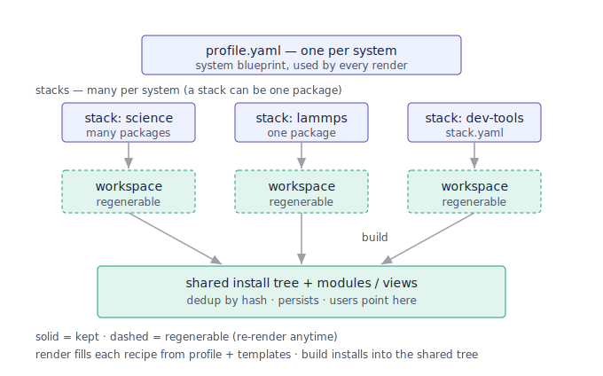
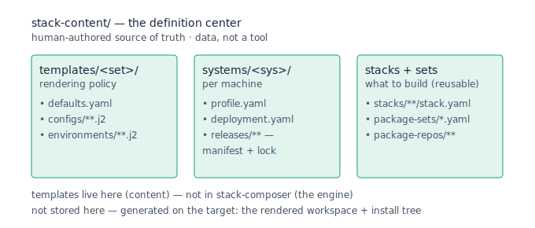

# Stack Generation Structure v1

The canonical structure for the stack-generation project: what files exist, what
each holds, and the one rule that decides where every piece of information lives.
The active inputs are `profile.yaml`, `deployment.yaml`, `defaults.yaml`,
`stack.yaml`, package content, and templates.

No v1 release has deployed yet. Change the current model directly before v1 if
first-system evidence shows it is wrong.

## The method: each fact lives where it varies

Every piece of information varies with exactly one thing. That — not convenience
— decides its home. This is the rule that keeps the model consistent system to
system.

| Varies with… | Lives in | Written by | Example |
|---|---|---|---|
| the machine — facts | `systems/<sys>/profile.yaml` | cluster-inspector | which compilers/MPI/GPU exist, OS, targets |
| the machine — paths | `systems/<sys>/deployment.yaml` | installer | install tree, caches, view/module roots, spack root |
| nothing — site policy | `defaults.yaml` (one) | maintainer | "build all reported compilers", openmpi, target=native |
| the stack — intent | `stacks/<stack>/stack.yaml` | anyone | specs, kind, optional narrowing ("this one: cce only") |
| render mechanics | `templates/<set>/*.j2` | maintainer, ~never | how a `packages.yaml` is written |

No additional contract layer is required. Site policy lives in `defaults.yaml`;
render mechanics live in templates; Spack already models compiler/MPI selection.

## defaults.yaml — site policy, one file, write as policy not lists

`defaults.yaml` is **one per site** (lives in `templates/<set>/`), merged into
every stack on every system. The only per-system files are `profile.yaml` and
`deployment.yaml`.

Write selections as **policy that resolves against any profile**, so the file is
identical everywhere:

```yaml
schema_version: 1

# What to build, from what the profile reports. A stack may override any of these.
compilers: baseline            # baseline (gcc-or-first, lean default) | all (fan out) | [gcc, cce]
mpi:    { provider: openmpi, source: auto }    # source: auto | build | platform
gpu:    { archs: all }                         # all reported, or [gfx90a, sm_80]
target: native                 # native | baseline | <explicit, e.g. x86_64_v3>

# Site conventions (rarely touched).
spack:      { floor: "1.1.1" }
externals:  { openssl: system, curl: system }
modules:    { format: tcl, exposure: front_door, hierarchy: collapsed }
foundation_pins: { zlib: "1.3.1", xz: "5.4.6", zstd: "1.5.6" }
release:    { save_lockfiles: true, save_manifest: true }
```

`compilers: all` resolves to `{cce, gcc, …}` on a Cray and `{gcc, aocc}` on
Penguin — same file, same rule, different menu.

## Selecting compilers/MPI/GPU is a default + an override, never a new file

"Build with CCE or Intel" is one of two moves, identical on every system:

- change the **site default** — `defaults.yaml: compilers: [gcc, cce]`, or
- **override on the build** — `stacks/foo/stack.yaml`:

```yaml
name: foo
builds:
  - name: mpi
    kind: mpi                # cpu | mpi | gpu (usually inferred from specs)
    specs: [hdf5@1.14.5+mpi]
    compilers: [cce]         # ← override, narrows the default for this build
    # mpi: { provider: cray-mpich, source: platform }   # optional per-build override
```

The rule is always **defaults → stack wins**. Explicit beats policy.

## Resolution: from menu to lanes

`stack-composer` resolves each build to a set of **lanes** (the things it
renders a `spack.yaml` for):

1. `kind` = explicit, else inferred from specs (gpu > mpi > cpu).
2. `compilers` = (build override or `defaults.compilers`) resolved against
   `profile`: `baseline` → gcc-or-first (the lean default); `all` → every reported
   compiler; a list → intersect with reported (an absent one is a clear error).
   For an mpi/gpu build using a **platform** MPI, a non-explicit selection
   (`baseline`/`all`) is **auto-narrowed** to the compilers that MPI was built
   against (its `compatibility` + flavor keys); an explicit list is honored
   as-is (a missing platform flavor then errors, or use `source: build`).
3. `mpi` (kind mpi/gpu) = provider + source. `source: auto` (default) uses the
   first platform MPI the profile reports unless defaults supplies
   `mpi.provider_family_priority`, else builds the provider from source;
   `source: build` always builds it; `source: platform` forces a reported
   platform MPI. Cray MPICH, Open MPI on Slingshot, MVAPICH, and site MPI builds
   all use the same provider metadata path.
4. `gpu.archs` (kind gpu) = (override or default) resolved against the profile's
   GPU arches.
5. `target` = `native` (the runtime node's preferred uarch) | `baseline`
   (the conservative shared target) | explicit.
6. vendor scope is selected per compiler lane from `defaults.provider_scopes`.
   The default template set maps ordinary providers to `vendor/linux` and maps
   `cray-pe` to `vendor/cray`, but that is template metadata, not a hardcoded
   renderer branch.

Lanes = selected compilers × (the MPI provider, if mpi/gpu) × (each GPU arch, if
gpu). So `compilers: [gcc, aocc]` + `kind: mpi` = two lanes. Each lane →
`environments/<compiler>/<lane>/spack.yaml` that `include::`s the scopes it needs
(`common`, `os/<family>`, `target/<uarch>`, vendor, `mpi/<provider>`,
`gpu/<toolkit>`). Everything inside a lane is Spack's job — we do not re-model it.

## Look before you spec: `stack-composer show`

Before authoring a stack, see the system's buildable menu:

```
stack-composer show <profile> [--defaults defaults.yaml] [--stack stack.yaml]
```

Summary-first, never a wall of text. One line per MPI **provider** (versions
collapsed, compilers it ties to shown), then the lanes you would build under the
current defaults:

```
penguin · rhel9 · targets: zen4 (native), x86_64_v3 (baseline)

compilers (4 available)
  gcc 13.2.0, 11.4.0   aocc 4.1.0   intel 2024.1   llvm 17.0.6

mpi (28 module variants → 3 providers)
  openmpi   5.0.3, 4.1.6   compilers: gcc, aocc, intel, llvm   [platform]
  mpich     4.2.1          compilers: gcc, intel               [platform]
  mvapich2  2.3.7          compilers: gcc, intel               [platform]

you would build  (defaults: compilers=all · mpi=openmpi · target=native)
  cpu → 4 lanes    mpi → 4 lanes    gpu → 0 lanes
```

Top half is "what the system offers" (profile only); bottom is "what you'd get"
(profile ∩ defaults). The line shape never changes, so 30 variants read like 3.

## The pieces, final

profile (facts) · deployment (paths) · defaults (site policy) · stack (intent) ·
templates (render mechanics). Five, each one job, joined by one override rule.





## Related

- `stack_workspace_lifecycle_v1.md` — per-stack workspaces, the shared install tree, the three lifetimes.
- `stack_build_handoff_note_v1.md` — where render stops and the build seam.
- `deployment_inputs_and_ownership_v1.md` — the chosen roots (`deployment.yaml`).
