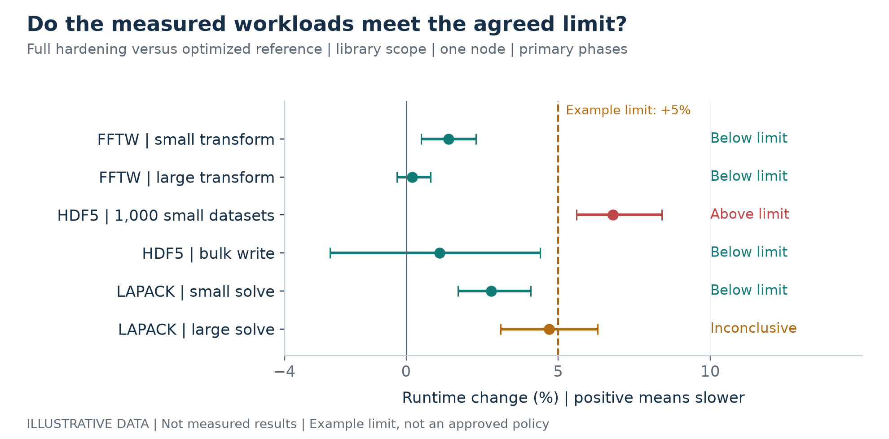
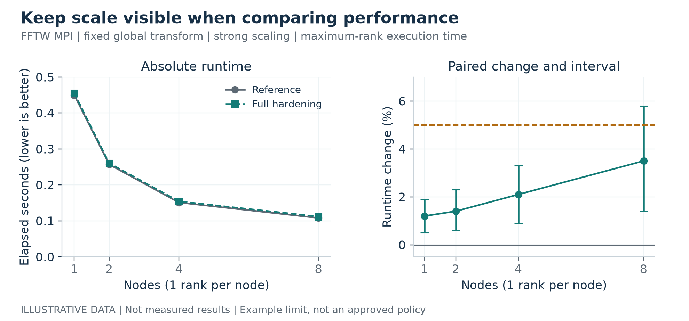
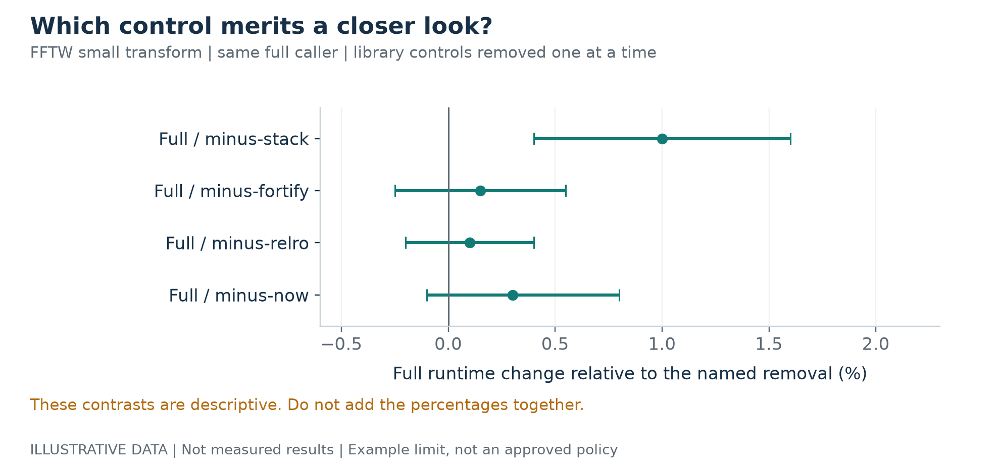
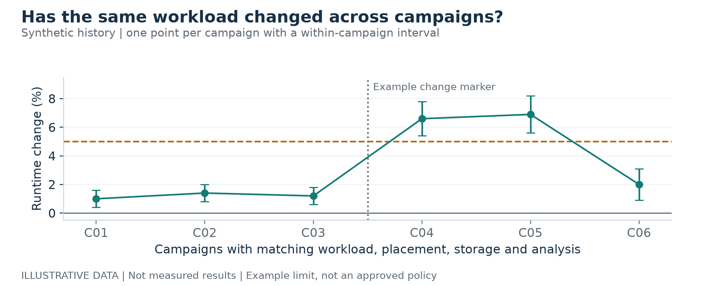
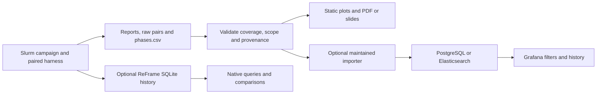

# Presenting the ReFrame hardening results

Date: 2026-10-09. Use this plan after collecting the campaign in [08](08-slurm-campaign.md). The audience needs to understand which workloads were tested, how much their runtime changed, how certain the comparison is, and which cases remain unresolved. Start with a portable PDF and plots from the campaign's paired summaries. Add a live dashboard when repeated monitoring becomes useful.

The [five-page presentation draft](../../output/pdf/reframe-hardening-presentation-draft.pdf) and every example figure below use **invented values and intervals**. They demonstrate presentation choices, not measured or expected overhead. The **+5% example limit is not an agreed trial limit**. No target-system campaign results are included. The figures are PNGs for slides and SVGs for editable, sharp exports.

## What ReFrame already provides

ReFrame produces a JSON run report, configurable performance logs, and a terminal performance report. Database-backed history and comparison queries were added in **4.7**, whose package release was published on **2024-11-13**. This is the work described in the [FOSDEM 2025 performance analytics talk](https://archive.fosdem.org/2025/schedule/event/fosdem-2025-4755-adding-built-in-support-for-basic-performance-test-analytics-to-reframe/). The trial's **4.10.4** pin includes these features and was the newest stable release when checked on 2026-10-09. [ReFrame tutorial](https://reframe-hpc.readthedocs.io/en/stable/tutorial.html#inspecting-past-results), [CLI reference](https://reframe-hpc.readthedocs.io/en/stable/manpage.html#querying-past-results), [PyPI release metadata](https://pypi.org/pypi/reframe-hpc/json), [4.10.4 release](https://github.com/reframe-hpc/reframe/releases/tag/v4.10.4).

There is a documented first-hand pattern of sending ReFrame performance records to Elasticsearch and visualizing them in Kibana, presented by the ReFrame team at SC'19. The current tutorial documents an HTTP JSON performance-log handler. These establish supported output paths and a deployed example; they do not establish one visualization method as the most common today. [SC'19 presentation](https://hust-workshop.github.io/2019_presentations/3-reframe.pdf), [HTTP logging tutorial](https://reframe-hpc.readthedocs.io/en/stable/tutorial.html#sending-performance-data-to-an-http-endpoint).

For this experiment, native historical comparisons complement the paired analysis. They do not replace the bootstrap interval calculated by `paired.py` or establish that two selected sessions used the same flags, storage, workload arguments, or rank layout.

## Start with four figures

| View | Audience question | Data and presentation |
|---|---|---|
| Workload comparison | Does full hardening meet the agreed runtime limit? | One point and 95% interval per allocation and workload's declared primary phase, full/reference only. Show zero and the actual predeclared limit. |
| Node scaling | Does the effect change across nodes? | Absolute full/reference elapsed time beside paired runtime change and interval; facet by workload, scaling mode and ranks per node. |
| Control attribution | Which control warrants investigation? | Full versus each named removal, for one workload and phase. Keep executable PIE in a separate panel with full libraries fixed. |
| Campaign history | Has a comparable condition changed over time? | One point per campaign/allocation, uncertainty, missing-run markers and change annotations. Exclude incompatible conditions. |

### Workload comparison



Explain the metric before interpreting the colors: `100 * (geometric mean of paired full/reference runtime ratios - 1)`. Positive means the hardened arm took longer. It is an elapsed-runtime change, not a throughput-loss percentage. The horizontal bars show the existing paired-bootstrap 95% interval. In the figure, four cases meet the illustrative limit, one exceeds it, and one is inconclusive; those counts describe invented examples only.

For the [first assessment in 08](08-slurm-campaign.md#repeatability-and-a-manageable-first-assessment), show three allocation estimates for each condition, labelled with replicate/job and actual node identities. Each point summarizes 20 process pairs in its own allocation. State the number of distinct hosts/node sets and show disagreements instead of averaging them away. The pilot's 10 pairs establish initial feasibility; the 20-pair, three-allocation assessment is a bounded screening budget, not a promise to detect an arbitrary small effect. Report observed direction, magnitude and uncertainty without a for/against-hardening verdict.

Arithmetic mean and sample standard deviation in seconds describe each arm's timing spread. The paired-change standard deviation is in percentage points. Use them in a supporting table or appendix; the headline effect remains the paired geometric mean and its interval. Standard deviation is not an error bar for the mean. Kernel loop counts and MPI ranks do not increase the reported process-pair sample count. An interval describes within-allocation variation; a combined interval across allocations would require an analysis that preserves the allocation/node grouping.

Use text labels as well as color. An upper endpoint at or below an agreed limit supports meeting that limit for the recorded condition; a lower endpoint above it supports exceeding it; an interval crossing it is inconclusive. If no limit was declared, show estimates and intervals with a descriptive status. A detectable small change can still meet the limit. An interval containing zero does not prove zero overhead.

### Node scaling



Plot elapsed seconds and relative change together: a small percentage on a long job can matter, while a larger percentage on a tiny job can have a small absolute cost. The example uses FFTW MPI maximum-rank execution time, a fixed global transform, and one rank per node. Real results must label transform/data size, total ranks, ranks per node, timer scope, and the fixed MPI/UCX build.

Show HDF5 strong and weak scaling in separate plots. In strong scaling, the global data remains fixed; in weak scaling, data per rank remains fixed and global data grows. Also separate shared/local storage, collective/independent requests, warmed reads/writes and durable/buffered settings. Actual I/O-mode diagnostics would improve a future analysis; a request for collective I/O alone does not prove which optimizations were used.

### Control attribution



The removal percentages are relative to different comparators; **do not add them together**. Inspect startup-sensitive `process_elapsed` separately from warmed kernels for RELRO/NOW. `process_elapsed` includes process creation, loading, work, validation and output capture; it is not an isolated loader timer. LAPACK's Fortran library has no FORTIFY removal in this matrix. Executable PIE is its own contrast, with both arms using the full libraries.

### Campaign history



Compare the same workload arguments, phase, compiler/dependency identities, hardening scope, node class, rank layout, storage, cache/durability settings and analysis version. Keep incompatible conditions in separate series. A change marker suggests an investigation; it does not establish the cause. The shown intervals describe uncertainty within each invented campaign; they do not quantify variation across independent allocations.

## How to turn the real campaign into a report

The current collector in [08](08-slurm-campaign.md#6-collect-and-interpret-every-phase) emits `phases.csv`. Use its estimates directly rather than recomputing them from rounded terminal output. The report renderer and joined completeness manifest below are proposed additions; this draft does not install a renderer or a Grafana service.

| Input | Use |
|---|---|
| `package`, `workload`, `comparator`, `scope`, `phase`, `primary` | Select headline full/reference primary rows and label every panel. Keep exploratory phases/removals separate. |
| `full_seconds`, `comparator_seconds`, `runtime_increase_percent`, `ci_low`, `ci_high`, `pairs` | Absolute-time plots, paired-effect plots and interval captions. |
| `full_seconds_mean`, `full_seconds_stdev`, `comparator_seconds_mean`, `comparator_seconds_stdev`, `paired_change_stdev_percent_points` | Descriptive timing/spread table; keep arithmetic means distinct from the geometric headline metric. |
| `nodes`, `ranks`, `ranks_per_node`, `scaling`, `io_dir` | Partition comparable conditions; never average across scales or filesystems. |
| `limit_percent`, `interpretation` | Show the predeclared decision rule; leave an unset limit descriptive. |
| `session`, `run_label`, `job_id`, `replicate`, `node_list`, `summary_path` | Link an allocation point back to its source summary and actual placement; count distinct physical hosts from inventory/expanded host lists. |
| Raw pairs, JSON reports, Slurm accounting and campaign manifest | Diagnose noise, reconcile failures/skips/cancelled jobs, and establish expected versus completed coverage. |
| Source/build logs, ELF checks and node inventory | Record what was built, whether controls were applied, and where it ran. |

Before plotting, validate numeric values, interval ordering, positive runtimes, comparator identity and the planned grouping keys. Reject accidental duplicate result cells; retain deliberate repeated allocations as separate observations. Reconcile expected, completed, failed, skipped, cancelled and not-applicable cases. The existing CSV contains completed summaries only, so it cannot supply a complete coverage panel by itself. Never represent absent rows as zero overhead or report all-green coverage from ReFrame PASS alone.

Preserve `report.json`, the raw paired data, the campaign input manifest, procedure commit, build/source identities and the rendered snapshot together. Add a machine-readable join for immutable identities and workload arguments before producing automatic historical trends; not every required comparability field is currently a column in `phases.csv`. Keep compiler-hardening verification and runtime interpretation separate: a low runtime cost is not a finding that a protection is ineffective or a STIG compliance decision.

## Native history and a possible Grafana route

For future runs, optional native history can be enabled before submitting the campaign. Choose a persistent database location on a filesystem supporting file locking, accessible to the jobs and subsequent queries. Retain the explicit per-run JSON reports as portable artifacts. The commands below enable storage; they do not import older reports or add extra campaign metadata to the current launcher.

```bash
export RFM_ENABLE_RESULTS_STORAGE=1
export RFM_SQLITE_DB_FILE="$TRIAL_ROOT/results/reframe-history.db"
# Submit/run the campaign with these variables exported.
# After runs, query the same database using the pinned executable:
"$TRIAL_ROOT/tools/reframe-venv/bin/reframe" \
  -C "$TRIAL_ROOT/reframe/settings.py" --list-stored-sessions
```

ReFrame also provides `--describe-stored-sessions`, `--list-stored-testcases`, `--performance-compare`, and CSV table output. `--session-extras` can attach campaign/build/condition identifiers when launching a session. Use explicit matching-condition selection for comparisons; our allocation-local ReFrame system name by itself does not encode node count or storage. [Storage and query reference](https://reframe-hpc.readthedocs.io/en/stable/manpage.html#result-storage).

For recurring monitoring, Grafana can query Elasticsearch or PostgreSQL. A recommended route for this paired experiment is **completed campaign -> validated paired summaries and coverage records -> maintained importer/data store -> Grafana**. ReFrame's `httpjson` handler is an alternative event transport, but its payload must be mapped to our metrics and context. It does not automatically join coverage/build artifacts or turn the campaign's bootstrap intervals into dashboard panels. [Grafana Elasticsearch](https://grafana.com/docs/grafana/latest/datasources/elasticsearch/), [Grafana PostgreSQL](https://grafana.com/docs/grafana/latest/datasources/postgres/).



Dashboard filters should include package/workload, comparator, phase/scope, build identity, node/rank layout, storage and campaign. Suggested panels are completion/failures, paired change with uncertainty, absolute runtime, comparable history, and evidence links. Store interval endpoints without treating them as additional samples; aggregating those endpoints across incompatible runs is not a valid combined confidence interval. Define deduplication, snapshot retention and a deliberate baseline selection policy before adding alerts.

## A short meeting narrative

1. **Purpose and scope:** measure runtime cost and correctness of the supplied controls for named workloads; state which library/caller contrasts and fixed dependencies are involved.
2. **Qualification and coverage:** show what ran, correctness/placement status, build-control verification and missing cases before performance conclusions.
3. **Primary comparison:** show full/reference runtime change with intervals, absolute seconds and the predeclared limit. Describe supported and inconclusive conditions in plain language.
4. **Scale and attribution:** show node trends and short/startup/control experiments only where they clarify an observed effect. Keep untested application/deployment scopes explicit.
5. **Decision and next runs:** explain which conditions meet the rule, need investigation, or need more precision/repeated allocations.

Use a bounded sentence once actual data exists: “For [workload, scale and storage], full hardening changed runtime by [estimate]% with a 95% interval of [low, high]%. This [meets / exceeds / does not resolve] the predeclared [limit]% limit.” For the ISSM, pair that statement with the protection/artifact checks; for managers, add the affected job's absolute time and the operational consequence.

## Public direction and useful additional tooling

The project exposes direction through [issues](https://github.com/reframe-hpc/reframe/issues), [pull requests](https://github.com/reframe-hpc/reframe/pulls), and [milestones](https://github.com/reframe-hpc/reframe/milestones); no separate maintained feature roadmap was found in the reviewed official sources. On 2026-10-09, open milestones included **4.10.5**, **4.11**, and **5.0**. This metadata indicates intended scope, not promised delivery. The detailed [roadmap research](../reframe_roadmap_and_tooling_research_v1.md) records current themes and source links.

For this trial, the next useful additions are an expected-matrix completeness gate, immutable build identities, guarded cross-campaign comparisons, an analysis respecting allocation/node grouping, and a portable report snapshot. Pairing, bootstrap intervals, descriptive spread, repeated-allocation submission and correctness/placement checks already exist. Possible generic upstream proposals include typed provenance/export fields, uncertainty-aware comparison hooks, baseline-compatibility guards and plot/report templates. These are suggestions to discuss with maintainers, not announced upstream work; first establish which gaps cannot be addressed in a suite or report adapter.

Further research: [reporting/history/integration findings](../reframe_reporting_and_history_research_v1.md), [roadmap and tooling findings](../reframe_roadmap_and_tooling_research_v1.md). The examples above are ready to show as a proposed reporting design; replace them with validated actual outputs before presenting performance conclusions.
